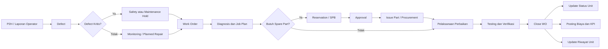
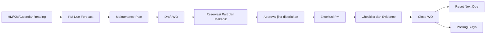
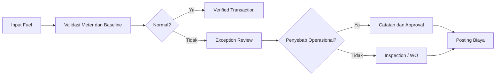
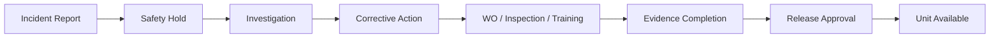

# Strategi Pengembangan Sistem Fleet Monitoring Terintegrasi

## 1. Tujuan Dokumen

Dokumen ini menyusun arah pengembangan sistem **Equipment Maintenance & Fleet Monitoring** agar:

1. Setiap menu tidak berdiri sendiri.
2. Data unit, aktivitas, biaya, dan approval menggunakan sumber data yang sama.
3. Informasi yang ditampilkan benar-benar membantu user mengambil keputusan.
4. Alur kerja antardivisi dapat dilacak dari awal sampai selesai.
5. Tampilan terasa seperti sistem operasional yang nyata, bukan sekadar kumpulan dashboard atau fitur demo.

---

## 2. Kesimpulan Utama

HTML saat ini sudah memiliki fondasi yang cukup baik, terutama pada hubungan:

> **Master Asset → Inspeksi/P2H → Work Order → Status Efektif Unit**

Namun, integrasi tersebut belum merata ke seluruh menu. Beberapa modul sudah terlihat cukup matang secara tampilan, seperti Fuel dan Cost Control, tetapi masih belum sepenuhnya menggunakan alur transaksi yang sama dengan Asset, Work Order, Approval, dan Reports.

Arah pengembangan yang disarankan adalah:

> **Jangan menjadikan setiap menu sebagai aplikasi terpisah. Jadikan seluruh menu sebagai sudut pandang berbeda terhadap objek bisnis yang sama: unit, project, orang, pekerjaan, transaksi, dan dokumen.**

Pusat integrasi sistem sebaiknya adalah:

- **Unit ID** sebagai identitas utama aset.
- **Project/Site ID** sebagai konteks lokasi dan organisasi.
- **Work Order ID** sebagai pusat aktivitas maintenance.
- **Document/Transaction ID** sebagai pusat approval dan audit.
- **User/Role ID** sebagai dasar akses dan tanggung jawab.
- **Timeline aktivitas** sebagai jejak perubahan lintas menu.

---

## 3. Evaluasi Kondisi Sistem Saat Ini

### 3.1 Kekuatan yang Sudah Ada

Sistem sudah menunjukkan beberapa konsep yang tepat:

| Kekuatan | Penjelasan |
|---|---|
| Status efektif unit | Status aset dapat dipengaruhi oleh data Master Asset, P2H, atau Work Order. |
| Detail Unit 360° | Detail aset sudah menggabungkan ringkasan, lokasi, histori WO, dan histori P2H. |
| Otomatisasi status | Pembuatan WO dengan downtime dapat mengubah status unit menjadi Breakdown. |
| Pencegahan konflik status | Unit tidak dapat langsung diubah menjadi Ready selama masih memiliki WO aktif. |
| WO terhubung ke SPB | Dari detail WO, user dapat diarahkan membuat permintaan spare part. |
| Fuel memakai data aset | Daftar unit pada form fuel mengambil data dari Master Asset. |
| Konsep audit trail | Beberapa transaksi sudah memiliki referensi, status, waktu, dan sumber perubahan. |
| Konsep RBAC | Pengaturan sudah memiliki Role, Read, Create, Edit, dan Approve. |
| Threshold terpusat | Sistem sudah menyiapkan konfigurasi SLA, batas ban, PM warning, dan anomali fuel. |

### 3.2 Masalah Utama

| Masalah | Dampak |
|---|---|
| Sidebar terlalu datar | Enam belas menu ditampilkan sejajar sehingga user sulit memahami kelompok prosesnya. |
| Integrasi belum menyeluruh | Fuel, biaya, condition monitoring, approval, dan logistics masih memiliki data atau proses yang terpisah. |
| Banyak informasi bersifat demonstratif | Sebagian angka, transaksi, approval, kondisi ban, dan valuasi masih hardcoded atau hanya menghasilkan notifikasi. |
| Status unit terlalu disederhanakan | READY, STANDBY, INSPEKSI, BREAKDOWN, dan ACCIDENT_HOLD dicampur dalam satu status, padahal kondisi operasional, maintenance, dan safety berbeda. |
| Approval belum menjadi workflow | Approve dan reject baru menghapus baris dari tampilan, belum memperbarui dokumen sumber. |
| Logistics baru berfokus pada SPB | Belum ada inventory, reservation, issue, return, purchase request, PO, vendor, atau lead time. |
| Condition Monitoring terlalu sempit | Saat ini hanya menggambarkan ban 10-wheeler dan belum terikat jelas ke unit tertentu. |
| Dashboard terlalu generik | Belum membedakan kebutuhan Manager, Planner, Mechanic, Logistics, HSE, dan Finance. |
| Persistensi masih lokal | Penggunaan local storage cocok untuk prototype, tetapi tidak cocok untuk aplikasi multiuser. |
| Modul eksternal belum dapat diaudit penuh | PM, Report, People & KPI, HSE, Productivity, dan Inspection menggunakan container yang diisi JavaScript eksternal. |

---

## 4. Prinsip Arsitektur Produk

### 4.1 Satu Objek, Banyak Sudut Pandang

Setiap data penting harus memiliki identitas yang sama di semua menu.

Contoh:

```text
Unit EXC-210
├── Project aktif: Site Alpha
├── Status operasional: Standby
├── Safety hold: Tidak
├── P2H terakhir: Fail
├── WO aktif: WO-2026-0182
├── PM berikutnya: 37 HM lagi
├── Fuel anomaly: +18%
├── Part request: SPB-2026-0101
├── Biaya bulan berjalan: Rp ...
└── Penanggung jawab: Foreman A
```

User tidak seharusnya mencari ulang EXC-210 di setiap menu. Ketika user membuka unit tersebut, seluruh konteks terkait harus tersedia.

### 4.2 Unit 360° sebagai Integration Hub

Detail Unit 360° sebaiknya dikembangkan menjadi pusat navigasi lintas modul.

Tab yang disarankan:

1. Ringkasan.
2. Lokasi dan mutasi.
3. P2H dan inspeksi.
4. Work Order.
5. Preventive Maintenance.
6. Condition Monitoring.
7. Fuel.
8. Productivity.
9. Spare Part.
10. Biaya.
11. HSE.
12. Dokumen dan audit trail.

User tetap dapat masuk melalui menu utama, tetapi seluruh transaksi harus dapat dibuka kembali dari Unit 360°.

### 4.3 Event-Driven Workflow

Setiap kejadian harus memicu tindakan sistem.

| Event | Respons Sistem |
|---|---|
| P2H menemukan defect kritis | Buat defect, tahan unit, rekomendasikan atau otomatis buat WO. |
| Unit dinyatakan Breakdown | Buat WO darurat jika belum ada WO aktif. |
| WO membutuhkan part | Buat reservation atau SPB yang terhubung ke WO. |
| SPB disetujui | Kurangi/reservasi stok atau lanjutkan procurement. |
| WO selesai | Minta verifikasi, hitung downtime, update status unit, posting biaya. |
| HM/KM mendekati PM | Buat alert dan draft PM Work Order. |
| Fuel melewati baseline | Masuk exception review dan, bila perlu, buat inspection/WO. |
| Insiden HSE terjadi | Aktifkan Safety Hold dan blokir status Ready. |
| Unit pindah project | Buat transaksi mutasi/BAST dan update project aktif. |

---

## 5. Arsitektur Menu yang Disarankan

Sidebar sekarang sebaiknya tidak menampilkan seluruh menu dalam satu level. Gunakan pengelompokan berdasarkan pekerjaan user.

```mermaid
flowchart TD
    A[Overview] --> A1[Dashboard]
    A --> A2[Monitoring Unit]

    B[Asset & Operations] --> B1[Master Asset]
    B --> B2[Inspeksi & P2H]
    B --> B3[Condition Monitoring]
    B --> B4[Fuel]
    B --> B5[Produktivitas]

    C[Maintenance] --> C1[Work Order]
    C --> C2[Preventive Maintenance]
    C --> C3[Spare Part & Logistik]

    D[Control & Governance] --> D1[Biaya]
    D --> D2[HSE / Accident]
    D --> D3[Approval]
    D --> D4[Laporan & Form]

    E[Administration] --> E1[People & KPI]
    E --> E2[Pengaturan]
```



### Rekomendasi Navigasi

- Gunakan menu kelompok yang dapat dibuka-tutup.
- Tampilkan badge pada menu, misalnya:
  - 4 Breakdown.
  - 7 WO overdue.
  - 12 transaksi belum diverifikasi.
  - 5 approval pending.
- Simpan project/site sebagai filter global.
- Tambahkan breadcrumb:
  - `Master Asset / EXC-210 / Work Order / WO-2026-0182`
- Setiap halaman detail harus memiliki tombol aksi kontekstual, bukan memaksa user kembali ke sidebar.
- Menu yang tidak relevan dengan role user tidak perlu ditampilkan.

---

## 6. Alur Bisnis Utama yang Harus Menjadi Prioritas

### 6.1 Corrective Maintenance



### 6.2 Preventive Maintenance



### 6.3 Fuel Exception



### 6.4 HSE Incident



---

## 7. Evaluasi dan Kebutuhan Setiap Menu

## 7.1 Dashboard

### User utama

- Equipment Manager.
- Project Manager.
- Maintenance Manager.
- Executive reviewer.

### Informasi saat ini yang relevan

- Total unit.
- Ready, Standby, Breakdown, dan Inspection/PM.
- Posisi unit.
- Emergency Work Order.
- Unit per kategori.
- Work Order aktif.

Informasi tersebut tetap dibutuhkan, tetapi Dashboard harus difokuskan pada **keputusan**, bukan sekadar jumlah.

### Informasi yang perlu ditambahkan

- Physical Availability.
- Utilization.
- Breakdown rate.
- MTTR.
- MTBF.
- PM compliance.
- WO overdue.
- Downtime hari ini dan bulan berjalan.
- Unit dengan fuel anomaly.
- Cost variance.
- Safety hold.
- Approval kritis.
- Top five unit dengan risiko tertinggi.
- Tren, bukan hanya angka saat ini.

### Rekomendasi

Dashboard dibuat role-based:

| Role | Isi Utama |
|---|---|
| Manager | Availability, downtime, cost, PM compliance, exception, dan trend. |
| Planner | PM due, WO backlog, part waiting, manpower capacity. |
| Foreman | Unit tidak ready, defect baru, pekerjaan shift hari ini. |
| Logistics | Stock critical, reservation, SPB, PO delay. |
| HSE | Incident, safety hold, corrective action overdue. |

### Keputusan

**Pertahankan, tetapi ubah menjadi exception-first dan role-based.**

---

## 7.2 Monitoring Unit

### User utama

- Equipment Control.
- Dispatcher.
- Foreman.
- Manager.

### Informasi saat ini yang relevan

- Unit non-ready.
- Kategori.
- Lokasi.
- Status terakhir.
- Tindakan lanjutan.

Ini sudah menuju kebutuhan user yang tepat.

### Kekurangan

- Hanya menonjolkan non-ready.
- Belum terlihat siapa penanggung jawabnya.
- Belum terlihat usia masalah atau SLA.
- Belum terlihat alasan status secara langsung.
- Belum terlihat status komunikasi atau eskalasi.
- Label “sinkron real-time” harus benar-benar didukung timestamp dan sumber data.

### Informasi wajib

- Unit.
- Project/site.
- Status efektif.
- Status operasional.
- Status maintenance.
- Safety hold.
- Sumber status.
- Waktu update.
- Active WO/defect.
- Downtime duration.
- PIC.
- Next action.
- SLA due.
- Last GPS time.
- Data freshness indicator.

### Keputusan

**Jadikan sebagai Fleet Command Center, bukan sekadar tabel unit bermasalah.**

---

## 7.3 Master Asset

### User utama

- Asset Administrator.
- Equipment Manager.
- Planner.
- Finance.
- HSE.

### Informasi saat ini yang relevan

- Asset ID.
- Kategori.
- Lokasi.
- Last update.
- Status efektif.

Informasi tersebut penting, tetapi belum cukup disebut Master Asset.

### Data wajib

#### Identitas

- Asset ID/kode lambung.
- Serial number.
- Registration number.
- Brand, model, type.
- Manufacturing year.
- Acquisition date.
- Commissioning date.
- Ownership: owned, rented, leased.
- Vendor atau lessor.

#### Operasional

- Meter type: HM/KM.
- Last meter.
- Project aktif.
- Cost center.
- Operator/crew assignment.
- GPS device ID.
- Availability status.

#### Maintenance

- Maintenance strategy.
- PM package.
- Warranty.
- Criticality.
- Component hierarchy.
- Last service.
- Next due.

#### Administrasi

- Document expiry.
- Insurance.
- Permit.
- Asset value.
- Depreciation class.
- Disposal status.

### Aksi yang diperlukan

- Register.
- Edit.
- Transfer/mutasi.
- Assign operator.
- Update meter.
- Attach document.
- Deactivate/dispose.
- View Unit 360°.

### Keputusan

**Pertahankan sebagai single source of truth. Form registrasi saat ini harus diperluas dan dibagi menjadi beberapa langkah.**

---

## 7.4 Inspeksi & P2H

### User utama

- Operator.
- Foreman.
- Inspector.
- Mechanic.

### Kebutuhan utama

- Checklist berdasarkan kategori/model unit.
- Tanggal, waktu, shift, project.
- Operator dan NRP.
- HM/KM.
- Foto evidence.
- Condition: OK, warning, defect.
- Severity.
- Catatan.
- Signature/verifier.
- Lokasi GPS bila diperlukan.
- Offline/mobile mode.

### Aturan integrasi

- Defect minor menjadi observation.
- Defect medium menjadi planned correction.
- Defect critical mengubah status unit menjadi Inspection Hold atau Breakdown.
- Defect dapat menghasilkan WO otomatis.
- P2H tidak boleh dianggap selesai jika item wajib belum diisi.
- Perubahan HM/KM harus memperbarui PM forecast dan fuel baseline.

### Keputusan

**Menu wajib. Fokuskan untuk penggunaan cepat di lapangan dan otomatisasi defect-to-WO.**

---

## 7.5 Work Order

### User utama

- Planner.
- Foreman.
- Mechanic.
- Supervisor.
- Manager.

### Informasi saat ini yang relevan

- Open.
- In Progress.
- Closed.
- Priority.
- Unit.
- Issue.
- Downtime.
- Assigned mechanic.
- Action taken.
- Status unit setelah perbaikan.

Kanban sudah berguna untuk melihat alur, tetapi tiga kolom terlalu sederhana.

### Status yang disarankan

```text
Draft
→ Submitted
→ Approved
→ Planned
→ Waiting Part
→ Ready to Execute
→ In Progress
→ Testing
→ Waiting Verification
→ Closed
→ Cancelled
```

### Informasi wajib

- WO ID.
- Source: P2H, PM, breakdown, HSE, condition, manual.
- Asset dan project.
- Failure date/time.
- Problem statement.
- Failure code.
- Cause code.
- Action code.
- Priority dan criticality.
- Planner.
- Mechanic/team.
- Estimated duration.
- Planned start/end.
- Actual start/end.
- Downtime.
- Labor hours.
- Parts.
- External service.
- Attachment.
- Checklist.
- Testing result.
- Verifier.
- Closure reason.

### Integrasi

- WO harus menjadi pusat:
  - Spare part.
  - Labor.
  - Downtime.
  - Cost.
  - P2H defect.
  - PM.
  - HSE corrective action.
  - Condition alert.
  - Approval.
  - Report.

### Keputusan

**Menjadi modul inti setelah Master Asset. Kanban dipertahankan, tetapi tambahkan list view, calendar, backlog, SLA, dan detail transaksi.**

---

## 7.6 Preventive Maintenance

### User utama

- Maintenance Planner.
- Foreman.
- Manager.

### Informasi wajib

- Unit dan PM strategy.
- Trigger: HM, KM, tanggal, atau kombinasi.
- Last service.
- Current meter.
- Next due.
- Remaining HM/KM/day.
- Forecast date.
- PM package/checklist.
- Standard labor.
- Required parts.
- Estimated cost.
- Project.
- Planner.
- Status preparation.
- Compliance.

### Integrasi

- Meter berasal dari P2H, telematics, fuel, atau input verified.
- PM due menghasilkan draft WO.
- Spare part di-reserve sebelum jadwal.
- PM completion memperbarui next due.
- Cost masuk ke Cost Control.
- Overdue PM memengaruhi risk score unit.

### Keputusan

**Menu wajib dan harus dikembangkan setelah alur P2H–WO stabil.**

---

## 7.7 Spare Part & Logistik

### User utama

- Storekeeper.
- Logistics.
- Planner.
- Procurement.
- Approver.

### Informasi saat ini yang relevan

- Pemilihan WO aktif.
- Part number.
- Deskripsi.
- Quantity.
- Unit of measure.
- SPB.

Ini relevan tetapi belum cukup untuk disebut modul Logistics.

### Submodul yang dibutuhkan

1. Part master.
2. Warehouse/site stock.
3. Stock movement.
4. Reservation.
5. Issue to WO.
6. Return.
7. Transfer antarwarehouse.
8. Stock opname.
9. Min-max/reorder point.
10. Purchase request.
11. SPB.
12. PO tracking.
13. Vendor dan lead time.
14. Repairable component/rotable.
15. Slow-moving dan dead stock.

### Integrasi

- WO mengajukan kebutuhan part.
- Sistem mengecek stok.
- Jika tersedia: reservation.
- Jika tidak tersedia: SPB/PR.
- Setelah approval: procurement.
- Saat issue: cost masuk ke WO.
- Saat return: stok dan WO diperbarui.
- WO tidak boleh close jika part transaction belum selesai, kecuali ada alasan.

### Keputusan

**Pertahankan, tetapi ubah dari satu form SPB menjadi siklus inventory-to-procurement.**

---

## 7.8 Condition Monitoring

### User utama

- Inspector.
- Reliability Engineer.
- Planner.
- Foreman.

### Evaluasi

Skema ban dan input tread/pressure berguna sebagai contoh, tetapi terlalu spesifik untuk menjadi satu menu umum.

### Kebutuhan yang disarankan

- Pilih unit terlebih dahulu.
- Jenis measurement:
  - Tire tread dan pressure.
  - Oil analysis.
  - Vibration.
  - Temperature.
  - Battery.
  - Brake.
  - Undercarriage.
  - Hydraulic pressure.
  - Engine parameter.
- Reading date.
- Measurement point.
- Value dan unit.
- Threshold.
- Trend.
- Severity.
- Inspector.
- Evidence.
- Recommendation.
- Related WO.

### Integrasi

- Threshold harus berasal dari Settings atau equipment model.
- Alert critical membuat defect atau WO.
- Riwayat terlihat di Unit 360°.
- Condition trend digunakan untuk PM planning.
- Biaya tindakan masuk ke Cost Control.

### Keputusan

**Pertahankan, tetapi jangan membatasi menu pada satu jenis kendaraan atau komponen.**

---

## 7.9 Fuel

### User utama

- Fuelman.
- Logistics.
- Foreman.
- Cost Control.
- Manager.

### Informasi saat ini yang relevan

Menu Fuel sudah memiliki banyak elemen yang memang dibutuhkan:

- Transaksi pengisian.
- Meter awal dan akhir.
- Liter.
- Baseline.
- Deviasi.
- Biaya.
- Operator/fuelman.
- Anomaly status.
- Verification.
- Tank stock.
- Sounding.
- Reconciliation.

### Perbaikan utama

- Gunakan Asset ID asli, bukan teks unit bebas.
- Operator dipilih dari master people.
- Project dan lokasi mengikuti assignment unit.
- Meter harus divalidasi terhadap reading terakhir.
- Harga fuel harus berasal dari purchase/batch/site.
- Transaksi mengurangi stok tangki.
- Selisih sounding menghasilkan adjustment transaction.
- Anomali masuk approval atau exception review.
- Threshold tidak boleh hardcoded.
- Pisahkan halaman operasional dari analytics agar tabel tidak terlalu padat.

### Struktur yang disarankan

| Tab | Tujuan |
|---|---|
| Daily Transaction | Input dan verifikasi pengisian. |
| Exception Review | Menangani deviasi dan transaksi tidak wajar. |
| Tank & Stock | Saldo, receipt, issue, sounding, adjustment. |
| Baseline | Standar per model, kondisi kerja, dan project. |
| Analytics | Consumption, cost, anomaly trend. |

### Keputusan

**Pertahankan. Secara kebutuhan sudah kuat, tetapi harus dihubungkan ke inventory, meter, people, approval, dan cost.**

---

## 7.10 Produktivitas

### User utama

- Project Manager.
- Equipment Manager.
- Dispatcher.
- Cost Control.

### Informasi wajib

- Unit.
- Project.
- Shift.
- Operator.
- HM/KM awal dan akhir.
- Operating hour.
- Idle hour.
- Standby hour.
- Breakdown hour.
- Production quantity.
- Load/cycle count.
- Distance.
- Cycle time.
- Target.
- Actual.
- Delay reason.
- Utilization.
- Productivity rate.
- Fuel consumption.
- Cost per production unit.

### Integrasi

- Unit status menentukan jam available.
- WO menentukan downtime.
- Fuel menentukan consumption.
- People menentukan operator.
- Cost menghasilkan cost per hour atau cost per ton.
- HSE dapat mengecualikan jam akibat safety hold.
- Project master menentukan target.

### Keputusan

**Jangan hanya menjadi dashboard grafik. Harus memiliki sumber data shift/activity log yang jelas.**

---

## 7.11 Biaya

### User utama

- Cost Control.
- Finance.
- Equipment Manager.
- Management.

### Informasi saat ini yang relevan

- Budget versus actual.
- Cost variance.
- Repair cost.
- PM cost.
- PO.
- LPJ.
- Asset valuation.
- Book value.
- Market value.
- Buyer offer.

Namun, aktivitas operasional dan valuasi/disposal adalah dua domain berbeda.

### Struktur yang disarankan

#### Tab Operational Cost

- Cost per WO.
- Part.
- Labor.
- External service.
- Fuel.
- Tire.
- PM.
- Corrective maintenance.
- Cost per HM/KM.
- Cost per project.
- Budget versus actual.

#### Tab Asset Financial

- Acquisition value.
- Depreciation.
- Book value.
- Market appraisal.
- Disposal candidate.
- Buyer offer.
- Approval.
- Gain/loss.

#### Tab Commitment

- SPB.
- PR.
- PO.
- Goods receipt.
- Invoice.
- Payment status.
- Outstanding commitment.

### Integrasi

- Biaya tidak boleh diinput ulang jika sudah berasal dari Fuel, WO, Part Issue, PO, labor, atau vendor service.
- Manual adjustment harus memiliki alasan dan approval.
- Semua biaya menggunakan cost center, project, asset, account code, dan transaction date.

### Keputusan

**Pertahankan, tetapi pisahkan operational cost dari valuation/disposal serta hentikan duplikasi input transaksi.**

---

## 7.12 People & KPI

### User utama

- Equipment Manager.
- Foreman.
- Planner.
- HR liaison.

### Batas ruang lingkup

Menu ini tidak perlu menjadi HRIS penuh. Fokuskan hanya pada data yang berdampak langsung ke operasi alat.

### Informasi wajib

- Employee ID/NRP.
- Name.
- Role.
- Skill.
- Certification.
- Certification expiry.
- Project assignment.
- Shift.
- Availability.
- Mechanic workload.
- Operator-unit assignment.
- Training.
- Safety violation.
- P2H compliance.
- WO productivity.
- Rework rate.
- Response time.

### Integrasi

- Operator pada P2H, Fuel, Productivity, dan Incident berasal dari people master.
- Mechanic pada WO berasal dari skill dan availability.
- Certification expiry dapat memblokir assignment.
- KPI dihitung dari transaksi, bukan diinput manual.

### Keputusan

**Pertahankan dengan scope operasi dan kompetensi, bukan administrasi HR umum.**

---

## 7.13 HSE / Accident

### User utama

- HSE Officer.
- Site Manager.
- Equipment Manager.
- Approver.

### Informasi wajib

- Incident ID.
- Date/time.
- Site.
- Unit.
- Person involved.
- Severity.
- Incident type.
- Description.
- Immediate action.
- Evidence.
- Witness.
- Damage.
- Safety hold.
- Investigation.
- Root cause.
- Corrective action.
- Target date.
- PIC.
- Release recommendation.
- Approval.
- Closure evidence.

### Integrasi

- Incident aktif mengaktifkan Safety Hold.
- Unit tidak dapat menjadi Ready sebelum release approval.
- Corrective action dapat membuat WO, inspection, atau training.
- Damage cost masuk Cost Control.
- Incident dan action overdue muncul di Dashboard.
- Approval Inbox menerima permintaan release.

### Keputusan

**Menu wajib untuk governance. Safety Hold harus menjadi rule sistem, bukan hanya label.**

---

## 7.14 Laporan & Form

### User utama

Semua role, sesuai hak akses.

### Prinsip

Menu Report tidak boleh menjadi lokasi data utama. Report hanya membaca transaksi yang sudah terjadi.

### Kebutuhan

- Operational report.
- Daily equipment report.
- Availability report.
- Breakdown report.
- PM compliance.
- WO aging.
- Fuel consumption.
- Fuel reconciliation.
- Inventory movement.
- Cost by unit/project.
- HSE report.
- Approval history.
- Audit trail.
- Form template.
- Scheduled report.
- Saved filter.
- Export PDF/Excel.
- Import validation.
- Report versioning.

### Keputusan

**Pertahankan sebagai reporting layer dan document center, bukan tempat menyimpan salinan data.**

---

## 7.15 Approval

### User utama

- Supervisor.
- Manager.
- Department Head.
- Finance.
- HSE.
- Procurement.

### Informasi saat ini yang relevan

- Document ID.
- Type.
- Requester.
- Detail/amount.
- Approve/reject.

Informasi tersebut merupakan minimum, tetapi belum cukup untuk keputusan.

### Informasi wajib

- Request date.
- Requester.
- Project.
- Document type.
- Related unit/WO.
- Amount.
- Budget impact.
- Reason.
- Attachment.
- Current step.
- Previous approver.
- SLA.
- Risk/urgency.
- Approval history.
- Comment.
- Delegation.
- Escalation.

### Integrasi

- Approval harus memperbarui dokumen sumber.
- Reject mengembalikan dokumen ke requester.
- Approve dapat memicu langkah berikutnya.
- User tidak boleh approve transaksi miliknya sendiri jika segregation of duties diterapkan.
- Semua tindakan tersimpan dalam audit log.

### Keputusan

**Ubah menjadi universal workflow inbox, bukan daftar statis.**

---

## 7.16 Pengaturan

### User utama

- System Administrator.
- Process Owner.
- Authorized Manager.

### Informasi yang sudah tepat

- RBAC.
- Threshold.
- SLA.
- Master lokasi.

### Kebutuhan tambahan

- Role per module dan per action.
- Scope akses per project/site.
- Approval matrix.
- Notification rules.
- Numbering format.
- Status dictionary.
- Failure/cause/action code.
- Unit category/model.
- PM package.
- Form template.
- Fuel baseline.
- Warehouse.
- Cost center.
- Shift.
- Integration settings.
- Audit configuration.
- Version history.
- Effective date.

### Keputusan

**Pertahankan. Semua threshold yang digunakan sistem harus membaca konfigurasi ini, bukan nilai hardcoded.**

---

## 8. Model Status Unit yang Lebih Aman

Saat ini satu field status digunakan untuk beberapa makna. Lebih aman memisahkannya.

### 8.1 Status Dasar

| Field | Contoh |
|---|---|
| Operational Status | Operating, Standby, Idle, Mobilization. |
| Maintenance Status | No Active Work, Inspection, PM, Breakdown Repair. |
| Safety Status | Clear, Safety Hold, Investigation, Released. |
| Assignment Status | Assigned, Unassigned, Transfer Process. |
| Availability Flag | Available atau Unavailable. |

### 8.2 Effective Status

Status yang ditampilkan ke user dihitung dengan prioritas:

```text
Jika Safety Hold aktif
    → ACCIDENT HOLD
Jika ada critical defect atau breakdown WO aktif
    → BREAKDOWN
Jika ada inspection hold
    → INSPECTION HOLD
Jika PM sedang dieksekusi
    → PM
Jika unit sehat dan sedang bekerja
    → OPERATING
Jika unit sehat tetapi tidak bekerja
    → STANDBY
```

### 8.3 Aturan Penting

- Ready tidak sama dengan Operating.
- Standby bukan selalu masalah.
- PM terjadwal tidak sama dengan Breakdown.
- Unit tidak boleh Ready jika:
  - Safety Hold aktif.
  - Critical defect belum ditutup.
  - Breakdown WO masih aktif.
  - Mandatory inspection belum lolos.
- Perubahan status manual harus memiliki alasan dan audit trail.

---

## 9. Data Model Minimum

| Entitas | Relasi Utama |
|---|---|
| Asset | Project, category, model, status, meter, owner. |
| Project/Site | Asset assignment, user scope, cost center. |
| Meter Reading | Asset, date, source, HM/KM, verifier. |
| Inspection | Asset, operator, checklist, result. |
| Defect | Inspection, asset, severity, WO. |
| Work Order | Asset, defect/PM/incident, task, part, labor, cost. |
| PM Plan | Asset/model, trigger, package, next due. |
| Part Master | Warehouse, stock, vendor, unit of measure. |
| Part Reservation | WO, part, quantity, warehouse. |
| Inventory Transaction | Receipt, issue, return, transfer, adjustment. |
| Fuel Transaction | Asset, tank, meter, operator, cost, status. |
| Fuel Tank | Site, stock, receipt, issue, sounding. |
| Condition Reading | Asset, component, measurement, threshold. |
| Productivity Log | Asset, shift, operator, production, delay. |
| Cost Transaction | Asset, project, WO, source module, account. |
| Incident | Asset, person, severity, hold, action. |
| Approval Request | Source document, approver, step, decision. |
| User & Role | Permission, project scope, delegation. |
| Document | Entity reference, attachment, version. |
| Audit Log | Actor, timestamp, old value, new value, source. |

### Kunci Integrasi

Semua transaksi minimal membawa:

```text
transaction_id
asset_id
project_id
created_at
created_by
status
source_module
reference_id
```

Untuk transaksi biaya:

```text
cost_center_id
account_code
amount
currency
posting_date
```

---

## 10. Strategi Validasi Kebutuhan User

Pertanyaan “apakah informasi ini dibutuhkan user?” tidak sebaiknya dijawab berdasarkan tampilan saja. Gunakan metode berikut.

### 10.1 Identifikasi Role

Minimal lakukan validasi dengan:

- Equipment Manager.
- Maintenance Planner.
- Foreman.
- Operator.
- Mechanic.
- Logistics/Storekeeper.
- HSE.
- Cost Control/Finance.
- Approver.

### 10.2 Uji Setiap Informasi

Setiap field atau KPI harus menjawab lima pertanyaan:

| Pertanyaan | Kriteria |
|---|---|
| Keputusan apa yang dibuat? | Jika tidak memengaruhi keputusan, pertimbangkan untuk dihapus. |
| Siapa yang memakai? | Informasi harus punya user utama. |
| Seberapa sering dipakai? | Harian, mingguan, bulanan, atau hanya saat audit. |
| Seberapa baru datanya? | Real-time, per shift, harian, atau bulanan. |
| Apa tindakan setelah melihatnya? | Harus ada tindakan, drill-down, atau eskalasi. |

### 10.3 Klasifikasi Informasi

| Kelas | Perlakuan |
|---|---|
| Critical | Tampilkan di halaman utama dan beri alert. |
| Actionable | Tampilkan bersama tombol tindakan. |
| Reference | Simpan di detail atau tab sekunder. |
| Audit | Simpan di history, tidak perlu memenuhi halaman utama. |
| Redundant | Hapus atau gabungkan. |
| Unknown | Validasi langsung dengan user. |

### 10.4 Skenario Usability Test

Gunakan tugas nyata, misalnya:

1. Cari penyebab unit EXC-210 tidak ready.
2. Buat WO dari temuan P2H.
3. Minta spare part untuk WO tersebut.
4. Approve SPB sebagai manager.
5. Catat part issue.
6. Tutup WO dan kembalikan unit menjadi available.
7. Lihat total biaya kerusakan.
8. Cari unit yang PM-nya akan jatuh tempo.
9. Verifikasi transaksi fuel abnormal.
10. Tahan unit setelah insiden dan release setelah approval.

Keberhasilan dinilai dari:

- Waktu penyelesaian.
- Jumlah klik.
- Kesalahan input.
- Titik user kembali ke menu sebelumnya.
- Pertanyaan yang muncul saat task dilakukan.
- Informasi yang ternyata tidak dibaca.

---

## 11. Strategi UX

### 11.1 Task-First

Judul dan tombol harus memakai bahasa pekerjaan user:

- “Lapor Kerusakan”.
- “Buat Work Order”.
- “Minta Spare Part”.
- “Verifikasi Pengisian”.
- “Release Unit”.
- “Jadwalkan PM”.

Hindari label teknis yang tidak dipahami semua role.

### 11.2 Exception-First

Halaman utama tidak perlu menampilkan semua data sekaligus. Utamakan:

- Overdue.
- Abnormal.
- Pending.
- Unverified.
- Out of stock.
- Safety hold.
- Budget overrun.
- Data stale.

### 11.3 Progressive Disclosure

- Ringkasan di level pertama.
- Detail dan histori di tab.
- Form lanjutan di modal atau halaman detail.
- Field teknis hanya muncul jika kondisi membutuhkannya.

### 11.4 Prefilled Cross-Module Action

Ketika user menekan “Minta Part” dari WO:

- WO ID otomatis terisi.
- Unit otomatis terisi.
- Project otomatis terisi.
- Diagnosis terlihat.
- Suggested parts dapat ditampilkan.

User tidak boleh memilih ulang data yang sudah diketahui sistem.

### 11.5 Konsistensi

Gunakan komponen yang sama untuk:

- Status.
- Severity.
- Priority.
- Approval state.
- Empty state.
- Validation.
- Confirmation.
- Timeline.
- Attachment.
- Audit history.

### 11.6 Kurangi Kesan Demo atau AI-Generated

- Kurangi jumlah kartu KPI yang tidak memiliki tindakan.
- Hindari angka statis yang terlihat sempurna.
- Gunakan empty, loading, error, and stale states.
- Gunakan istilah sesuai SOP perusahaan.
- Tampilkan sumber data dan waktu update.
- Gunakan tabel hanya saat perbandingan memang diperlukan.
- Gunakan grafik hanya untuk tren atau pola.
- Hindari dekorasi berlebihan yang tidak membantu pekerjaan.

---

## 12. Rekomendasi Teknis

### 12.1 Backend dan Database

Prototype yang menyimpan state di browser harus dipindahkan ke backend.

Minimal diperlukan:

- Authentication.
- REST API atau GraphQL.
- Relational database.
- File storage.
- Audit log.
- Transaction handling.
- Server-side validation.
- Role-based authorization.
- Project/site data scope.
- Notification service.
- Background job untuk SLA dan PM due.

### 12.2 Arsitektur Modular

Struktur yang disarankan:

```text
Frontend
├── Shared Design System
├── Dashboard
├── Asset
├── Inspection
├── Maintenance
├── Inventory
├── Fuel
├── Productivity
├── Cost
├── HSE
├── Approval
└── Reports

Backend
├── Identity & RBAC
├── Asset Service
├── Maintenance Service
├── Inventory Service
├── Fuel Service
├── Cost Service
├── HSE Service
├── Approval Workflow
├── Reporting Service
└── Audit & Notification
```

Untuk tahap awal, backend tidak harus langsung microservices. Modular monolith lebih realistis, selama batas domain dan tabelnya jelas.

### 12.3 Hindari Duplikasi Logic

Logic berikut harus menjadi shared service:

- Effective status.
- Threshold.
- Approval.
- Number generation.
- Audit trail.
- Notification.
- Project scope.
- User permission.
- Meter validation.
- Cost posting.

---

## 13. Prioritas Pengembangan

### P0 — Foundation

- Data dictionary.
- Status model.
- User role dan permission.
- Project/site master.
- Asset master.
- Backend dan database.
- Audit log.
- Design system.
- Notification framework.
- Approval framework.

### P1 — Core Maintenance

- Unit 360°.
- Monitoring Unit.
- P2H.
- Defect.
- Work Order.
- Preventive Maintenance.
- Spare part reservation.
- Basic inventory.
- Approval untuk WO/SPB.
- Core reports.

### P2 — Operational Control

- Fuel transaction.
- Tank stock.
- Fuel exception.
- Cost posting.
- HSE incident dan safety hold.
- Management dashboard.
- Advanced reports.

### P3 — Optimization

- Productivity.
- People skill dan workload.
- Condition trend.
- Reliability KPI.
- Predictive alert.
- Telematics integration.
- Mobile/offline field app.

---

## 14. Roadmap Strategis

| Fase | Fokus | Output |
|---|---|---|
| Fase 1 — Discovery | Interview, task mapping, SOP, data audit. | Persona, journey, field matrix, status rules, menu map. |
| Fase 2 — Foundation | Backend, data model, RBAC, audit, master data. | Platform dasar yang dapat dipakai multiuser. |
| Fase 3 — Core Workflow | Asset, P2H, defect, WO, PM, part, approval. | Satu alur maintenance end-to-end. |
| Fase 4 — Control | Fuel, cost, HSE, dashboard, reports. | Kontrol biaya, keselamatan, dan exception. |
| Fase 5 — Optimization | Productivity, condition trend, KPI, integration. | Analitik dan optimasi operasi. |

### Gate Sebelum Pindah Fase

Fase berikutnya hanya dimulai jika:

- Data source sudah jelas.
- Owner proses sudah disepakati.
- Status dan approval rule sudah disetujui.
- User dapat menyelesaikan task utama tanpa workaround.
- Tidak ada duplikasi input antar menu.
- Audit trail dapat menelusuri perubahan.
- Dashboard dapat drill-down ke transaksi sumber.

---

## 15. Backlog Strategis

### Must Have

- Satu Asset ID di semua modul.
- Unit 360°.
- Effective status rule.
- P2H-to-defect-to-WO.
- WO-to-SPB-to-part issue.
- PM due-to-WO.
- Approval workflow.
- Audit trail.
- Project-based access.
- Notification dan SLA.
- Real transaction history.
- Role-based dashboard.

### Should Have

- Fuel-to-stock-to-cost.
- HSE safety hold.
- Cost per unit/HM/KM.
- Mobile P2H.
- Inventory min-max.
- WO calendar dan workload.
- Document expiry.
- Saved filters dan export.

### Could Have

- Telematics.
- Predictive maintenance.
- OCR dokumen.
- AI recommendation.
- Route/geofence.
- Automatic anomaly explanation.
- Advanced asset disposal scoring.

### Not Yet

- AI chatbot sebagai menu utama.
- Prediksi sebelum data historis cukup.
- Banyak dashboard dekoratif.
- Microservices kompleks.
- Fitur HR umum yang tidak terkait alat.
- Marketplace vendor penuh.

---

## 16. Definition of Integrated

Sistem baru dapat disebut terintegrasi jika:

1. User tidak perlu mengetik ulang Asset ID di transaksi lanjutan.
2. Setiap WO dapat ditelusuri ke sumbernya.
3. Setiap part issue dapat ditelusuri ke WO.
4. Setiap biaya dapat ditelusuri ke transaksi sumber.
5. Setiap status unit memiliki sumber, waktu, dan alasan.
6. Approval mengubah status dokumen sumber.
7. Dashboard dapat membuka data detail yang membentuk KPI.
8. Threshold berasal dari konfigurasi yang versioned.
9. Hak akses berlaku di backend, bukan hanya menyembunyikan tombol.
10. Semua perubahan penting masuk audit log.
11. Data project/site konsisten di seluruh menu.
12. User dapat melihat satu timeline lengkap untuk satu unit.

---

## 17. Langkah Paling Strategis Setelah Dokumen Ini

### Langkah 1 — Tetapkan Core Object

Sepakati identitas dan field minimum untuk:

- Asset.
- Project.
- User.
- Meter.
- Inspection.
- Defect.
- Work Order.
- Part.
- Approval.
- Cost.

### Langkah 2 — Workshop Workflow

Lakukan workshop menggunakan satu kasus nyata:

> P2H gagal → unit ditahan → WO dibuat → part diminta → approval → part dikeluarkan → repair → testing → WO ditutup → unit kembali available → cost tercatat.

Semua menu yang tidak mendukung alur ini belum menjadi prioritas.

### Langkah 3 — Susun Information Requirement Matrix

Untuk setiap role dan menu, catat:

- Tugas.
- Keputusan.
- Informasi.
- Tindakan.
- Frekuensi.
- SLA.
- Sumber data.
- Output.

### Langkah 4 — Revisi Struktur Menu

Kelompokkan menu menjadi Overview, Asset & Operations, Maintenance, Control & Governance, dan Administration.

### Langkah 5 — Desain Unit 360°

Sebelum mempercantik semua halaman, selesaikan satu halaman Unit 360° yang benar-benar menarik data lintas modul.

### Langkah 6 — Implementasikan Satu Vertical Slice

Bangun alur penuh untuk satu kasus sampai backend dan audit trail, bukan menyelesaikan tampilan seluruh menu secara paralel.

Vertical slice pertama:

```text
Master Asset
→ P2H
→ Defect
→ Work Order
→ SPB
→ Approval
→ Part Issue
→ WO Close
→ Status Update
→ Cost
→ Report
```

### Langkah 7 — Uji dengan User Nyata

Uji task, bukan hanya meminta pendapat visual. Catat bagian yang membingungkan, informasi yang tidak digunakan, dan data yang dicari user tetapi belum tersedia.

---

## 18. Keputusan Akhir

### Yang Dipertahankan

- Konsep dashboard.
- Monitoring terintegrasi.
- Master Asset.
- Unit 360°.
- P2H.
- Work Order.
- PM.
- Fuel.
- Cost Control.
- HSE.
- Approval.
- Settings dan RBAC.

### Yang Harus Diubah

- Struktur sidebar.
- Model status.
- Approval statis.
- Logistics yang hanya berupa SPB.
- Condition Monitoring yang hanya fokus pada ban.
- Cost yang mencampur operasi dan disposal.
- Dashboard generik.
- Data hardcoded.
- Alert sebagai pengganti transaksi.
- Local storage sebagai sumber data utama.

### Prinsip Keputusan

> Sistem ini sebaiknya dikembangkan berdasarkan **alur kerja dan keputusan user**, bukan berdasarkan jumlah menu atau banyaknya informasi yang dapat ditampilkan.

Keberhasilan sistem bukan diukur dari banyaknya modul, tetapi dari kemampuan user menyelesaikan pekerjaan lintas divisi tanpa input ulang, kehilangan konteks, konflik status, atau data yang tidak dapat ditelusuri.
