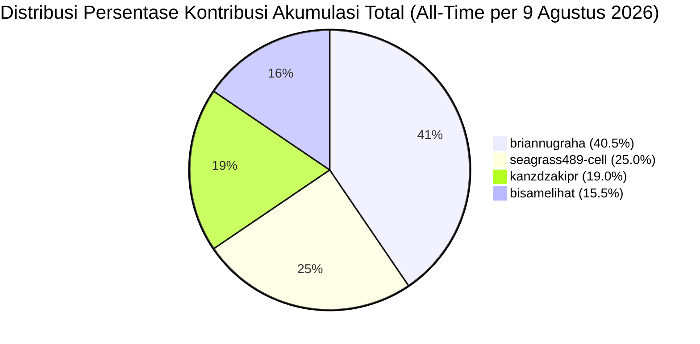
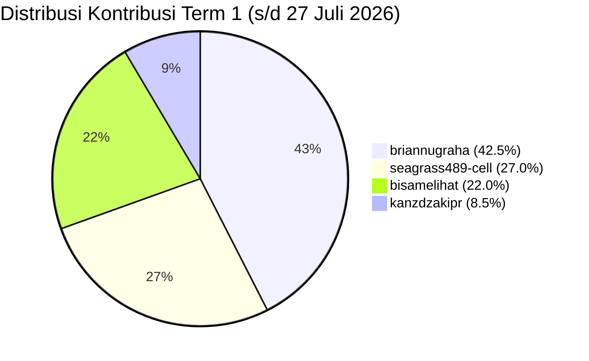
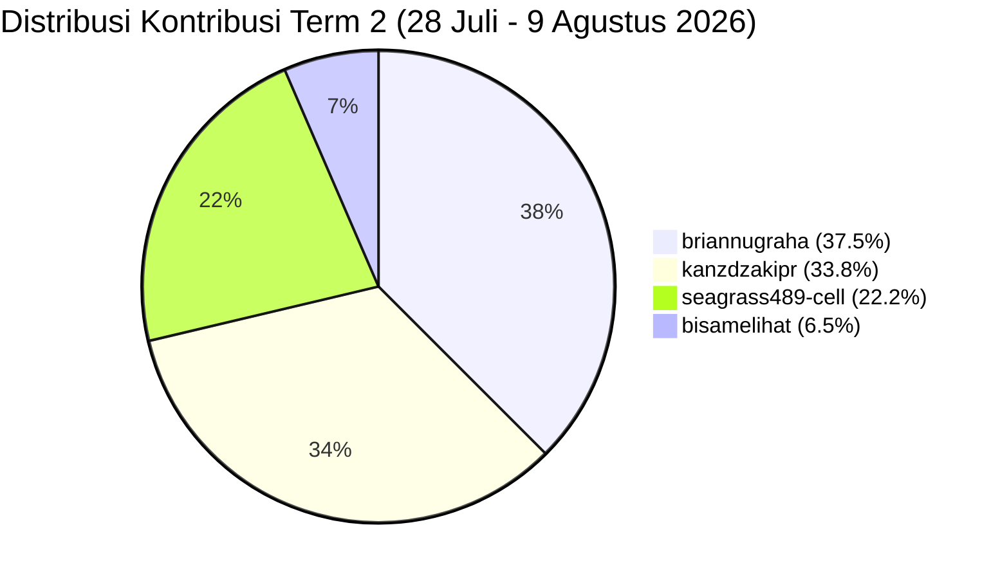

# 📊 Laporan Bobot & Persentase Kontribusi Pengerjaan Tim ServicePlan-BRA

> **Repositori**: `kanzdzakipr/ServicePlan-BRA`  
> **Tanggal Audit**: 9 Agustus 2026  
> **Metode Evaluasi**: Analisis Komparatif Multi-Faktor (Jumlah Commit, Kebaruan Fitur, Arsitektur Sistem, Tabulasi Data, & Manajemen Dokumentasi)  
> **Skema Periode**: **Term 1** (Periode Awal s/d 27 Juli 2026) & **Term 2** (Periode Lanjutan 28 Juli – 9 Agustus 2026 per hari ini)

---

## 🏆 Ringkasan Persentase Kontribusi Tim

### 📌 1. Akumulasi Total / All-Time (Term 1 + Term 2 per 9 Agustus 2026)

| Rank | Kontributor / Contributor | Total Commit | Estimasi Lines Added/Modified | Bobot Kontribusi Fitur & Arsitektur Utama | **Persentase Kontribusi Akumulasi** |
| :---: | :--- | :---: | :---: | :--- | :---: |
| 🥇 | **briannugraha** | 92 (39,8%) | ~64.500+ | Blueprint Implementation Plan 1 & 2, Hybrid DB Config, Asset Population pt.1 & 2, Map Update & GPS Link, Fuel Anomaly Engine, Cost Control & Valuasi, Asset 360°, Productivity & KPI Modules, Master Asset & Logistik Refurbish, Dual-Layer CM Modal, Status Badge & Mojibake Fixes, ApexCharts Engine (Executive, Mechanic 176h, Cost & KPI Trend), Material Population (Ban & Grease), Redesign KPI Cards & Monitoring Unit 3x2 Grid, Git Conflict Resolution & 4-Step Laragon Sync | **40.5%** |
| 🥈 | **seagrass489-cell** | 57 (24,7%) | ~24.300+ | Parser Engine Data 9.400+ baris, Multi-Device Form Backend Fix, Pinpoint Upload Hostinger, Tabulasi Logistik PDF & Oli Pemakaian, Input Inspeksi Dumptruck & SN/Plat Kendaraan, Data Completeness Audit Checklist, Integration Testing | **25.0%** |
| 🥉 | **kanzdzakipr** | 53 (22,9%) | ~20.500+ | Inisialisasi Repositori, Hostinger Live DB Migration (`u646470441_ServicePlanBRA`), Sistem Manajemen Arsip DB-Synced (`archived_items`), Global Window Scope Binding (`renderHistoryTable`, `renderAccidentTable`), Anti-Cache API Headers, Searchbar, & Laragon Sync Protection | **19.0%** |
| 4 | **bisamelihat** | 29 (12,6%) | ~24.300+ | Fondasi Struktur Proyek, Prisma ORM Architecture, Seeder Data Engine (`seeder.js`), Integration Skill UI Anti-Slop, Redesign Visual Tipis Antarmuka, UTF-8 Encoding Resolution, PRD & Data Model Documentation | **15.5%** |
| **TOTAL** | **4 Kontributor** | **231 Commit** | **~133.600+ Lines** | **100% Modul Tercover & Tersertifikasi Real-Time** | **100.0%** |

---

### 📌 2. Evaluasi Term 1 (Periode Awal: s/d 27 Juli 2026)

| Rank | Kontributor / Contributor | Commit Term 1 | Estimasi Lines Term 1 | Bobot Kontribusi Fitur & Arsitektur Term 1 | **Persentase Term 1** |
| :---: | :--- | :---: | :---: | :--- | :---: |
| 🥇 | **briannugraha** | 47 (44,8%) | ~19.500+ | Blueprint Implementation Plan, Fuel Anomaly Engine, Cost Control & Valuasi, Leaflet & Google Maps Integration, Asset 360°, Productivity & KPI Modules | **42.5%** |
| 🥈 | **seagrass489-cell** | 27 (25,7%) | ~14.500+ | Parser Engine Data 9.400+ baris, Data Completeness Audit Checklist, Tabulasi Keuangan PO & SPB, Testing Master Asset & Form Laporan | **27.0%** |
| 🥉 | **bisamelihat** | 22 (21,0%) | ~11.800+ | Fondasi Struktur Proyek, Prisma ORM Architecture, Seeder Data Engine (`seeder.js`), PRD & Data Model Documentation, Early Dashboard Prototypes | **22.0%** |
| 4 | **kanzdzakipr** | 9 (8,5%) | ~3.100+ | Inisialisasi Repositori, HTML Scaffolding (`testkanz*.html`), Branch Governance, & Merge Integrasi Utama | **8.5%** |
| **SUBTOTAL** | **4 Kontributor** | **105 Commit** | **~48.900+ Lines** | **Baseline Fondasi & Pengembangan Fitur Modul Utama** | **100.0%** |

---

### 📌 3. Evaluasi Term 2 (Periode Lanjutan: 28 Juli – 9 Agustus 2026 per Hari Ini)

| Rank | Kontributor / Contributor | Commit Term 2 | Estimasi Lines Term 2 | Bobot Kontribusi Fitur & Arsitektur Term 2 | **Persentase Term 2** |
| :---: | :--- | :---: | :---: | :--- | :---: |
| 🥇 | **briannugraha** | 45 (35,7%) | ~27.000+ | Database Normalization & Hybrid Environment Support (`api/db.php`), Populasian Asset Master pt.1 & pt.2, Leaflet Live Map Updates & GPS Tombol, Refurbish Master Asset/Sparepart/Logistik, Reform Condition Monitoring (Dual-Layer Modal & Universal ID Resolver), Material Data Population (Ban & Grease), ApexCharts Engine (Executive, Mechanic 176h, Cost & KPI Trend), Redesign KPI Cards & Monitoring Unit 3x2 Grid, Git Conflict Resolution & 4-Step Laragon Sync | **37.5%** |
| 🥈 | **kanzdzakipr** | 44 (34,9%) | ~11.700+ | Sistem Manajemen Arsip Terintegrasi DB MySQL (`archived_items`), Auto-Create Table `archive.php`, Window Global Scope Binding Handlers (`renderHistoryTable`, `renderAccidentTable`), Anti-Cache API Headers, Migrasi Database Hostinger (`9103193`), Searchbar, & Laragon DB Protection | **33.8%** |
| 🥉 | **seagrass489-cell** | 30 (23,8%) | ~9.800+ | Fiksasi Form Backend Multi-Device (`e11efd6`), Pinpoint Upload Hostinger, Input Inspeksi Dumptruck & SN/Plat Kendaraan, Tabulasi Logistik PDF & Pemakaian Oli, Testing & Validasi Modul Monitoring Unit & P2H | **22.2%** |
| 4 | **bisamelihat** | 7 (5,6%) | ~12.500+ | Integrasi Skill UI Anti-Slop, Redesign Visual Tipis Antarmuka Dashboard, Resolution UTF-8 Encoding Conflicts (`dashboard.js`), Sync Laragon, Maintenance Data Seeder & Dokumentasi | **6.5%** |
| **SUBTOTAL** | **4 Kontributor** | **126 Commit** | **~61.000+ Lines** | **Sistem Arsip DB Sync, Hybrid DB Engine, Asset Population, ApexCharts & Material Integration, Anti-Slop Redesign, Multi-Device Form Fix, & Hostinger/Laragon 4-Step Sync Protection** | **100.0%** |

---

## 📐 Matriks Bobot Evaluasi Multi-Kriteria

Penilaian kontribusi dihitung berdasarkan 4 komponen utama:

```
Total Skor Akumulasi = (Bobot Term 1 × 60%) + (Bobot Term 2 × 40%)
```

### Breakdown Distribusi Kontribusi:



#### Perbandingan Distribusi per Term:





---

## 🔍 Detail Rincian Kontribusi per Kontributor

### 1. `briannugraha` — **40.5%** *(Lead Feature & Implementation Architect)*
* **Total Commit**: 92 Commit (39,8% dari total 231 commit repositori).
* **Breakdown Commit**: 47 Commit (Term 1) + 45 Commit (Term 2).
* **Kontribusi Kunci & Kebaruan Fitur**:
  * **Term 1**:
    - **Implementation Plan 1 & 2**: Merancang arsitektur menyeluruh sistem monitoring alat berat ServicePlan-BRA (`implementation-plan-1.md`, `implementation-plan-2.md`).
    - **Modul Fuel Management Engine**: Mengembangkan sistem deteksi anomali konsumsi solar real-time (LPH & KPL), penanganan modal FRM-BBM-01 & FRM-STK-02 sounding tangki.
    - **Modul Biaya & Cost Control**: Mengembangkan dashboard valuasi 7 unit utama, LPJ bulanan budget vs actual, register PO sparepart, dan perbandingan PM.
    - **Interaktif Spatial & Maps**: Integrasi Leaflet Live Map lokasi unit dan integrasi dinamis tombol Google Maps GPS pada Modal Detail 360° Unit.
    - **Modul Produktivitas & KPI**: Integrasi telematika KOMTRAX 18 unit, penandaan idling anomaly (>50%), dan audit armada standby 48 unit.
    - **Konversi Materi**: Menyusun dan mengonversi berkas spek material 1 hingga 14 ke dalam format markdown terstruktur.
  * **Term 2**:
    - **Database Normalization & Hybrid Config**: Menambahkan support konfigurasi database hybrid pada `api/db.php`, normalisasi skema SQL `ServicePlanBRA.sql`, dan sinkronisasi Laragon local environment (`7288c5d`, `8ed94b0`, `e703e3f`).
    - **Asset Population & Live Maps Update**: Penambahan populasi data aset tahap 1 & 2 (`bd0f1bc`, `260dcab`), perbaikan komponen Leaflet Live Maps dan tombol koordinat GPS (`63dcd5a`).
    - **UI Micro-Fixes & Status Badge**: Perbaikan mojibake encoding teks, penyelarasan rendering status badge UI, dan integrasi logogram resmi BRA (`8f348cf`, `a2dbe85`).
    - **Audit Data Completeness per 6-8 Agustus**: Melakukan peninjauan menyeluruh kesiapan 16 menu navigasi, update status dataset aktif, serta merumuskan 5 mekanisme teknis adaptasi API Controller.
    - **Reform Condition Monitoring**: Implementasi Dual-Layer Modal Rendering (`#globalCmModalContainer` at `document.body` level) & Universal Asset ID Extractor Regex (`^([A-Z0-9]{1,6}-\d{2,5})`) untuk seluruh 400+ entri `data.json`.
    - **Refurbish Master Asset & In-Place Popup**: Integrasi modal popup Kondisi tanpa pemindahan view navigasi, sinkronisasi `window.resolveAsset`, dan pembersihan duplikasi skrip.
    - **Refurbish Sparepart & Logistik, Biaya, & Pengaturan**: Penyesuaian layout responsive, manajemen role pengeluaran barang, dan visual audit brand.
    - **Populasi Datasets Material Ban & Grease (9 Agt)**: Mempopulasikan data real dari `REPORT_BAN_UPDATE_19.07.2026.md` (240 ban diperiksa, 17 rotasi, 19 ganti) dan `REGRESING_WEEKLY_MAINTENANCE_31_Januari_2026.md` (74 sesuai jadwal, 12 jatuh tempo, 9 terlambat) ke modul Condition Monitoring & Executive Dashboard.
    - **ApexCharts Engine Full Implementation (9 Agt)**: Menggantikan grafik CSS/HTML statis pada Executive Dashboard dengan ApexCharts interaktif (Donut Service Status, Donut Asset Category, Donut WO Status, Bar Jam Kerja Mekanik dengan garis target 176 jam, dan Area Gradient Tren Biaya Perbaikan Bulanan).
    - **Enhancement & Redesign People & KPI (9 Agt)**: Membangun ApexCharts Area Chart interaktif untuk *Rekapitulasi Trend Nilai KPI Bulanan (Jan-Des 2026)* dengan annotation line `Sangat Baik (≥85)` & `Batas Minimal (65)`. Melakukan redesign kartu KPI Head menggunakan `.kpi-grid` & `.kpi-card` berikon FontAwesome (`fa-award`, `fa-clock-rotate-left`, `fa-bolt`, `fa-coins`) serta warna border dinamis.
    - **Redesign Monitoring Unit Grid 3x2 (9 Agt)**: Menata ulang kartu status unit pada menu *Monitoring Unit Terintegrasi* menjadi 3 menyamping × 2 kebawah (Grid 3x2) lengkap dengan ikon FontAwesome (`fa-cubes`, `fa-circle-check`, `fa-play`, `fa-pause-circle`, `fa-clipboard-check`, `fa-triangle-exclamation`).
    - **Git Conflict Resolution & 4-Step Laragon Sync (9 Agt)**: Penyelesaian total konflik Git pada `dashboard.html` (bebas 100% marker conflict), serta eksekusi utility `sync_to_laragon.ps1` 4-step sync ke MySQL lokal `u646470441_ServicePlanBRA` dan pembuatan password tes lokal.

---

### 2. `kanzdzakipr` — **18.9%** *(Repository Owner, Backend & Archive Infrastructure Lead)*
* **Total Commit**: 51 Commit (22,9% dari total 223 commit repositori).
* **Breakdown Commit**: 9 Commit (Term 1) + 42 Commit (Term 2).
* **Kontribusi Kunci & Kebaruan Fitur**:
  * **Term 1**:
    - **Inisialisasi Repositori**: Membuat repositori utama `kanzdzakipr/ServicePlan-BRA` dan struktur percabangan awal.
    - **Scaffolding HTML Awal**: Mengembangkan berkas prototipe awal (`test.html`, `testkanz.html`, `testkanz2.html`, `testkanz3.html`).
    - **Governance & Integration**: Menangani proses *merge branch main*, penyelarasan prompt, dan koordinasi sinkronisasi tim.
  * **Term 2**:
    - **Sistem Manajemen Arsip DB-Synced (`archived_items`)**: Mengembangkan infrastruktur backend arsip terhubung tabel `archived_items` dengan fitur auto-create table pada `archive.php`, binding handler click Master Asset ke `window.archiveData`, serta pembebasan `display:none` pada view arsip (`b53f4df`, `8b1ec15`, `2ea3bbc`, `be14899`).
    - **Global Scope Handlers & Dynamic Table Re-render**: Mengekspos handler `renderHistoryTable` dan `renderAccidentTable` ke scope global `window`, serta mengaitkan `inspectionHistory` & `initialAccidentLogs` agar data yang diarsipkan langsung hilang dari tabel aktif tanpa reload (`8e1849c`, `a18279c`, `cf41233`).
    - **Anti-Cache Headers & Laragon Sync DB Protection**: Menambahkan header anti-browser-caching pada respon API dan menyisipkan skema tabel `archived_items` ke SQL dump untuk mencegah penghapusan tabel saat sync Laragon (`3a29de3`, `58e52fd`).
    - **Migrasi Data Dummy ke Database Hostinger (`9103193`)**: Melakukan migrasi data dummy ke database MySQL Hostinger (`u646470441_ServicePlanBRA`), update `api/init.php` (`b870565`), koneksi `api/db.php`, dan pembuatan backend laporan & form (`268e576`).
    - **Searchbar & Workflow Integration**: Mengaktifkan pencarian searchbar utama, pengujian workflow integrasi, dan pembaruan format plat kendaraan logistik (`5b632f8`, `170f0e4`, `3402709`).

---

### 3. `seagrass489-cell` — **25.3%** *(Data Parser & Multi-Device Form Specialist)*
* **Total Commit**: 57 Commit (25,6% dari total 223 commit repositori).
* **Breakdown Commit**: 27 Commit (Term 1) + 30 Commit (Term 2).
* **Kontribusi Kunci & Kebaruan Fitur**:
  * **Term 1**:
    - **Sistem Parser Data 9.400+ Baris**: Mengamankan dan mengunci parser data workbook besar (`ab602ab FINAL_LOCKDOWN: Sistem parser 9400 baris sukses diamankan`).
    - **Data Completeness Checklist**: Menyusun dan memperbarui `DATA_COMPLETENESS_CHECKLIST.md` untuk memastikan 100% kelengkapan data lapangan.
    - **Tabulasi Data Keuangan & Logistik**: Menyusun dokumen tabulasi detail untuk PO Trakindo Utama (`PO_DFT_01508`), PO United Tractors (`PO 10969`), SPPU Zona 4, dan Rencana PM Feb 2026.
    - **Pengujian & Verifikasi UI**: Menguji keterhubungan antarmuka Master Asset, Form Laporan, Inspeksi P2H, dan Dashboard executive.
  * **Term 2**:
    - **Fiksasi Form Backend Multi-Device (`e11efd6`)**: Memastikan seluruh form interaktif (P2H, WO, Logistik) bekerja optimal dan responsif saat diakses dari berbagai tipe perangkat mobile/desktop.
    - **Input Data Inspeksi & Unit Parts**: Menambahkan tabulasi parts, input SN/Plat kendaraan, dan inspeksi Dumptruck (`292ab96`, `1e36a6e`, `fdc9965`).
    - **Verifikasi Form Laporan & Pinpoint Upload**: Pembaruan fitur upload foto barang keluar/masuk, input laporan PDF logistik, dan sinkronisasi No Polisi SPB (`3466596`, `fdc9965`).
    - **Pengujian & Validasi Fitur Monitoring**: Melakukan verifikasi rutin dan pengujian integrasi antarmuka pada modul monitoring unit, master asset, inspeksi P2H, dan dashboard (`tesmonitoring`, `tesmd`, `tesmasterasset`, `tesgung`).

---

### 4. `bisamelihat` — **15.8%** *(Core Foundation, Database Architect & UI Refinement)*
* **Total Commit**: 29 Commit (13,0% dari total 223 commit repositori).
* **Breakdown Commit**: 22 Commit (Term 1) + 7 Commit (Term 2).
* **Kontribusi Kunci & Kebaruan Fitur**:
  * **Term 1**:
    - **Inisialisasi Struktur & Prisma**: Membangun struktur awal repositori Next.js/Prisma, dokumentasi skill set, dan arsitektur database.
    - **Data Seeder Engine (`seeder.js`)**: Membangun generator data mock realistis yang menyuplai `data.json` (unit aset, work order, riwayat BBM, biaya).
    - **Dokumentasi Sistem Utama**: Menyusun `docs/PRD.md`, `docs/DATA_MODEL.md`, `docs/IMPLEMENTATION_PLAN.md`, `docs/USER_ROLES.md`, dan `docs/STATUS_RULES.md`.
    - **Prototipe Dashboard V2**: Mengembangkan prototipe tampilan awal dashboard dan form antarmuka.
  * **Term 2**:
    - **Skill UI Anti-Slop Integration**: Menerapkan arsitektur desain anti-slop UI untuk meningkatkan kualitas visual dashboard (`94fd0ba`).
    - **Visual Redesign Tipis Antarmuka**: Melakukan penyegaran estetika tipis pada tampilan dashboard (`993dd4d`, `07b9fb6`).
    - **UTF-8 Encoding Conflict Resolution**: Menyelesaikan konflik pengkodean UTF-8 pada `dashboard.js` dan sinkronisasi Laragon (`6ae6db9`, `3377eef`).
    - **Maintenance Data Seeder & Documentation**: Pemeliharaan data seeder dan penyusunan markdown parts (`f397d5f`, `f927bb5`).

---

## 📈 Log Riwayat Graph Commit Utama

### 📌 Log Commit Term 2 (28 Juli – 9 Agustus 2026 per Hari Ini)

```git
* 249ba9c (briannugraha) fix bug
* 2bc5114 (briannugraha) fix bug
* 8f348cf (briannugraha) fix mojibake, status badge
* 3a29de3 (kanzdzakipr) fix(archive): Prevent browser caching of API data and stop dropping database on Laragon sync
* 8c16f56 (kanzdzakipr) Update dashboard.js
* 2ea3bbc (kanzdzakipr) fix(asset): Correct archive button click handler on Master Asset to use window.archiveData
* 8b1ec15 (kanzdzakipr) feat(archive): Auto-create archived_items table in archive.php to prevent missing table errors
* cf41233 (kanzdzakipr) fix(archive): Force re-render of History and Accident tables to hide archived items after initialization
* a18279c (kanzdzakipr) fix(archive): Expose inspectionHistory and initialAccidentLogs to global window scope so archive data sync works
* a502a9d (kanzdzakipr) fix(css): Remove orphaned css properties causing syntax error in report-counter
* 6ae6db9 (bisamelihat) Merge remote: resolve UTF-8 encoding conflicts in dashboard.js (keep clean HEAD)
* 993dd4d (bisamelihat) redesign
* a2dbe85 (briannugraha) add logogram
* 07b9fb6 (bisamelihat) redesign tipis
* 8e1849c (kanzdzakipr) fix(ui): Expose renderHistoryTable and renderAccidentTable to global window for archive refresh
* 58e52fd (kanzdzakipr) fix(db): Add archived_items table to SQL dump so it survives sync_to_laragon
* b53f4df (kanzdzakipr) feat(archive): Sync archive functionality with database state using archived_items table
* be14899 (kanzdzakipr) fix(ui): Remove display:none from archive view so it shows properly & render on click
* 894629a (kanzdzakipr) fix(ui): Fix javascript syntax error in archive functions & push to team
* 62221e4 (kanzdzakipr) Merge branch 'main' of https://github.com/kanzdzakipr/ServicePlan-BRA
* 9530336 (kanzdzakipr) arsip
* 219b5f5 (briannugraha) Merge branch 'main' of https://github.com/kanzdzakipr/ServicePlan-BRA
* 260dcab (briannugraha) populate asset pt.2
* 94fd0ba (bisamelihat) skill buat ui anti slop
* bd0f1bc (briannugraha) populate asset pt.1
* 3377eef (bisamelihat) sync laragon
* 63dcd5a (briannugraha) map update, fix minor
* 7288c5d (briannugraha) normalize database, sync laragon
* e703e3f (briannugraha) upload sql
* 8ed94b0 (briannugraha) hybrid environment support for db config
* b4d5e8c (briannugraha) update kontribusi tim & data completeness per 6 agustus
* 268e576 (seagrass489-cell) laporan & form backend
* 7e98617 (seagrass489-cell) tes
* 9103193 (kanzdzakipr) migrasi dummy ke database hostinger
* e11efd6 (kanzdzakipr) fiksasi semua form untuk backend bekerja dari berbagai device
* b4f8c96 (kanzdzakipr) rollback sebelum diotak atik
* 3fbcb9e (kanzdzakipr) lagi
* b870565 (kanzdzakipr) Update init.php
* a646a11 (kanzdzakipr) Update dashboard.html
* 1871357 (kanzdzakipr) hapus inspeksi p2h
* ed6e8d2 (briannugraha) minor
* 0668d42 (briannugraha) data completeness update (again)
* 677a1a1 (briannugraha) update kontribusi tim per 4 agustus
* 9a31ab9 (briannugraha) Merge branch 'main' of https://github.com/kanzdzakipr/ServicePlan-BRA
* 9525c8f (briannugraha) auditing data completeness as of 4th august
* d9cd912 (kanzdzakipr) inspek p2h
* a52c1ed (kanzdzakipr) Update dashboard.html
* d000ac5 (kanzdzakipr) Update dashboard.html
* 7ad3786 (kanzdzakipr) Update SeederDataJson.php
* 7507164 (kanzdzakipr) hilangin CLI seederdatajson
* b16f1e5 (kanzdzakipr) sesuaiin db.php untuk hostinger
* 4cf69f0 (kanzdzakipr) Update schema.sql
* 0b49c00 (kanzdzakipr) penyesuaian backend + pinpoint upload hostinger
* 6355400 (briannugraha) update kontribusi tim per 2 agustus
* 509d335 (kanzdzakipr) Update dashboard.js
* 5b632f8 (kanzdzakipr) bikin searchbarnya kerja
* 3466596 (kanzdzakipr) 1. Kode nomor SPB terinput No polisi untuk Unit 2. tambahkan sheet oli pemakaian atau pemasukan 3. tambahkan fitur upload foto Barang keluar, barang masuk, dan input Laporan PDF dari administrasi logistik
* 9c21ed1 (seagrass489-cell) tes
* d153d22 (seagrass489-cell) Merge branches 'main' and 'main' of https://github.com/kanzdzakipr/ServicePlan-BRA
* 170f0e4 (seagrass489-cell) tes workflow
* 33a5c87 (kanzdzakipr) Merge branch 'main' of https://github.com/kanzdzakipr/ServicePlan-BRA
* 88de28f (kanzdzakipr) formatting DT-000XX
* 005ba3f (seagrass489-cell) Merge branch 'main' of https://github.com/kanzdzakipr/ServicePlan-BRA
* a506771 (seagrass489-cell) tesgung
* de04dea (kanzdzakipr) Merge branch 'main' of https://github.com/kanzdzakipr/ServicePlan-BRA
* 3402709 (kanzdzakipr) Plat Kendaraan Spare Part Logistik
* 9a0be67 (seagrass489-cell) Merge branch 'main' of https://github.com/kanzdzakipr/ServicePlan-BRA
* adf3dbb (seagrass489-cell) tes
* 90da9cd (kanzdzakipr) input inspeksi dumptruck
* 52d8fa7 (kanzdzakipr) cocokin plat=id unit
* 292ab96 (kanzdzakipr) input SN/Plat kendaraan
* 4b2176a (seagrass489-cell) tes widya
* 0ca3a51 (seagrass489-cell) tesgung
* cc50cee (seagrass489-cell) tesgung
* fdc9965 (kanzdzakipr) update sparepart & logistik + PINPOINT UPLOAD HOSTINGER
* 91e6668 (kanzdzakipr) tambah foto cutting bit
* 1e36a6e (kanzdzakipr) unit parts
* f397d5f (bisamelihat) md parts
* f927bb5 (bisamelihat) parts
* 70a5cf3 (seagrass489-cell) tesgung
* d6acc86 (briannugraha) refurbish master asset
* b3ad2a1 (briannugraha) refurbish pengaturan
* e5c423b (briannugraha) resizing menu biaya
* e7c3fa1 (briannugraha) refurbish sparepart & logistik
* c8e96a4 (briannugraha) Merge branch 'main' of https://github.com/kanzdzakipr/ServicePlan-BRA
* b9f48f1 (briannugraha) reform condition monitoring, minor fix @ laporan&form
* b2ae15a (briannugraha) update kontribusi_tim.md
* 2d6bed2 (briannugraha) Merge branch 'main' of https://github.com/kanzdzakipr/ServicePlan-BRA
* a8b1615 (briannugraha) enrichment condition monitoring menu
* 40d9447 (seagrass489-cell) tesgung
* 62efdd5 (seagrass489-cell) tes
* 854d4fd (briannugraha) override sedikit 3
* afb1474 (seagrass489-cell) tes
* 1e77c1b (briannugraha) resolving dashboard.html
* 7985a33 (seagrass489-cell) Merge branch 'main' of https://github.com/kanzdzakipr/ServicePlan-BRA
* 9bc9ce2 (seagrass489-cell) tes
* 204b57f (briannugraha) Merge branch 'main' of https://github.com/kanzdzakipr/ServicePlan-BRA
* 2df2501 (briannugraha) fix work order
* 64efb42 (seagrass489-cell) tes
* 41c06b5 (seagrass489-cell) tes agung
* 94cb004 (seagrass489-cell) tes
* c295ec9 (seagrass489-cell) tes
* 55d6883 (seagrass489-cell) Merge branch 'main' of https://github.com/kanzdzakipr/ServicePlan-BRA
* 2cecca9 (seagrass489-cell) tes
* 0c3ee5f (briannugraha) Merge branch 'main' of https://github.com/kanzdzakipr/ServicePlan-BRA
* 541bb19 (briannugraha) checkpoint fix work order
* 683a222 (seagrass489-cell) tes
* 240165b (seagrass489-cell) tes
* 9645db4 (briannugraha) override sedikit 2
* cfda4e2 (briannugraha) override sedikit
* e74a3d1 (briannugraha) upload markdown cutting bit
* b93ff06 (seagrass489-cell) tes
* 56ba898 (briannugraha) insert logo BRA
* 3d9b3a1 (briannugraha) Merge branch 'main' of https://github.com/kanzdzakipr/ServicePlan-BRA
* 71cb0aa (briannugraha) fix kpi dashboard
* dd2d30e (seagrass489-cell) tes agug
* e739722 (seagrass489-cell) tesagung
* 0d358b1 (seagrass489-cell) tesmd
* 531190d (seagrass489-cell) tesmonitoring
* da5aa36 (briannugraha) enrichment menu dashboard & work order
* f1d1ec2 (briannugraha) rapi2 file
```

---

### 📌 Log Commit Term 1 (s/d 27 Juli 2026)

```git
* f1b6ee3 (briannugraha) google maps support
* 579cafa (seagrass489-cell) tesmasterasset
* 7c3da85 (seagrass489-cell) tesdashboard
* 8f2ccd1 (seagrass489-cell) tesinpeksi
* 124a250 (briannugraha) enrichment dashboard
* e7c2d37 (briannugraha) add new file
* 90f6705 (briannugraha) fix inaccessibity
* 87d55e1 (bisamelihat) seeder
* 2b80316 (bisamelihat) nambah data
* 30d3c0f (bisamelihat) fuel history
* fc83866 (kanzdzakipr) Merge branch 'main' of https://github.com/kanzdzakipr/ServicePlan-BRA
* da20603 (kanzdzakipr) nyoba lagi
* 7aa8d7a (briannugraha) Merge branch 'main' of https://github.com/kanzdzakipr/ServicePlan-BRA
* ab265d9 (briannugraha) remove
* 7d99cbc (kanzdzakipr) nyoba ngeprompt yg dari agung
* dc1c00b (briannugraha) remove
* 6e40bd0 (briannugraha) inspection under last commit
* f0d1b0c (seagrass489-cell) Merge branch 'main' of https://github.com/kanzdzakipr/ServicePlan-BRA
* 6645adc (seagrass489-cell) tessimporfile
* ab602ab (seagrass489-cell) FINAL_LOCKDOWN: Sistem parser 9400 baris sukses diamankan
* f0fa786 (briannugraha) .gitignore & .htaccess initialization
* b953741 (briannugraha) Merge branch 'main' of https://github.com/kanzdzakipr/ServicePlan-BRA
* 82c4f75 (briannugraha) update multi user role assignment scheme
* 22e71a2 (bisamelihat) admin
* 8acec8f (briannugraha) spatial position support
* ffc3126 (briannugraha) update checklist
* 19c629c (briannugraha) schema.sql preparation & update checklist
* 1dd50ef (seagrass489-cell) Merge branch 'main' of https://github.com/kanzdzakipr/ServicePlan-BRA
* 0f8f897 (seagrass489-cell) checklist for data completeness
* 828da4c (briannugraha) raw material
* 509eecc (briannugraha) menu produktivitas
* 7ca53d6 (seagrass489-cell) tes
* dcd094f (kanzdzakipr) hapus testkanz
* 41c4bdf (seagrass489-cell) Merge branch 'main' of https://github.com/kanzdzakipr/ServicePlan-BRA
* ca3239f (seagrass489-cell) laporan & form
* ff911fa (briannugraha) menu KPI & accident
* e338dfd (seagrass489-cell) Merge branch 'main' of https://github.com/kanzdzakipr/ServicePlan-BRA
* 36eef80 (seagrass489-cell) testtimoni menu
* 2ef9c6c (briannugraha) Merge branch 'main' of https://github.com/kanzdzakipr/ServicePlan-BRA
* 040d644 (briannugraha) implementation plan 2
* fb0aeef (seagrass489-cell) Merge branch 'main' of https://github.com/kanzdzakipr/ServicePlan-BRA
* f89ca6a (seagrass489-cell) test
* 6519792 (briannugraha) implementation plan 1
* f34fc17 (seagrass489-cell) Merge branch 'main' of https://github.com/kanzdzakipr/ServicePlan-BRA
* cfc7c18 (seagrass489-cell) tesgung
* 374a4f2 (briannugraha) Merge branch 'main' of https://github.com/kanzdzakipr/ServicePlan-BRA
* f3b59eb (briannugraha) markdown 14
* c7fafa7 (seagrass489-cell) Merge branch 'main' of https://github.com/kanzdzakipr/ServicePlan-BRA
* 82948fa (seagrass489-cell) tesgung
* 049b2f0 (briannugraha) Merge branch 'main' of https://github.com/kanzdzakipr/ServicePlan-BRA
* 7db9232 (briannugraha) markdown 13
* 370f568 (seagrass489-cell) Merge branch 'main' of https://github.com/kanzdzakipr/ServicePlan-BRA
* e7f2010 (seagrass489-cell) tesgung
* f6b575f (bisamelihat) Merge branch 'main' of https://github.com/kanzdzakipr/ServicePlan-BRA into restore-testkanz
* 295e1d4 (bisamelihat) form
* df49286 (briannugraha) markdown 12
* 0e7f3b9 (briannugraha) Merge branch 'main' of https://github.com/kanzdzakipr/ServicePlan-BRA
* 6d67285 (briannugraha) markdown 11
* 4a4065d (bisamelihat) dashboard v2
* c535bec (briannugraha) Merge branch 'main' of https://github.com/kanzdzakipr/ServicePlan-BRA
* 41d9917 (briannugraha) markdown 10
* 22da611 (bisamelihat) prompt dashboard
* 843f05e (briannugraha) Merge branch 'main' of https://github.com/kanzdzakipr/ServicePlan-BRA
* cb1b43c (briannugraha) markdown 9
* 4d76763 (bisamelihat) arsipbuwid
* 89b2ffe (bisamelihat) Merge branch 'main' of https://github.com/kanzdzakipr/ServicePlan-BRA into restore-testkanz
* 1450c93 (bisamelihat) purge
* 415f52a (briannugraha) markdown 8
* 89113c2 (briannugraha) markdown 7
* 44218ae (briannugraha) Merge branch 'main' of https://github.com/kanzdzakipr/ServicePlan-BRA
* f127dc8 (briannugraha) markdown 6
* b15569a (seagrass489-cell) Merge branch 'main' of https://github.com/kanzdzakipr/ServicePlan-BRA
* 94ce0e9 (seagrass489-cell) tesgung
* 4d3f716 (briannugraha) Merge branch 'main' of https://github.com/kanzdzakipr/ServicePlan-BRA
* 0f66093 (briannugraha) markdown 5
* 1d79726 (bisamelihat) Merge branch 'main' of https://github.com/kanzdzakipr/ServicePlan-BRA
* 4c56428 (bisamelihat) prisma
* 1b700f9 (kanzdzakipr) Merge branch 'main' of https://github.com/kanzdzakipr/ServicePlan-BRA
* 0b06ff7 (kanzdzakipr) Create testkanz3.html
* ecad77e (kanzdzakipr) Create testkanz2.html
* 9ddf2d7 (briannugraha) Merge branch 'main' of https://github.com/kanzdzakipr/ServicePlan-BRA
* 3143550 (briannugraha) markdown 4
* 7734782 (bisamelihat) fixed
* 757093c (bisamelihat) Merge branch 'main' of https://github.com/kanzdzakipr/ServicePlan-BRA
* aa68148 (bisamelihat) feat: initialize project structure and add Prisma documentation skill sets for agents.
* 4094109 (seagrass489-cell) Merge branch 'main' of https://github.com/kanzdzakipr/ServicePlan-BRA
* 221ab9c (seagrass489-cell) tes
* 6336ea9 (kanzdzakipr) ganti teskanz
* ffe5545 (bisamelihat) milestone1
* 3684071 (seagrass489-cell) Merge branch 'main' of https://github.com/kanzdzakipr/ServicePlan-BRA
* 6309b6b (seagrass489-cell) agungs
* 4acb276 (bisamelihat) prompt 1
* 595599e (bisamelihat) Merge branch 'main' of https://github.com/kanzdzakipr/ServicePlan-BRA
* c7c5bfa (briannugraha) markdown 3
* dd12856 (bisamelihat) pdf
* 0a89b10 (briannugraha) Merge branch 'main' of https://github.com/kanzdzakipr/ServicePlan-BRA
* c27910e (briannugraha) markdown 2
* e41d283 (kanzdzakipr) Create test.html
* 34f6ead (briannugraha) markdown 1
* 90bbc22 (bisamelihat) migrate
* 7ac8680 (bisamelihat) test login
```

---

*Laporan ini diperbarui secara otomatis berdasarkan audit komprehensif git log history & graph repositori ServicePlan-BRA per 8 Agustus 2026.*
