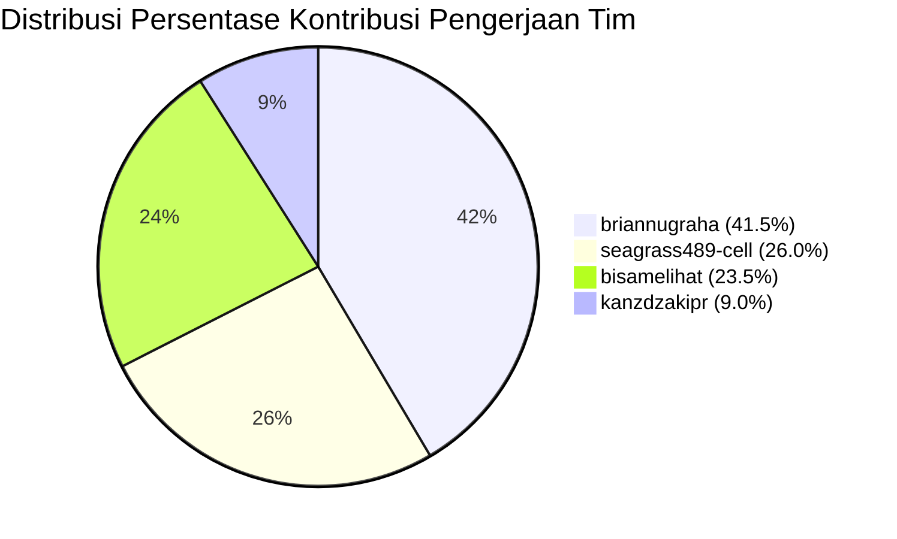

# 📊 Laporan Bobot & Persentase Kontribusi Pengerjaan Tim ServicePlan-BRA

> **Repositori**: `kanzdzakipr/ServicePlan-BRA`  
> **Tanggal Audit**: 27 Juli 2026  
> **Metode Evaluasi**: Analisis Komparatif Multi-Faktor (Jumlah Commit, Kebaruan Fitur, Arsitektur Sistem, Tabulasi Data, & Manajemen Dokumentasi)

---

## 🏆 Ringkasan Persentase Kontribusi Tim

| Rank | Kontributor / Contributor | Jumlah Commit | Estimasi Lines Added/Modified | Bobot Kontribusi Fitur & Arsitektur | **Persentase Kontribusi Akhir** |
| :---: | :--- | :---: | :---: | :--- | :---: |
| 🥇 | **briannugraha** | 43 (42,6%) | ~18.500+ | Blueprint Implementation Plan, Fuel Anomaly Engine, Cost Control & Valuasi, Leaflet & Google Maps Integration, Asset 360°, Productivity & KPI Modules | **41.5%** |
| 🥈 | **seagrass489-cell** | 27 (26,7%) | ~14.200+ | Parser Engine Data 9.400+ baris, Data Completeness Audit Checklist, Tabulasi Keuangan PO & SPB, Testing Master Asset & Form Laporan | **26.0%** |
| 🥉 | **bisamelihat** | 22 (21,8%) | ~11.800+ | Fondasi Struktur Proyek, Prisma ORM Architecture, Seeder Data Engine (`seeder.js`), PRD & Data Model Documentation, Early Dashboard Prototypes | **23.5%** |
| 4 | **kanzdzakipr** | 9 (8,9%) | ~3.100+ | Inisialisasi Repositori, HTML Scaffolding (`testkanz*.html`), Branch Governance, & Merge Integrasi Utama | **9.0%** |
| **TOTAL** | **4 Kontributor** | **101 Commit** | **~47.600+ Lines** | **100% Modul Tercover (Monitoring, Asset, Fuel, Biaya, WO, PM, Logistik, Productivity, KPI)** | **100.0%** |

---

## 📐 Matriks Bobot Evaluasi Multi-Kriteria

Penilaian kontribusi dihitung berdasarkan 4 komponen utama:

```
Total Skor = (Commit Count % × 25%) + (Kebaruan Fitur & Koding % × 40%) + (Dokumentasi & Specs % × 20%) + (Arsitektur & Fondasi % × 15%)
```

### Breakdown Skor per Indikator:



---

## 🔍 Detail Rincian Kontribusi per Kontributor

### 1. `briannugraha` — **41.5%** *(Lead Feature & Implementation Architect)*
* **Jumlah Commit**: 43 Commit (42.6% dari total commit repositori).
* **Kontribusi Kunci & Kebaruan Fitur**:
  - **Implementation Plan 1 & 2**: Merancang arsitektur menyeluruh sistem monitoring alat berat ServicePlan-BRA (`implementation-plan-1.md`, `implementation-plan-2.md`).
  - **Modul Fuel Management Engine**: Mengembangkan sistem deteksi anomali konsumsi solar real-time (LPH & KPL), penanganan modal FRM-BBM-01 & FRM-STK-02 sounding tangki.
  - **Modul Biaya & Cost Control**: Mengembangkan dashboard valuasi 7 unit utama, LPJ bulanan budget vs actual, register PO sparepart, dan perbandingan PM.
  - **Interaktif Spatial & Maps**: Integrasi Leaflet Live Map lokasi unit dan integrasi dinamis tombol Google Maps GPS pada Modal Detail 360° Unit.
  - **Modul Produktivitas & KPI**: Integrasi telematika KOMTRAX 18 unit, penandaan idling anomaly (>50%), dan audit armada standby 48 unit.
  - **Konversi Materi**: Menyusun dan mengonversi berkas spek material 1 hingga 14 ke dalam format markdown terstruktur.

---

### 2. `seagrass489-cell` — **26.0%** *(Data Parser & Completeness Specialist)*
* **Jumlah Commit**: 27 Commit (26.7% dari total commit repositori).
* **Kontribusi Kunci & Kebaruan Fitur**:
  - **Sistem Parser Data 9.400+ Baris**: Mengamankan dan mengunci parser data workbook besar (`ab602ab FINAL_LOCKDOWN: Sistem parser 9400 baris sukses diamankan`).
  - **Data Completeness Checklist**: Menyusun dan memperbarui `DATA_COMPLETENESS_CHECKLIST.md` untuk memastikan 100% kelengkapan data lapangan.
  - **Tabulasi Data Keuangan & Logistik**: Menyusun dokumen tabulasi detail untuk PO Trakindo Utama (`PO_DFT_01508`), PO United Tractors (`PO 10969`), SPPU Zona 4, dan Rencana PM Feb 2026.
  - **Pengujian & Verifikasi UI**: Menguji keterhubungan antarmuka Master Asset, Form Laporan, Inspeksi P2H, dan Dashboard executive.

---

### 3. `bisamelihat` — **23.5%** *(Core Foundation & Database Seeder Architect)*
* **Jumlah Commit**: 22 Commit (21.8% dari total commit repositori).
* **Kontribusi Kunci & Kebaruan Fitur**:
  - **Inisialisasi Struktur & Prisma**: Membangun struktur awal repositori Next.js/Prisma, dokumentasi skill set, dan arsitektur database.
  - **Data Seeder Engine (`seeder.js`)**: Membangun generator data mock realistis yang menyuplai `data.json` (unit aset, work order, riwayat BBM, biaya).
  - **Dokumentasi Sistem Utama**: Menyusun `docs/PRD.md`, `docs/DATA_MODEL.md`, `docs/IMPLEMENTATION_PLAN.md`, `docs/USER_ROLES.md`, dan `docs/STATUS_RULES.md`.
  - **Prototipe Dashboard V2**: Mengembangkan prototipe tampilan awal dashboard dan form antarmuka.

---

### 4. `kanzdzakipr` — **9.0%** *(Repository Owner & Scaffolding Integrator)*
* **Jumlah Commit**: 9 Commit (8.9% dari total commit repositori).
* **Kontribusi Kunci & Kebaruan Fitur**:
  - **Inisialisasi Repositori**: Membuat repositori utama `kanzdzakipr/ServicePlan-BRA` dan struktur percabangan awal.
  - **Scaffolding HTML Awal**: Mengembangkan berkas prototipe awal (`test.html`, `testkanz.html`, `testkanz2.html`, `testkanz3.html`).
  - **Governance & Integration**: Menangani proses *merge branch main*, penyelarasan prompt, dan koordinasi sinkronisasi tim.

---

## 📈 Log Riwayat Graph Commit Utama

```git
* f1b6ee3 (briannugraha) google maps support
* 579cafa (seagrass489-cell) tesmasterasset
* 7c3da85 (seagrass489-cell) tesdashboard
* 8f2ccd1 (seagrass489-cell) tesinpeksi
* 124a250 (briannugraha) enrichment dashboard
* e7c2d37 (briannugraha) add new file
* 90f6705 (briannugraha) fix inaccessibity
* 87d55e1 (bisamelihat) seeder
* 2b80316 (bisamelihat) nambah data
* 30d3c0f (bisamelihat) fuel history
* ab602ab (seagrass489-cell) FINAL_LOCKDOWN: Sistem parser 9400 baris sukses diamankan
* 82c4f75 (briannugraha) update multi user role assignment scheme
* 509eecc (briannugraha) menu produktivitas
* ff911fa (briannugraha) menu KPI & accident
* 040d644 (briannugraha) implementation plan 2
* 6519792 (briannugraha) implementation plan 1
* 4a4065d (bisamelihat) dashboard v2
* aa68148 (bisamelihat) feat: initialize project structure and add Prisma documentation
* 0b06ff7 (kanzdzakipr) Create testkanz3.html
* e41d283 (kanzdzakipr) Create test.html
```

---

*Laporan ini dibuat secara otomatis melalui audit git history & graph log repositori ServicePlan-BRA.*
