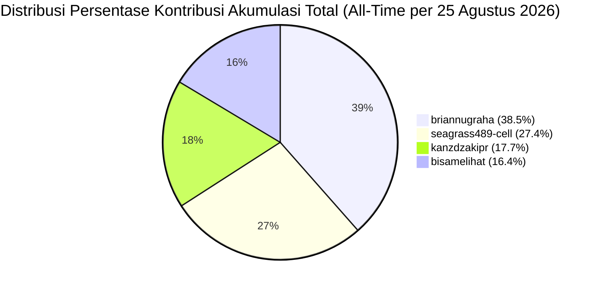
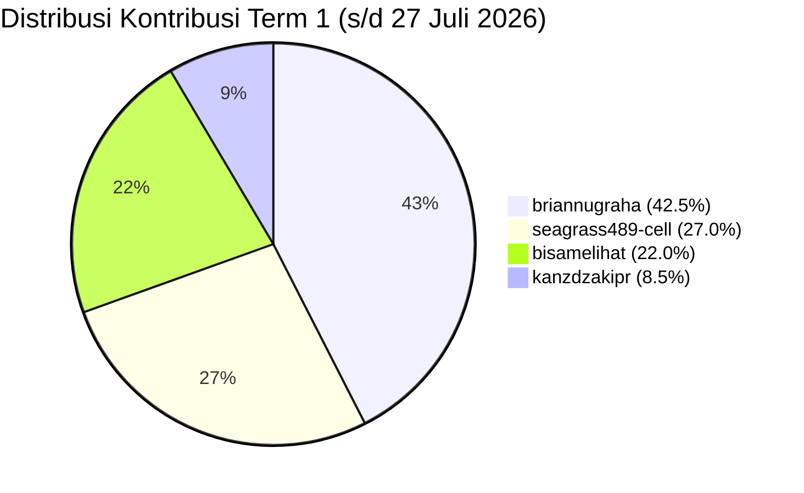
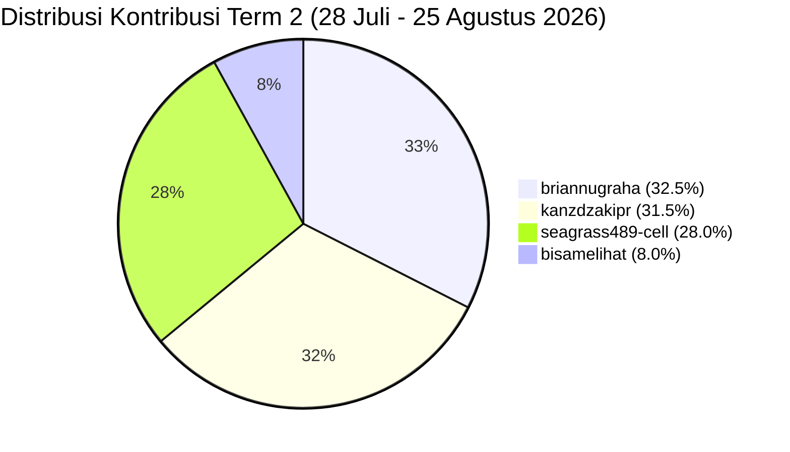

# 📊 Laporan Bobot & Persentase Kontribusi Pengerjaan Tim ServicePlan-BRA

> **Repositori**: `kanzdzakipr/ServicePlan-BRA`  
> **Tanggal Audit**: 25 Agustus 2026  
> **Basis Audit Git**: `fb9bd48` (`main`/`origin/main`, 25 Agustus 2026 07:50 WIB)  
> **Metode Evaluasi**: Analisis Komparatif Multi-Faktor (jumlah commit, deliverable fitur, dampak arsitektur, risiko produksi yang ditutup, pengujian, data, dan dokumentasi). Angka `Git Numstat` dihitung dari commit non-merge dan dipakai sebagai bukti volume, bukan sebagai satu-satunya penentu bobot.  
> **Skema Periode**: **Term 1** (Periode Awal s/d 27 Juli 2026) & **Term 2** (Periode Lanjutan 28 Juli – 25 Agustus 2026 per hari ini)  

---

## 🏆 Ringkasan Persentase Kontribusi Tim

### 📌 1. Akumulasi Total / All-Time (Term 1 + Term 2 per 25 Agustus 2026)

| Rank | Kontributor / Contributor | Total Commit | Git Numstat `+ / -` (non-merge) | Bobot Kontribusi Fitur & Arsitektur Utama | **Persentase Kontribusi Akumulasi** |
| :---: | :--- | :---: | :---: | :--- | :---: |
| 🥇 | **briannugraha** | 99 (36,8%) | +109.791 / -46.791 | Blueprint Implementation Plan 1 & 2, Hybrid DB Config, Asset Population, Live Map & GPS, Fuel Anomaly Engine, Cost Control, Asset 360°, Productivity & KPI, ApexCharts Engine & Chart Interactivity, Notification System, Monitoring Unit, RBAC Master Bypass, dan sinkronisasi Laragon/hosting | **38.5%** |
| 🥈 | **seagrass489-cell** | 69 (25,7%) | +68.053 / -18.189 | Parser Engine 9.400+ baris, data completeness, backend laporan/form, arsitektur security server-side, authentication/session/CSRF/CORS/RBAC, object authorization lintas API, upload hardening, attack simulation, automated security tests, dan CI quality gate | **27.4%** |
| 🥉 | **kanzdzakipr** | 65 (24,2%) | +10.944 / -6.420 | Inisialisasi repositori, implementasi RBAC 10 roles & navigation guards, WO target status & autofill workflow, downtime split target/actual & overdue styling, monitoring cards active filter & global reset, maintenance routing, sistem arsip DB-synced, migrasi Hostinger, anti-cache API, dan proteksi sinkronisasi Laragon | **17.7%** |
| 4 | **bisamelihat** | 36 (13,4%) | +87.220 / -65.317 | Fondasi struktur proyek, Prisma/seeder architecture, dokumentasi model sistem, prototipe dashboard, integrasi skill UI anti-slop, sprint UI overhaul A1–A9 (interaktivitas chart drilldown, filter status service berkala), dan resolusi konflik UTF-8 | **16.4%** |
| **TOTAL** | **4 Kontributor** | **269 Commit** | **+276.008 / -136.717** | **Skor dinormalisasi menjadi 100% berdasarkan bukti Git dan dampak deliverable** | **100.0%** |

---

### 📌 2. Evaluasi Term 1 (Periode Awal: s/d 27 Juli 2026)

| Rank | Kontributor / Contributor | Commit Term 1 | Git Numstat `+ / -` (non-merge) | Bobot Kontribusi Fitur & Arsitektur Term 1 | **Persentase Term 1** |
| :---: | :--- | :---: | :---: | :--- | :---: |
| 🥇 | **briannugraha** | 45 (43,7%) | +55.120 / -10.289 | Blueprint Implementation Plan, Fuel Anomaly Engine, Cost Control & Valuasi, Leaflet & Google Maps Integration, Asset 360°, Productivity & KPI Modules | **42.5%** |
| 🥈 | **seagrass489-cell** | 27 (26,2%) | +24.875 / -331 | Parser Engine Data 9.400+ baris, Data Completeness Audit Checklist, Tabulasi Keuangan PO & SPB, Testing Master Asset & Form Laporan | **27.0%** |
| 🥉 | **bisamelihat** | 22 (21,4%) | +59.249 / -49.334 | Fondasi Struktur Proyek, Prisma ORM Architecture, Seeder Data Engine (`seeder.js`), PRD & Data Model Documentation, Early Dashboard Prototypes | **22.0%** |
| 4 | **kanzdzakipr** | 9 (8,7%) | +2.491 / -1.697 | Inisialisasi Repositori, HTML Scaffolding (`testkanz*.html`), Branch Governance, & Merge Integrasi Utama | **8.5%** |
| **SUBTOTAL** | **4 Kontributor** | **103 Commit** | **+141.735 / -61.651** | **Baseline Fondasi & Pengembangan Fitur Modul Utama** | **100.0%** |

---

### 📌 3. Evaluasi Term 2 (Periode Lanjutan: 28 Juli – 25 Agustus 2026 per Hari Ini)

| Rank | Kontributor / Contributor | Commit Term 2 | Git Numstat `+ / -` (non-merge) | Bobot Kontribusi Fitur & Arsitektur Term 2 | **Persentase Term 2** |
| :---: | :--- | :---: | :---: | :--- | :---: |
| 🥇 | **briannugraha** | 54 (32,5%) | +54.671 / -36.502 | Hybrid DB, asset population, live maps, Condition Monitoring dual-layer, material Ban & Grease, ApexCharts engine & interactive filtering, People & KPI, notification system, Executive Dashboard, Monitoring Unit grid 3x2, RBAC master bypass, dan hosting/Laragon sync | **32.5%** |
| 🥈 | **kanzdzakipr** | 56 (33,7%) | +8.453 / -4.723 | RBAC 10 roles & navigation guards, WO target status & autofill workflow, split downtime target vs actual & overdue styling, maintenance type routing, monitoring cards active filter & click reset, asset mapping schemas, sistem arsip MySQL `archived_items`, migrasi Hostinger, anti-cache API, dan Laragon DB protection | **31.5%** |
| 🥉 | **seagrass489-cell** | 42 (25,3%) | +43.178 / -17.858 | Backend laporan/form, security audit & remediation, server-side authentication, secure session, CSRF/CORS, RBAC, object-level authorization pada API, secure upload/download, deployment hardening, automated security test suite, dan GitHub Actions quality gate | **28.0%** |
| 4 | **bisamelihat** | 14 (8,4%) | +27.971 / -15.983 | Sprint UI overhaul A1–A9 (interaktivitas chart drilldown, filter status service berkala, refinement dashboard & monitoring), integrasi skill UI anti-slop, resolusi konflik UTF-8, serta sinkronisasi Laragon & maintenance seeder | **8.0%** |
| **SUBTOTAL** | **4 Kontributor** | **166 Commit** | **+134.273 / -75.066** | **RBAC engine & navigation guards, WO workflow enhancement, UI overhaul A1-A9, security architecture & CI, sistem arsip DB, hybrid DB, ApexCharts interactivity, dan Hostinger/Laragon sync** | **100.0%** |

---

## 📐 Matriks Bobot Evaluasi Multi-Kriteria

Penilaian kontribusi menggunakan dua lapisan bukti:

1. **Bukti kuantitatif Git**: jumlah commit, commit non-merge, serta `numstat` penambahan/penghapusan baris.
2. **Dampak deliverable**: keluasan modul, kebaruan fitur, keputusan arsitektur, risiko produksi yang ditutup, pengujian otomatis, data, dan dokumentasi.

Snapshot bukti kuantitatif Term 2 yang dipakai pada audit per 25 Agustus 2026:

| Kontributor | Porsi semua commit | Porsi commit non-merge | Porsi lines added | Skor Term 2 setelah audit deliverable |
| :--- | ---: | ---: | ---: | ---: |
| **briannugraha** | 32,5% | 36,9% | 40,7% | **32,5%** |
| **kanzdzakipr** | 33,7% | 41,8% | 6,3% | **31,5%** |
| **seagrass489-cell** | 25,3% | 28,7% | 32,2% | **28,0%** |
| **bisamelihat** | 8,4% | 9,8% | 20,8% | **8,0%** |

`Lines added` tidak langsung disamakan dengan kontribusi karena dapat terdistorsi oleh impor data, pemindahan file, hasil generator, atau reformat besar. Skor akhir menormalkan bukti Git dengan dampak deliverable yang dapat diuji dan digunakan.

Formula bobot periode akumulasi:

```
Total Skor Akumulasi = (Bobot Term 1 × 60%) + (Bobot Term 2 × 40%)
```

### Breakdown Distribusi Kontribusi:



#### Perbandingan Distribusi per Term:





---

## 🔍 Detail Rincian Kontribusi per Kontributor

### 1. `briannugraha` — **38.5%** *(Lead Feature & Implementation Architect)*
* **Total Commit**: 99 Commit (36,8% dari total 269 commit repositori).
* **Breakdown Commit**: 45 Commit (Term 1) + 54 Commit (Term 2).
* **Kontribusi Kunci & Kebaruan Fitur**:
  * **Term 1**:
    - **Implementation Plan 1 & 2**: Merancang arsitektur menyeluruh sistem monitoring alat berat ServicePlan-BRA (`implementation-plan-1.md`, `implementation-plan-2.md`).
    - **Modul Fuel Management Engine**: Mengembangkan sistem deteksi anomali konsumsi solar real-time (LPH & KPL), penanganan modal FRM-BBM-01 & FRM-STK-02 sounding tangki.
    - **Modul Biaya & Cost Control**: Mengembangkan dashboard valuasi 7 unit utama, LPJ bulanan budget vs actual, register PO sparepart, dan perbandingan PM.
    - **Interaktif Spatial & Maps**: Integrasi Leaflet Live Map lokasi unit dan integrasi dinamis tombol Google Maps GPS pada Modal Detail 360° Unit.
    - **Modul Produktivitas & KPI**: Integrasi telematika KOMTRAX 18 unit, penandaan idling anomaly (>50%), dan audit armada standby 48 unit.
    - **Konversi Materi**: Menyusun dan mengonversi berkas spek material 1 hingga 14 ke dalam format markdown terstruktur.
  * **Term 2**:
    - **Database Normalization & Hybrid Config**: Menambahkan support konfigurasi database hybrid pada `api/db.php`, normalisasi skema SQL `ServicePlanBRA.sql`, dan sinkronisasi Laragon local environment (`7288c5d`, `8ed94b0`, `e703e3f`).
    - **Asset Population & Live Maps Update**: Penambahan populasi data aset tahap 1 & 2 (`bd0f1bc`, `260dcab`), perbaikan komponen Leaflet Live Maps dan tombol koordinat GPS (`63dcd5a`).
    - **UI Micro-Fixes & Status Badge**: Perbaikan mojibake encoding teks, penyelarasan rendering status badge UI, dan integrasi logogram resmi BRA (`8f348cf`, `a2dbe85`).
    - **Audit Data Completeness per 6-8 Agustus**: Melakukan peninjauan menyeluruh kesiapan 16 menu navigasi, update status dataset aktif, serta merumuskan 5 mekanisme teknis adaptasi API Controller.
    - **Reform Condition Monitoring**: Implementasi Dual-Layer Modal Rendering (`#globalCmModalContainer` at `document.body` level) & Universal Asset ID Extractor Regex (`^([A-Z0-9]{1,6}-\d{2,5})`) untuk seluruh 400+ entri `data.json`.
    - **Refurbish Master Asset & In-Place Popup**: Integrasi modal popup Kondisi tanpa pemindahan view navigasi, sinkronisasi `window.resolveAsset`, dan pembersihan duplikasi skrip.
    - **Refurbish Sparepart & Logistik, Biaya, & Pengaturan**: Penyesuaian layout responsive, manajemen role pengeluaran barang, dan visual audit brand.
    - **Populasi Datasets Material Ban & Grease (9 Agt)**: Mempopulasikan data real dari `REPORT_BAN_UPDATE_19.07.2026.md` (240 ban diperiksa, 17 rotasi, 19 ganti) dan `REGRESING_WEEKLY_MAINTENANCE_31_Januari_2026.md` (74 sesuai jadwal, 12 jatuh tempo, 9 terlambat) ke modul Condition Monitoring & Executive Dashboard.
    - **ApexCharts Engine Full Implementation & Linkage**: Menggantikan grafik CSS/HTML statis pada Executive Dashboard dengan ApexCharts interaktif (Donut Service Status, Donut Asset Category, Donut WO Status, Bar Jam Kerja Mekanik dengan garis target 176 jam, dan Area Gradient Tren Biaya Perbaikan Bulanan), serta linkage klik slice/legend chart ke filter tabel monitoring.
    - **Enhancement & Redesign People & KPI**: Membangun ApexCharts Area Chart interaktif untuk *Rekapitulasi Trend Nilai KPI Bulanan (Jan-Des 2026)* dengan annotation line `Sangat Baik (≥85)` & `Batas Minimal (65)`. Melakukan redesign kartu KPI Head menggunakan `.kpi-grid` & `.kpi-card` berikon FontAwesome (`fa-award`, `fa-clock-rotate-left`, `fa-bolt`, `fa-coins`) serta warna border dinamis.
    - **Redesign Monitoring Unit Grid 3x2**: Menata ulang kartu status unit pada menu *Monitoring Unit Terintegrasi* menjadi 3 menyamping × 2 kebawah (Grid 3x2) lengkap dengan ikon FontAwesome.
    - **RBAC Master Bypass & Admin Access Fix (`21cb18a`)**: Memastikan akun Administrator memiliki hak akses master penuh ke seluruh modul, implementasi fallback role auto-detection, dan proteksi event guard navigasi.
    - **Git Conflict Resolution & Laragon Sync Utility**: Penyelesaian konflik Git pada `dashboard.html` serta eksekusi utility `sync_to_laragon.ps1` 4-step sync ke MySQL lokal `u646470441_ServicePlanBRA`.

---

### 2. `seagrass489-cell` — **27.4%** *(Data Engineering, Security Architecture & Quality Lead)*
* **Total Commit**: 69 Commit (25,7% dari total 269 commit repositori).
* **Breakdown Commit**: 27 Commit (Term 1) + 42 Commit (Term 2).
* **Kontribusi Kunci & Kebaruan Fitur**:
  * **Term 1**:
    - **Sistem Parser Data 9.400+ Baris**: Mengamankan dan mengunci parser data workbook besar (`ab602ab FINAL_LOCKDOWN: Sistem parser 9400 baris sukses diamankan`).
    - **Data Completeness Checklist**: Menyusun dan memperbarui `DATA_COMPLETENESS_CHECKLIST.md` untuk memastikan 100% kelengkapan data lapangan.
    - **Tabulasi Data Keuangan & Logistik**: Menyusun dokumen tabulasi detail untuk PO Trakindo Utama (`PO_DFT_01508`), PO United Tractors (`PO 10969`), SPPU Zona 4, dan Rencana PM Feb 2026.
    - **Pengujian & Verifikasi UI**: Menguji keterhubungan antarmuka Master Asset, Form Laporan, Inspeksi P2H, dan Dashboard executive.
  * **Term 2**:
    - **Backend Laporan & Form (`268e576`)**: Mengembangkan integrasi backend untuk modul laporan dan form operasional agar data tidak berhenti pada state browser saja.
    - **Security Audit & Threat Modeling (`d045e01`, `75e6468`)**: Menyusun audit menyeluruh terhadap authentication, authorization, injection, file handling, database privilege, secrets, dependency, dan production readiness; melengkapinya dengan attack-simulation checklist berbasis bukti PASS/FAIL.
    - **Server-Side Authentication & Session Security (`d045e01`)**: Membangun `api/auth.php`, shared security bootstrap `api/security.php`, adaptive password hashing, session regeneration, idle/absolute timeout, CSRF token, CORS allowlist, dan logout server-side.
    - **RBAC & Route Authorization (`d045e01`, `9e198d5`)**: Menerapkan permission matrix deny-by-default, migrasi RBAC, serta object/location authorization pada controller aset, work order, laporan, logistik, inspeksi, fuel, PM, accident, archive, init, dan sync.
    - **Credential & Deployment Hardening (`a2f0367`, `e7bdd38`)**: Memindahkan konfigurasi sensitif ke environment, menyediakan local temporary-password tooling, memperketat `.htaccess`, dan memperbaiki alur sinkronisasi Laragon tanpa mengekspos kredensial produksi.
    - **Secure Upload & Authorized Download (`9e198d5`)**: Menambahkan validasi MIME-ekstensi, nama file acak, pencegahan eksekusi PHP, helper upload terpusat, serta download controller yang memerlukan authorization.
    - **Automated Security Quality Gate (`9e198d5`, `a3cce11`)**: Menambahkan unit, static, dan HTTP smoke tests (`tests/security_unit.php`, `tests/security_static.php`, `tests/security_http_smoke.php`), runner PowerShell, serta workflow GitHub Actions `.github/workflows/security-tests.yml`.

---

### 3. `kanzdzakipr` — **17.7%** *(Repository Owner, RBAC & Core Workflow Lead)*
* **Total Commit**: 65 Commit (24,2% dari total 269 commit repositori).
* **Breakdown Commit**: 9 Commit (Term 1) + 56 Commit (Term 2).
* **Kontribusi Kunci & Kebaruan Fitur**:
  * **Term 1**:
    - **Inisialisasi Repositori**: Membuat repositori utama `kanzdzakipr/ServicePlan-BRA` dan struktur percabangan awal.
    - **Scaffolding HTML Awal**: Mengembangkan berkas prototipe awal (`test.html`, `testkanz.html`, `testkanz2.html`, `testkanz3.html`).
    - **Governance & Integration**: Menangani proses *merge branch main*, penyelarasan prompt, dan koordinasi sinkronisasi tim.
  * **Term 2**:
    - **Implementasi RBAC 10 Roles & Navigation Guards (`065be6c`, `8a7d6b1`, `a37c574`)**: Merancang dan mengintegrasikan matriks RBAC 10 roles di `scripts/rbac.js`, menambahkan pengaman navigasi `showView()`, batasan aksi administratif dan tombol approve, serta modal override hak akses cell.
    - **Work Order Status Workflow & PM Detail Modal (`fb9bd48`)**: Memperbarui alur status Work Order dengan target status yang dapat dipilih secara dinamis, logika autofill cerdas, dan integrasi modal detail Preventive Maintenance baru.
    - **Downtime Split Target vs Actual & Overdue Styling (`e3b324f`)**: Memisahkan kolom downtime menjadi nilai target dan aktual dengan styling penanda overdue visual pada tampilan dashboard.
    - **Maintenance Type Selection & Route Routing (`112f2fd`)**: Menambahkan pilihan jenis pemeliharaan pada formulir Work Order baru dan routing otomatis ke tampilan modul spesifik setelah submit.
    - **Monitoring Cards Active Filter & Global Reset (`8c9b37c`)**: Mengembangkan indikator filter aktif auto-fading dan mekanisme klik global reset untuk kartu ringkasan status monitoring.
    - **Dashboard Script & Operation Form Schemas (`7937d2d`)**: Menambahkan skrip dashboard untuk pemetaan aset serta mendefinisikan skema formulir terstandarisasi untuk logistik dan operasional.
    - **Sistem Manajemen Arsip DB-Synced (`archived_items`)**: Mengembangkan infrastruktur backend arsip terhubung tabel `archived_items` dengan fitur auto-create table pada `archive.php`, binding handler click Master Asset ke `window.archiveData`, serta pembebasan `display:none` pada view arsip (`b53f4df`, `8b1ec15`, `2ea3bbc`, `be14899`).
    - **Global Scope Handlers & Dynamic Table Re-render**: Mengekspos handler `renderHistoryTable` dan `renderAccidentTable` ke scope global `window`, serta mengaitkan `inspectionHistory` & `initialAccidentLogs` agar data yang diarsipkan langsung hilang dari tabel aktif tanpa reload (`8e1849c`, `a18279c`, `cf41233`).
    - **Anti-Cache Headers & Laragon Sync DB Protection**: Menambahkan header anti-browser-caching pada respon API dan menyisipkan skema tabel `archived_items` ke SQL dump untuk mencegah penghapusan tabel saat sync Laragon (`3a29de3`, `58e52fd`).
    - **Migrasi Data Dummy ke Database Hostinger (`9103193`)**: Melakukan migrasi data dummy ke database MySQL Hostinger (`u646470441_ServicePlanBRA`), update `api/init.php` (`b870565`), dan koneksi `api/db.php`.
    - **Form, Logistik & Workflow Integration**: Memperbaiki form backend lintas perangkat (`e11efd6`), mengaktifkan searchbar, memasukkan inspeksi/unit parts, memperbarui plat kendaraan logistik, dan menyelaraskan fuel logs (`5b632f8`, `292ab96`, `3402709`, `f3394cc`).

---

### 4. `bisamelihat` — **16.4%** *(Core Foundation, Database Architect & UI Sprint Overhaul)*
* **Total Commit**: 36 Commit (13,4% dari total 269 commit repositori).
* **Breakdown Commit**: 22 Commit (Term 1) + 14 Commit (Term 2).
* **Kontribusi Kunci & Kebaruan Fitur**:
  * **Term 1**:
    - **Inisialisasi Struktur & Prisma**: Membangun struktur awal repositori Next.js/Prisma, dokumentasi skill set, dan arsitektur database.
    - **Data Seeder Engine (`seeder.js`)**: Membangun generator data mock realistis yang menyuplai `data.json` (unit aset, work order, riwayat BBM, biaya).
    - **Dokumentasi Sistem Utama**: Menyusun `docs/PRD.md`, `docs/DATA_MODEL.md`, `docs/IMPLEMENTATION_PLAN.md`, `docs/USER_ROLES.md`, dan `docs/STATUS_RULES.md`.
    - **Prototipe Dashboard V2**: Mengembangkan prototipe tampilan awal dashboard dan form antarmuka.
  * **Term 2**:
    - **Sprint UI Overhaul A1–A9 (`4896273` s/d `749e23b`, `e72fdaa`)**: Mengeksekusi rangkaian 9 paket pembaruan antarmuka terstruktur:
      - **A1–A3**: Refinement tata letak kartu, perapihan spasi, dan penyelarasan tipografi dashboard.
      - **A4**: Dropdown filter status service berkala (`220a3f3`).
      - **A5**: Peningkatan kemampuan interaktivitas ApexCharts (drilldown detail saat chart diklik) (`8883c69`).
      - **A6–A7**: Penataan visual tabel monitoring dan badge status operasional (`9897e45`).
      - **A8–A9**: Polishing akhir antarmuka monitoring & integrasi visual (`749e23b`).
    - **Skill UI Anti-Slop Integration (`94fd0ba`)**: Menerapkan arsitektur desain anti-slop UI untuk meningkatkan standar estetika dashboard.
    - **Visual Redesign Tipis Antarmuka (`993dd4d`, `07b9fb6`)**: Melakukan penyegaran estetika tipis pada tampilan dashboard.
    - **UTF-8 Encoding Conflict Resolution**: Menyelesaikan konflik pengkodean UTF-8 pada `dashboard.js` dan sinkronisasi Laragon (`6ae6db9`, `3377eef`).
    - **Maintenance Data Seeder & Documentation**: Pemeliharaan data seeder dan penyusunan markdown parts (`f397d5f`, `f927bb5`).

---

## 📈 Log Riwayat Graph Commit Utama

### 📌 Log Commit Term 2 (28 Juli – 25 Agustus 2026 per Hari Ini)

```git
* fb9bd48 (kanzdzakipr) feat: update WO status workflow with selectable target status, enhanced autofill logic, and new PM detail modal.
* e72fdaa (bisamelihat) Merge branch 'main' of https://github.com/kanzdzakipr/ServicePlan-BRA
* 749e23b (bisamelihat) A8 dan A9
* e3b324f (kanzdzakipr) feat: split downtime column into target and actual values with overdue styling in dashboard view
* 112f2fd (kanzdzakipr) feat: add maintenance type selection to new work order form and route to specific views upon submission
* 8c9b37c (kanzdzakipr) feat: add auto-fading active filter indicator and global click reset for monitoring dashboard cards
* 9897e45 (bisamelihat) A6 dan A7
* 8883c69 (bisamelihat) A5 bikin charnta bisa lebih detail saat diklkik
* 220a3f3 (bisamelihat) A4 dropdown di status service berkala
* 21cb18a (briannugraha) fix rbac
* 7937d2d (kanzdzakipr) feat: add dashboard scripts for asset mapping and define form schemas for logistics and operations
* 4a3711b (bisamelihat) A2 dan A3
* 4896273 (bisamelihat) A1
* 8a7d6b1 (kanzdzakipr) Merge pull request #1 from kanzdzakipr/tambahin-role
* a37c574 (kanzdzakipr) feat: implement role-based access control (RBAC) with secure navigation guards and administrative override restrictions.
* 065be6c (kanzdzakipr) tambah role
* 6e25f34 (briannugraha) minor
* 0330472 (briannugraha) redesign UI
* a3cce11 (seagrass489-cell) tes audit baru
* 66b9b9a (seagrass489-cell) tes
* 9e198d5 (seagrass489-cell) update security architecture, object authorization & upload + automated tests
* 241ecbc (briannugraha) fix hosting
* 699898a (briannugraha) update kontribusi tim per 9 agustus
* 75e6468 (seagrass489-cell) tes security
* e7bdd38 (seagrass489-cell) testlogin
* e9f5342 (seagrass489-cell) Merge branch 'main' of https://github.com/kanzdzakipr/ServicePlan-BRA
* 368373d (seagrass489-cell) tes
* c896528 (briannugraha) monitoring unit
* a2f0367 (seagrass489-cell) push password
* 9aa8ea5 (briannugraha) Merge branch 'main' of https://github.com/kanzdzakipr/ServicePlan-BRA
* 9d8691c (seagrass489-cell) tes audit baru
* a2e321b (briannugraha) refurbish exec dashboard 2 & people-kpi
* 7f3a654 (briannugraha) Merge branch 'main' of https://github.com/kanzdzakipr/ServicePlan-BRA
* 5af24cf (seagrass489-cell) Merge branch 'main' of https://github.com/kanzdzakipr/ServicePlan-BRA
* d045e01 (seagrass489-cell) test security audit
* 19dc7e5 (briannugraha) refurbish exec dashboard
* d48437e (briannugraha) added notification system
* 7cad144 (briannugraha) productivity menu
* f3394cc (kanzdzakipr) revisi fuel logs
* eb119f3 (kanzdzakipr) benerin archive ajg akhirnya
* 268c967 (kanzdzakipr) Fix accident archiving table to use globalData instead of initialAccidentLogs
* 4dff784 (kanzdzakipr) Resolve remaining conflict in dashboard.js
* 696d810 (kanzdzakipr) Resolve merge conflicts by keeping local bugfixes and rejecting mojibake
* bbc84f4 (kanzdzakipr) benerin arsip
* c41ed46 (briannugraha) update kontribusi tim per 8 agustus 18.47
* 249ba9c (briannugraha) fix bug
* 2bc5114 (briannugraha) fix bug
* 8f348cf (briannugraha) fix mojibake, status badge
* 3a29de3 (kanzdzakipr) fix(archive): Prevent browser caching of API data and stop dropping database on Laragon sync
* 8c16f56 (kanzdzakipr) Update dashboard.js
* 2ea3bbc (kanzdzakipr) fix(asset): Correct archive button click handler on Master Asset to use window.archiveData
* 8b1ec15 (kanzdzakipr) feat(archive): Auto-create archived_items table in archive.php to prevent missing table errors
* cf41233 (kanzdzakipr) fix(archive): Force re-render of History and Accident tables to hide archived items after initialization
* a18279c (kanzdzakipr) fix(archive): Expose inspectionHistory and initialAccidentLogs to global window scope so archive data sync works
* a502a9d (kanzdzakipr) fix(css): Remove orphaned css properties causing syntax error in report-counter
* 6ae6db9 (bisamelihat) Merge remote: resolve UTF-8 encoding conflicts in dashboard.js (keep clean HEAD)
* 993dd4d (bisamelihat) redesign
* a2dbe85 (briannugraha) add logogram
* 07b9fb6 (bisamelihat) redesign tipis
* 8e1849c (kanzdzakipr) fix(ui): Expose renderHistoryTable and renderAccidentTable to global window for archive refresh
* 58e52fd (kanzdzakipr) fix(db): Add archived_items table to SQL dump so it survives sync_to_laragon
* b53f4df (kanzdzakipr) feat(archive): Sync archive functionality with database state using archived_items table
* be14899 (kanzdzakipr) fix(ui): Remove display:none from archive view so it shows properly & render on click
* 894629a (kanzdzakipr) fix(ui): Fix javascript syntax error in archive functions & push to team
* 62221e4 (kanzdzakipr) Merge branch 'main' of https://github.com/kanzdzakipr/ServicePlan-BRA
* 9530336 (kanzdzakipr) arsip
* 219b5f5 (briannugraha) Merge branch 'main' of https://github.com/kanzdzakipr/ServicePlan-BRA
* 260dcab (briannugraha) populate asset pt.2
* 94fd0ba (bisamelihat) skill buat ui anti slop
* bd0f1bc (briannugraha) populate asset pt.1
* 3377eef (bisamelihat) sync laragon
* 63dcd5a (briannugraha) map update, fix minor
* 7288c5d (briannugraha) normalize database, sync laragon
* e703e3f (briannugraha) upload sql
* 8ed94b0 (briannugraha) hybrid environment support for db config
* b4d5e8c (briannugraha) update kontribusi tim & data completeness per 6 agustus
* 268e576 (seagrass489-cell) laporan & form backend
* 7e98617 (seagrass489-cell) tes
* 9103193 (kanzdzakipr) migrasi dummy ke database hostinger
* e11efd6 (kanzdzakipr) fiksasi semua form untuk backend bekerja dari berbagai device
* b4f8c96 (kanzdzakipr) rollback sebelum diotak atik
* 3fbcb9e (kanzdzakipr) lagi
* b870565 (kanzdzakipr) Update init.php
* a646a11 (kanzdzakipr) Update dashboard.html
* 1871357 (kanzdzakipr) hapus inspeksi p2h
* ed6e8d2 (briannugraha) minor
* 0668d42 (briannugraha) data completeness update (again)
* 677a1a1 (briannugraha) update kontribusi tim per 4 agustus
* 9a31ab9 (briannugraha) Merge branch 'main' of https://github.com/kanzdzakipr/ServicePlan-BRA
* 9525c8f (briannugraha) auditing data completeness as of 4th august
* d9cd912 (kanzdzakipr) inspek p2h
* a52c1ed (kanzdzakipr) Update dashboard.html
* d000ac5 (kanzdzakipr) Update dashboard.html
* 7ad3786 (kanzdzakipr) Update SeederDataJson.php
* 7507164 (kanzdzakipr) hilangin CLI seederdatajson
* b16f1e5 (kanzdzakipr) sesuaiin db.php untuk hostinger
* 4cf69f0 (kanzdzakipr) Update schema.sql
* 0b49c00 (kanzdzakipr) penyesuaian backend + pinpoint upload hostinger
* 6355400 (briannugraha) update kontribusi tim per 2 agustus
* 509d335 (kanzdzakipr) Update dashboard.js
* 5b632f8 (kanzdzakipr) bikin searchbarnya kerja
* 3466596 (kanzdzakipr) 1. Kode nomor SPB terinput No polisi untuk Unit 2. tambahkan sheet oli pemakaian atau pemasukan 3. tambahkan fitur upload foto Barang keluar, barang masuk, dan input Laporan PDF dari administrasi logistik
* 9c21ed1 (seagrass489-cell) tes
* d153d22 (seagrass489-cell) Merge branches 'main' and 'main' of https://github.com/kanzdzakipr/ServicePlan-BRA
* 170f0e4 (seagrass489-cell) tes workflow
* 33a5c87 (kanzdzakipr) Merge branch 'main' of https://github.com/kanzdzakipr/ServicePlan-BRA
* 88de28f (kanzdzakipr) formatting DT-000XX
* 005ba3f (seagrass489-cell) Merge branch 'main' of https://github.com/kanzdzakipr/ServicePlan-BRA
* a506771 (seagrass489-cell) tesgung
* de04dea (kanzdzakipr) Merge branch 'main' of https://github.com/kanzdzakipr/ServicePlan-BRA
* 3402709 (kanzdzakipr) Plat Kendaraan Spare Part Logistik
* 9a0be67 (seagrass489-cell) Merge branch 'main' of https://github.com/kanzdzakipr/ServicePlan-BRA
* adf3dbb (seagrass489-cell) tes
* 90da9cd (kanzdzakipr) input inspeksi dumptruck
* 52d8fa7 (kanzdzakipr) cocokin plat=id unit
* 292ab96 (kanzdzakipr) input SN/Plat kendaraan
* 4b2176a (seagrass489-cell) tes widya
* 0ca3a51 (seagrass489-cell) tesgung
* cc50cee (seagrass489-cell) tesgung
* fdc9965 (kanzdzakipr) update sparepart & logistik + PINPOINT UPLOAD HOSTINGER
* 91e6668 (kanzdzakipr) tambah foto cutting bit
* 1e36a6e (kanzdzakipr) unit parts
* f397d5f (bisamelihat) md parts
* f927bb5 (bisamelihat) parts
* 70a5cf3 (seagrass489-cell) tesgung
* d6acc86 (briannugraha) refurbish master asset
* b3ad2a1 (briannugraha) refurbish pengaturan
* e5c423b (briannugraha) resizing menu biaya
* e7c3fa1 (briannugraha) refurbish sparepart & logistik
* c8e96a4 (briannugraha) Merge branch 'main' of https://github.com/kanzdzakipr/ServicePlan-BRA
* b9f48f1 (briannugraha) reform condition monitoring, minor fix @ laporan&form
* b2ae15a (briannugraha) update kontribusi_tim.md
* 2d6bed2 (briannugraha) Merge branch 'main' of https://github.com/kanzdzakipr/ServicePlan-BRA
* a8b1615 (briannugraha) enrichment condition monitoring menu
* 40d9447 (seagrass489-cell) tesgung
* 62efdd5 (seagrass489-cell) tes
* 854d4fd (briannugraha) override sedikit 3
* afb1474 (seagrass489-cell) tes
* 1e77c1b (briannugraha) resolving dashboard.html
* 7985a33 (seagrass489-cell) Merge branch 'main' of https://github.com/kanzdzakipr/ServicePlan-BRA
* 9bc9ce2 (seagrass489-cell) tes
* 204b57f (briannugraha) Merge branch 'main' of https://github.com/kanzdzakipr/ServicePlan-BRA
* 2df2501 (briannugraha) fix work order
* 64efb42 (seagrass489-cell) tes
* 41c06b5 (seagrass489-cell) tes agung
* 94cb004 (seagrass489-cell) tes
* c295ec9 (seagrass489-cell) tes
* 55d6883 (seagrass489-cell) Merge branch 'main' of https://github.com/kanzdzakipr/ServicePlan-BRA
* 2cecca9 (seagrass489-cell) tes
* 0c3ee5f (briannugraha) Merge branch 'main' of https://github.com/kanzdzakipr/ServicePlan-BRA
* 541bb19 (briannugraha) checkpoint fix work order
* 683a222 (seagrass489-cell) tes
* 240165b (seagrass489-cell) tes
* 9645db4 (briannugraha) override sedikit 2
* cfda4e2 (briannugraha) override sedikit
* e74a3d1 (briannugraha) upload markdown cutting bit
* b93ff06 (seagrass489-cell) tes
* 56ba898 (briannugraha) insert logo BRA
* 3d9b3a1 (briannugraha) Merge branch 'main' of https://github.com/kanzdzakipr/ServicePlan-BRA
* 71cb0aa (briannugraha) fix kpi dashboard
* dd2d30e (seagrass489-cell) tes agug
* e739722 (seagrass489-cell) tesagung
* 0d358b1 (seagrass489-cell) tesmd
* 531190d (seagrass489-cell) tesmonitoring
* da5aa36 (briannugraha) enrichment menu dashboard & work order
* f1d1ec2 (briannugraha) rapi2 file
```

---

### 📌 Log Commit Term 1 (s/d 27 Juli 2026)

```git
* f1b6ee3 (briannugraha) google maps support
* 579cafa (seagrass489-cell) tesmasterasset
* 7c3da85 (seagrass489-cell) tesdashboard
* 8f2ccd1 (seagrass489-cell) tesinpeksi
* 124a250 (briannugraha) enrichment dashboard
* e7c2d37 (briannugraha) add new file
* 90f6705 (briannugraha) fix inaccessibity
* 87d55e1 (bisamelihat) seeder
* 2b80316 (bisamelihat) nambah data
* 30d3c0f (bisamelihat) fuel history
* fc83866 (kanzdzakipr) Merge branch 'main' of https://github.com/kanzdzakipr/ServicePlan-BRA
* da20603 (kanzdzakipr) nyoba lagi
* 7aa8d7a (briannugraha) Merge branch 'main' of https://github.com/kanzdzakipr/ServicePlan-BRA
* ab265d9 (briannugraha) remove
* 7d99cbc (kanzdzakipr) nyoba ngeprompt yg dari agung
* dc1c00b (briannugraha) remove
* 6e40bd0 (briannugraha) inspection under last commit
* f0d1b0c (seagrass489-cell) Merge branch 'main' of https://github.com/kanzdzakipr/ServicePlan-BRA
* 6645adc (seagrass489-cell) tessimporfile
* ab602ab (seagrass489-cell) FINAL_LOCKDOWN: Sistem parser 9400 baris sukses diamankan
* f0fa786 (briannugraha) .gitignore & .htaccess initialization
* b953741 (briannugraha) Merge branch 'main' of https://github.com/kanzdzakipr/ServicePlan-BRA
* 82c4f75 (briannugraha) update multi user role assignment scheme
* 22e71a2 (bisamelihat) admin
* 8acec8f (briannugraha) spatial position support
* ffc3126 (briannugraha) update checklist
* 19c629c (briannugraha) schema.sql preparation & update checklist
* 1dd50ef (seagrass489-cell) Merge branch 'main' of https://github.com/kanzdzakipr/ServicePlan-BRA
* 0f8f897 (seagrass489-cell) checklist for data completeness
* 828da4c (briannugraha) raw material
* 509eecc (briannugraha) menu produktivitas
* 7ca53d6 (seagrass489-cell) tes
* dcd094f (kanzdzakipr) hapus testkanz
* 41c4bdf (seagrass489-cell) Merge branch 'main' of https://github.com/kanzdzakipr/ServicePlan-BRA
* ca3239f (seagrass489-cell) laporan & form
* ff911fa (briannugraha) menu KPI & accident
* e338dfd (seagrass489-cell) Merge branch 'main' of https://github.com/kanzdzakipr/ServicePlan-BRA
* 36eef80 (seagrass489-cell) testtimoni menu
* 2ef9c6c (briannugraha) Merge branch 'main' of https://github.com/kanzdzakipr/ServicePlan-BRA
* 040d644 (briannugraha) implementation plan 2
* fb0aeef (seagrass489-cell) Merge branch 'main' of https://github.com/kanzdzakipr/ServicePlan-BRA
* f89ca6a (seagrass489-cell) test
* 6519792 (briannugraha) implementation plan 1
* f34fc17 (seagrass489-cell) Merge branch 'main' of https://github.com/kanzdzakipr/ServicePlan-BRA
* cfc7c18 (seagrass489-cell) tesgung
* 374a4f2 (briannugraha) Merge branch 'main' of https://github.com/kanzdzakipr/ServicePlan-BRA
* f3b59eb (briannugraha) markdown 14
* c7fafa7 (seagrass489-cell) Merge branch 'main' of https://github.com/kanzdzakipr/ServicePlan-BRA
* 82948fa (seagrass489-cell) tesgung
* 049b2f0 (briannugraha) Merge branch 'main' of https://github.com/kanzdzakipr/ServicePlan-BRA
* 7db9232 (briannugraha) markdown 13
* 370f568 (seagrass489-cell) Merge branch 'main' of https://github.com/kanzdzakipr/ServicePlan-BRA
* e7f2010 (seagrass489-cell) tesgung
* f6b575f (bisamelihat) Merge branch 'main' of https://github.com/kanzdzakipr/ServicePlan-BRA into restore-testkanz
* 295e1d4 (bisamelihat) form
* df49286 (briannugraha) markdown 12
* 0e7f3b9 (briannugraha) Merge branch 'main' of https://github.com/kanzdzakipr/ServicePlan-BRA
* 6d67285 (briannugraha) markdown 11
* 4a4065d (bisamelihat) dashboard v2
* c535bec (briannugraha) Merge branch 'main' of https://github.com/kanzdzakipr/ServicePlan-BRA
* 41d9917 (briannugraha) markdown 10
* 22da611 (bisamelihat) prompt dashboard
* 843f05e (briannugraha) Merge branch 'main' of https://github.com/kanzdzakipr/ServicePlan-BRA
* cb1b43c (briannugraha) markdown 9
* 4d76763 (bisamelihat) arsipbuwid
* 89b2ffe (bisamelihat) Merge branch 'main' of https://github.com/kanzdzakipr/ServicePlan-BRA into restore-testkanz
* 1450c93 (bisamelihat) purge
* 415f52a (briannugraha) markdown 8
* 89113c2 (briannugraha) markdown 7
* 44218ae (briannugraha) Merge branch 'main' of https://github.com/kanzdzakipr/ServicePlan-BRA
* f127dc8 (briannugraha) markdown 6
* b15569a (seagrass489-cell) Merge branch 'main' of https://github.com/kanzdzakipr/ServicePlan-BRA
* 94ce0e9 (seagrass489-cell) tesgung
* 4d3f716 (briannugraha) Merge branch 'main' of https://github.com/kanzdzakipr/ServicePlan-BRA
* 0f66093 (briannugraha) markdown 5
* 1d79726 (bisamelihat) Merge branch 'main' of https://github.com/kanzdzakipr/ServicePlan-BRA
* 4c56428 (bisamelihat) prisma
* 1b700f9 (kanzdzakipr) Merge branch 'main' of https://github.com/kanzdzakipr/ServicePlan-BRA
* 0b06ff7 (kanzdzakipr) Create testkanz3.html
* ecad77e (kanzdzakipr) Create testkanz2.html
* 9ddf2d7 (briannugraha) Merge branch 'main' of https://github.com/kanzdzakipr/ServicePlan-BRA
* 3143550 (briannugraha) markdown 4
* 7734782 (bisamelihat) fixed
* 757093c (bisamelihat) Merge branch 'main' of https://github.com/kanzdzakipr/ServicePlan-BRA
* aa68148 (bisamelihat) feat: initialize project structure and add Prisma documentation skill sets for agents.
* 4094109 (seagrass489-cell) Merge branch 'main' of https://github.com/kanzdzakipr/ServicePlan-BRA
* 221ab9c (seagrass489-cell) tes
* 6336ea9 (kanzdzakipr) ganti teskanz
* ffe5545 (bisamelihat) milestone1
* 3684071 (seagrass489-cell) Merge branch 'main' of https://github.com/kanzdzakipr/ServicePlan-BRA
* 6309b6b (seagrass489-cell) agungs
* 4acb276 (bisamelihat) prompt 1
* 595599e (bisamelihat) Merge branch 'main' of https://github.com/kanzdzakipr/ServicePlan-BRA
* c7c5bfa (briannugraha) markdown 3
* dd12856 (bisamelihat) pdf
* 0a89b10 (briannugraha) Merge branch 'main' of https://github.com/kanzdzakipr/ServicePlan-BRA
* c27910e (briannugraha) markdown 2
* e41d283 (kanzdzakipr) Create test.html
* 34f6ead (briannugraha) markdown 1
* 90bbc22 (bisamelihat) migrate
* 7ac8680 (bisamelihat) test login
```

---

*Laporan ini diperbarui secara otomatis berdasarkan audit komprehensif git log history & graph repositori ServicePlan-BRA per 25 Agustus 2026.*
