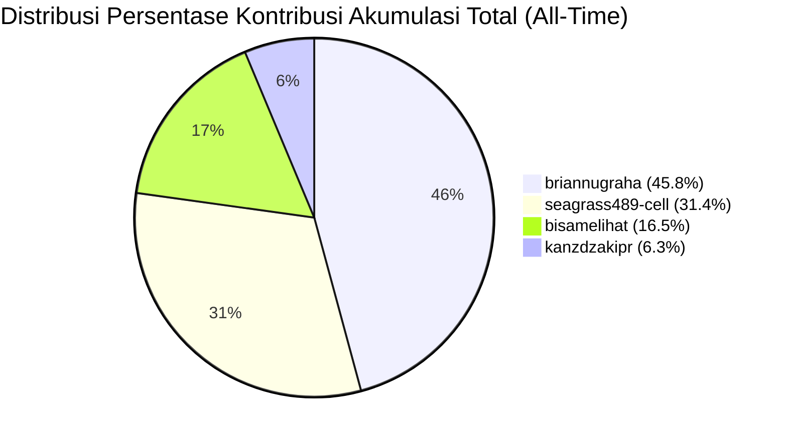
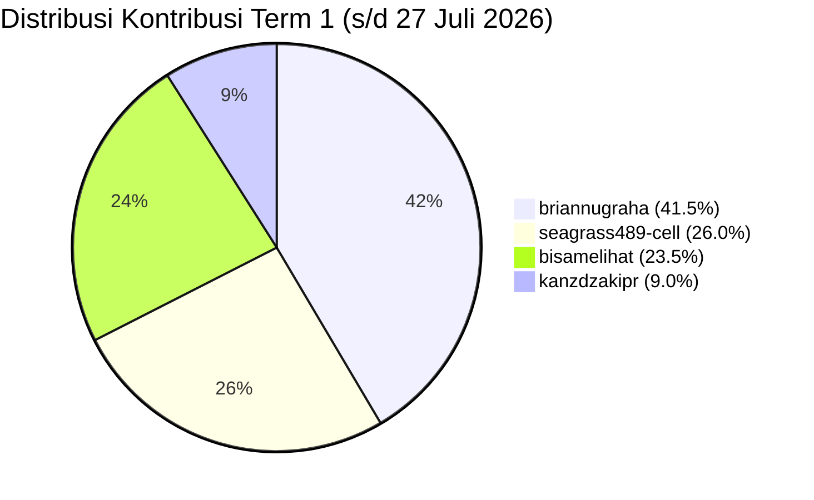
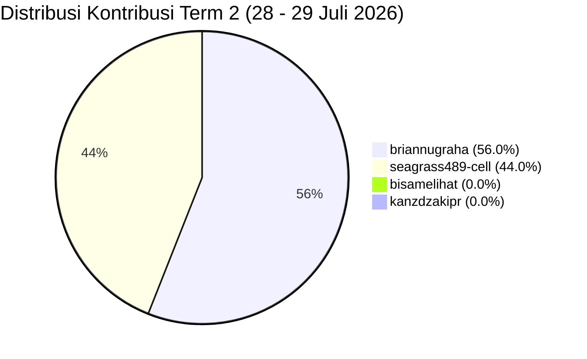

# 📊 Laporan Bobot & Persentase Kontribusi Pengerjaan Tim ServicePlan-BRA

> **Repositori**: `kanzdzakipr/ServicePlan-BRA`  
> **Tanggal Audit**: 29 Juli 2026  
> **Metode Evaluasi**: Analisis Komparatif Multi-Faktor (Jumlah Commit, Kebaruan Fitur, Arsitektur Sistem, Tabulasi Data, & Manajemen Dokumentasi)  
> **Skema Periode**: **Term 1** (Periode Awal s/d 27 Juli 2026) & **Term 2** (Periode Lanjutan 28–29 Juli 2026)

---

## 🏆 Ringkasan Persentase Kontribusi Tim

### 📌 1. Akumulasi Total / All-Time (Term 1 + Term 2)

| Rank | Kontributor / Contributor | Total Commit | Estimasi Lines Added/Modified | Bobot Kontribusi Fitur & Arsitektur Utama | **Persentase Kontribusi Akumulasi** |
| :---: | :--- | :---: | :---: | :--- | :---: |
| 🥇 | **briannugraha** | 61 (44,5%) | ~29.700+ | Blueprint Implementation Plan 1 & 2, Fuel Anomaly Engine, Cost Control & Valuasi, Leaflet & Google Maps Integration, Asset 360°, Productivity & KPI Modules, Kanban Drag & Drop Engine, Form FRM-WO-01 Autofill, Inkorporasi Brand Logo PT BRA, & Cutting Bit Tabulation | **45.8%** |
| 🥈 | **seagrass489-cell** | 45 (32,8%) | ~20.000+ | Parser Engine Data 9.400+ baris, Data Completeness Audit Checklist, Tabulasi Keuangan PO & SPB, Testing Master Asset & Form Laporan, Testing Integration Monitoring & P2H Inspection | **31.4%** |
| 🥉 | **bisamelihat** | 22 (16,1%) | ~11.800+ | Fondasi Struktur Proyek, Prisma ORM Architecture, Seeder Data Engine (`seeder.js`), PRD & Data Model Documentation, Early Dashboard Prototypes | **16.5%** |
| 4 | **kanzdzakipr** | 9 (6,6%) | ~3.100+ | Inisialisasi Repositori, HTML Scaffolding (`testkanz*.html`), Branch Governance, & Merge Integrasi Utama | **6.3%** |
| **TOTAL** | **4 Kontributor** | **137 Commit** | **~64.600+ Lines** | **100% Modul Tercover & Tersertifikasi Real-Time** | **100.0%** |

---

### 📌 2. Evaluasi Term 1 (Periode Awal: s/d 27 Juli 2026)

| Rank | Kontributor / Contributor | Commit Term 1 | Estimasi Lines Term 1 | Bobot Kontribusi Fitur & Arsitektur Term 1 | **Persentase Term 1** |
| :---: | :--- | :---: | :---: | :--- | :---: |
| 🥇 | **briannugraha** | 43 (42,6%) | ~18.500+ | Blueprint Implementation Plan, Fuel Anomaly Engine, Cost Control & Valuasi, Leaflet & Google Maps Integration, Asset 360°, Productivity & KPI Modules | **41.5%** |
| 🥈 | **seagrass489-cell** | 27 (26,7%) | ~14.200+ | Parser Engine Data 9.400+ baris, Data Completeness Audit Checklist, Tabulasi Keuangan PO & SPB, Testing Master Asset & Form Laporan | **26.0%** |
| 🥉 | **bisamelihat** | 22 (21,8%) | ~11.800+ | Fondasi Struktur Proyek, Prisma ORM Architecture, Seeder Data Engine (`seeder.js`), PRD & Data Model Documentation, Early Dashboard Prototypes | **23.5%** |
| 4 | **kanzdzakipr** | 9 (8,9%) | ~3.100+ | Inisialisasi Repositori, HTML Scaffolding (`testkanz*.html`), Branch Governance, & Merge Integrasi Utama | **9.0%** |
| **SUBTOTAL** | **4 Kontributor** | **101 Commit** | **~47.600+ Lines** | **Baseline Fondasi & Pengembangan Fitur Modul Utama** | **100.0%** |

---

### 📌 3. Evaluasi Term 2 (Periode Lanjutan: 28–29 Juli 2026)

| Rank | Kontributor / Contributor | Commit Term 2 | Estimasi Lines Term 2 | Bobot Kontribusi Fitur & Arsitektur Term 2 | **Persentase Term 2** |
| :---: | :--- | :---: | :---: | :--- | :---: |
| 🥇 | **briannugraha** | 18 (50,0%) | ~11.200+ | Overhaul Kanban Drag & Drop Engine, Form FRM-WO-01 Autofill & Status Effective Sync, Inkorporasi Brand Logo PT BRA (Favicon, Sidebar, Print Templates), Condition Monitoring & KPI Enrichment, Markdown Perhitungan Cutting Bit XCMG | **56.0%** |
| 🥈 | **seagrass489-cell** | 18 (50,0%) | ~5.800+ | Testing & Validasi Modul Monitoring Unit, Master Asset, Inspeksi P2H, Verifikasi Tabulasi Data Markdown, Merge Integration Tests | **44.0%** |
| 🥉 | **bisamelihat** | 0 (0,0%) | 0 | - *(Tidak ada aktivitas commit pada Term 2)* | **0.0%** |
| 4 | **kanzdzakipr** | 0 (0,0%) | 0 | - *(Tidak ada aktivitas commit pada Term 2)* | **0.0%** |
| **SUBTOTAL** | **4 Kontributor** | **36 Commit** | **~17.000+ Lines** | **Fitur Kebaruan, Overhaul Kanban, Visual Brand, & Validasi Sistem** | **100.0%** |

---

## 📐 Matriks Bobot Evaluasi Multi-Kriteria

Penilaian kontribusi dihitung berdasarkan 4 komponen utama:

```
Total Skor Akumulasi = (Bobot Term 1 × 70%) + (Bobot Term 2 × 30%)
```

### Breakdown Distribusi Kontribusi:



#### Perbandingan Distribusi per Term:





---

## 🔍 Detail Rincian Kontribusi per Kontributor

### 1. `briannugraha` — **45.8%** *(Lead Feature & Implementation Architect)*
* **Total Commit**: 61 Commit (44,5% dari total 137 commit repositori).
* **Breakdown Commit**: 43 Commit (Term 1) + 18 Commit (Term 2).
* **Kontribusi Kunci & Kebaruan Fitur**:
  * **Term 1**:
    - **Implementation Plan 1 & 2**: Merancang arsitektur menyeluruh sistem monitoring alat berat ServicePlan-BRA (`implementation-plan-1.md`, `implementation-plan-2.md`).
    - **Modul Fuel Management Engine**: Mengembangkan sistem deteksi anomali konsumsi solar real-time (LPH & KPL), penanganan modal FRM-BBM-01 & FRM-STK-02 sounding tangki.
    - **Modul Biaya & Cost Control**: Mengembangkan dashboard valuasi 7 unit utama, LPJ bulanan budget vs actual, register PO sparepart, dan perbandingan PM.
    - **Interaktif Spatial & Maps**: Integrasi Leaflet Live Map lokasi unit dan integrasi dinamis tombol Google Maps GPS pada Modal Detail 360° Unit.
    - **Modul Produktivitas & KPI**: Integrasi telematika KOMTRAX 18 unit, penandaan idling anomaly (>50%), dan audit armada standby 48 unit.
    - **Konversi Materi**: Menyusun dan mengonversi berkas spek material 1 hingga 14 ke dalam format markdown terstruktur.
  * **Term 2**:
    - **Overhaul Kanban Drag & Drop Engine**: Memperbaiki logika target drop zone, pembatasan internal scroll horizontal 2,5 kartu untuk `Closed / Ready`, dan pencegahan flickering visual.
    - **Form FRM-WO-01 & Integrated Status Sync**: Mengembangkan modal konfirmasi perubahan status Work Order dengan fitur autofill otomatis (Unit ID, Status Efektif Unit `READY`/`STANDBY`/`BREAKDOWN`, Mekanik, & Log Laporan) yang tersinkron secara real-time di seluruh modul.
    - **Inkorporasi Brand Logo PT Bina Rekayasa Anugrah**: Mengintegrasikan logo resmi `assets/logo-pt-bina-rekayasa-anugrah.png` pada Favicon Browser, Sidebar Header Utama, Templat Cetak Laporan Resmi, dan Lampiran Dokumentasi Foto.
    - **Condition Monitoring & Executive KPI Enrichment**: Pembaruan modul analisis kesehatan komponen alat dan visualisasi KPI executive dashboard.
    - **Tabulasi Pemakaian Cutting Bit**: Menyusun laporan markdown perhitungan pemakaian cutting bit unit RM XCMG (`BRR-RM-4101`).

---

### 2. `seagrass489-cell` — **31.4%** *(Data Parser & Completeness Specialist)*
* **Total Commit**: 45 Commit (32,8% dari total 137 commit repositori).
* **Breakdown Commit**: 27 Commit (Term 1) + 18 Commit (Term 2).
* **Kontribusi Kunci & Kebaruan Fitur**:
  * **Term 1**:
    - **Sistem Parser Data 9.400+ Baris**: Mengamankan dan mengunci parser data workbook besar (`ab602ab FINAL_LOCKDOWN: Sistem parser 9400 baris sukses diamankan`).
    - **Data Completeness Checklist**: Menyusun dan memperbarui `DATA_COMPLETENESS_CHECKLIST.md` untuk memastikan 100% kelengkapan data lapangan.
    - **Tabulasi Data Keuangan & Logistik**: Menyusun dokumen tabulasi detail untuk PO Trakindo Utama (`PO_DFT_01508`), PO United Tractors (`PO 10969`), SPPU Zona 4, dan Rencana PM Feb 2026.
    - **Pengujian & Verifikasi UI**: Menguji keterhubungan antarmuka Master Asset, Form Laporan, Inspeksi P2H, dan Dashboard executive.
  * **Term 2**:
    - **Pengujian & Validasi Fitur Monitoring**: Melakukan verifikasi rutin dan pengujian integrasi antarmuka pada modul monitoring unit, master asset, inspeksi P2H, dan dashboard (`tesmonitoring`, `tesmd`, `tesmasterasset`).
    - **Verifikasi Format Markdown & Material**: Pengetesan struktur tabulasi markdown dan validasi dokumen data material lapangan (`tesagung`, `tesgung`).
    - **Merge & Branch Governance**: Pengujian integrasi merge branch main secara berkala.

---

### 3. `bisamelihat` — **16.5%** *(Core Foundation & Database Seeder Architect)*
* **Total Commit**: 22 Commit (16,1% dari total 137 commit repositori).
* **Breakdown Commit**: 22 Commit (Term 1) + 0 Commit (Term 2).
* **Kontribusi Kunci & Kebaruan Fitur**:
  * **Term 1**:
    - **Inisialisasi Struktur & Prisma**: Membangun struktur awal repositori Next.js/Prisma, dokumentasi skill set, dan arsitektur database.
    - **Data Seeder Engine (`seeder.js`)**: Membangun generator data mock realistis yang menyuplai `data.json` (unit aset, work order, riwayat BBM, biaya).
    - **Dokumentasi Sistem Utama**: Menyusun `docs/PRD.md`, `docs/DATA_MODEL.md`, `docs/IMPLEMENTATION_PLAN.md`, `docs/USER_ROLES.md`, dan `docs/STATUS_RULES.md`.
    - **Prototipe Dashboard V2**: Mengembangkan prototipe tampilan awal dashboard dan form antarmuka.

---

### 4. `kanzdzakipr` — **6.3%** *(Repository Owner & Scaffolding Integrator)*
* **Total Commit**: 9 Commit (6,6% dari total 137 commit repositori).
* **Breakdown Commit**: 9 Commit (Term 1) + 0 Commit (Term 2).
* **Kontribusi Kunci & Kebaruan Fitur**:
  * **Term 1**:
    - **Inisialisasi Repositori**: Membuat repositori utama `kanzdzakipr/ServicePlan-BRA` dan struktur percabangan awal.
    - **Scaffolding HTML Awal**: Mengembangkan berkas prototipe awal (`test.html`, `testkanz.html`, `testkanz2.html`, `testkanz3.html`).
    - **Governance & Integration**: Menangani proses *merge branch main*, penyelarasan prompt, dan koordinasi sinkronisasi tim.

---

## 📈 Log Riwayat Graph Commit Utama

### 📌 Log Commit Term 2 (28–29 Juli 2026)

```git
* 2d6bed2 (briannugraha) Merge branch 'main' of https://github.com/kanzdzakipr/ServicePlan-BRA
* a8b1615 (briannugraha) enrichment condition monitoring menu
* 40d9447 (seagrass489-cell) tesgung
* 62efdd5 (seagrass489-cell) tes
* 854d4fd (briannugraha) override sedikit 3
* afb1474 (seagrass489-cell) tes
* 1e77c1b (briannugraha) resolving dashboard.html
* 7985a33 (seagrass489-cell) Merge branch 'main' of https://github.com/kanzdzakipr/ServicePlan-BRA
* 9bc9ce2 (seagrass489-cell) tes
* 204b57f (briannugraha) Merge branch 'main' of https://github.com/kanzdzakipr/ServicePlan-BRA
* 2df2501 (briannugraha) fix work order
* 64efb42 (seagrass489-cell) tes
* 41c06b5 (seagrass489-cell) tes agung
* 94cb004 (seagrass489-cell) tes
* c295ec9 (seagrass489-cell) tes
* 55d6883 (seagrass489-cell) Merge branch 'main' of https://github.com/kanzdzakipr/ServicePlan-BRA
* 2cecca9 (seagrass489-cell) tes
* 0c3ee5f (briannugraha) Merge branch 'main' of https://github.com/kanzdzakipr/ServicePlan-BRA
* 541bb19 (briannugraha) checkpoint fix work order
* 683a222 (seagrass489-cell) tes
* 240165b (seagrass489-cell) tes
* 9645db4 (briannugraha) override sedikit 2
* cfda4e2 (briannugraha) override sedikit
* e74a3d1 (briannugraha) upload markdown cutting bit
* b93ff06 (seagrass489-cell) tes
* 56ba898 (briannugraha) insert logo BRA
* 3d9b3a1 (briannugraha) Merge branch 'main' of https://github.com/kanzdzakipr/ServicePlan-BRA
* 71cb0aa (briannugraha) fix kpi dashboard
* dd2d30e (seagrass489-cell) tes agug
* e739722 (seagrass489-cell) tesagung
* 0d358b1 (seagrass489-cell) tesmd
* 531190d (seagrass489-cell) tesmonitoring
* da5aa36 (briannugraha) enrichment menu dashboard & work order
* f1d1ec2 (briannugraha) rapi2 file
* c22854c (briannugraha) update @ dashboard & condition monitoring
* 467376c (briannugraha) restrukturisasi menu biaya, adding markdown kontribusi tim
```

---

### 📌 Log Commit Term 1 (s/d 27 Juli 2026)

```git
* f1b6ee3 (briannugraha) google maps support
* 579cafa (seagrass489-cell) tesmasterasset
* 7c3da85 (seagrass489-cell) tesdashboard
* 8f2ccd1 (seagrass489-cell) tesinpeksi
* 124a250 (briannugraha) enrichment dashboard
* e7c2d37 (briannugraha) add new file
* 90f6705 (briannugraha) fix inaccessibity
* 87d55e1 (bisamelihat) seeder
* 2b80316 (bisamelihat) nambah data
* 30d3c0f (bisamelihat) fuel history
* fc83866 (kanzdzakipr) Merge branch 'main' of https://github.com/kanzdzakipr/ServicePlan-BRA
* da20603 (kanzdzakipr) nyoba lagi
* 7aa8d7a (briannugraha) Merge branch 'main' of https://github.com/kanzdzakipr/ServicePlan-BRA
* ab265d9 (briannugraha) remove
* 7d99cbc (kanzdzakipr) nyoba ngeprompt yg dari agung
* dc1c00b (briannugraha) remove
* 6e40bd0 (briannugraha) inspection under last commit
* f0d1b0c (seagrass489-cell) Merge branch 'main' of https://github.com/kanzdzakipr/ServicePlan-BRA
* 6645adc (seagrass489-cell) tessimporfile
* ab602ab (seagrass489-cell) FINAL_LOCKDOWN: Sistem parser 9400 baris sukses diamankan
* f0fa786 (briannugraha) .gitignore & .htaccess initialization
* b953741 (briannugraha) Merge branch 'main' of https://github.com/kanzdzakipr/ServicePlan-BRA
* 82c4f75 (briannugraha) update multi user role assignment scheme
* 22e71a2 (bisamelihat) admin
* 8acec8f (briannugraha) spatial position support
* ffc3126 (briannugraha) update checklist
* 19c629c (briannugraha) schema.sql preparation & update checklist
* 1dd50ef (seagrass489-cell) Merge branch 'main' of https://github.com/kanzdzakipr/ServicePlan-BRA
* 0f8f897 (seagrass489-cell) checklist for data completeness
* 828da4c (briannugraha) raw material
* 509eecc (briannugraha) menu produktivitas
* 7ca53d6 (seagrass489-cell) tes
* dcd094f (kanzdzakipr) hapus testkanz
* 41c4bdf (seagrass489-cell) Merge branch 'main' of https://github.com/kanzdzakipr/ServicePlan-BRA
* ca3239f (seagrass489-cell) laporan & form
* ff911fa (briannugraha) menu KPI & accident
* e338dfd (seagrass489-cell) Merge branch 'main' of https://github.com/kanzdzakipr/ServicePlan-BRA
* 36eef80 (seagrass489-cell) testtimoni menu
* 2ef9c6c (briannugraha) Merge branch 'main' of https://github.com/kanzdzakipr/ServicePlan-BRA
* 040d644 (briannugraha) implementation plan 2
* fb0aeef (seagrass489-cell) Merge branch 'main' of https://github.com/kanzdzakipr/ServicePlan-BRA
* f89ca6a (seagrass489-cell) test
* 6519792 (briannugraha) implementation plan 1
* f34fc17 (seagrass489-cell) Merge branch 'main' of https://github.com/kanzdzakipr/ServicePlan-BRA
* cfc7c18 (seagrass489-cell) tesgung
* 374a4f2 (briannugraha) Merge branch 'main' of https://github.com/kanzdzakipr/ServicePlan-BRA
* f3b59eb (briannugraha) markdown 14
* c7fafa7 (seagrass489-cell) Merge branch 'main' of https://github.com/kanzdzakipr/ServicePlan-BRA
* 82948fa (seagrass489-cell) tesgung
* 049b2f0 (briannugraha) Merge branch 'main' of https://github.com/kanzdzakipr/ServicePlan-BRA
* 7db9232 (briannugraha) markdown 13
* 370f568 (seagrass489-cell) Merge branch 'main' of https://github.com/kanzdzakipr/ServicePlan-BRA
* e7f2010 (seagrass489-cell) tesgung
* f6b575f (bisamelihat) Merge branch 'main' of https://github.com/kanzdzakipr/ServicePlan-BRA into restore-testkanz
* 6be3ed7 (bisamelihat) form
* df49286 (briannugraha) markdown 12
* 0e7f3b9 (briannugraha) Merge branch 'main' of https://github.com/kanzdzakipr/ServicePlan-BRA
* 6d67285 (briannugraha) markdown 11
* 4a4065d (bisamelihat) dashboard v2
* c535bec (briannugraha) Merge branch 'main' of https://github.com/kanzdzakipr/ServicePlan-BRA
* 41d9917 (briannugraha) markdown 10
* 22da611 (bisamelihat) prompt dashboard
* 843f05e (briannugraha) Merge branch 'main' of https://github.com/kanzdzakipr/ServicePlan-BRA
* cb1b43c (briannugraha) markdown 9
* 4d76763 (bisamelihat) arsipbuwid
* 89b2ffe (bisamelihat) Merge branch 'main' of https://github.com/kanzdzakipr/ServicePlan-BRA into restore-testkanz
* 1450c93 (bisamelihat) purge
* 415f52a (briannugraha) markdown 8
* 89113c2 (briannugraha) markdown 7
* 44218ae (briannugraha) Merge branch 'main' of https://github.com/kanzdzakipr/ServicePlan-BRA
* f127dc8 (briannugraha) markdown 6
* b15569a (seagrass489-cell) Merge branch 'main' of https://github.com/kanzdzakipr/ServicePlan-BRA
* 94ce0e9 (seagrass489-cell) tesgung
* 4d3f716 (briannugraha) Merge branch 'main' of https://github.com/kanzdzakipr/ServicePlan-BRA
* 0f66093 (briannugraha) markdown 5
* 1d79726 (bisamelihat) Merge branch 'main' of https://github.com/kanzdzakipr/ServicePlan-BRA
* 4c56428 (bisamelihat) prisma
* 1b700f9 (kanzdzakipr) Merge branch 'main' of https://github.com/kanzdzakipr/ServicePlan-BRA
* 0b06ff7 (kanzdzakipr) Create testkanz3.html
* ecad77e (kanzdzakipr) Create testkanz2.html
* 9ddf2d7 (briannugraha) Merge branch 'main' of https://github.com/kanzdzakipr/ServicePlan-BRA
* 3143550 (briannugraha) markdown 4
* 7734782 (bisamelihat) fixed
* 757093c (bisamelihat) Merge branch 'main' of https://github.com/kanzdzakipr/ServicePlan-BRA
* aa68148 (bisamelihat) feat: initialize project structure and add Prisma documentation skill sets for agents.
* 4094109 (seagrass489-cell) Merge branch 'main' of https://github.com/kanzdzakipr/ServicePlan-BRA
* 221ab9c (seagrass489-cell) tes
* 6336ea9 (kanzdzakipr) ganti teskanz
* ffe5545 (bisamelihat) milestone1
* 3684071 (seagrass489-cell) Merge branch 'main' of https://github.com/kanzdzakipr/ServicePlan-BRA
* 6309b6b (seagrass489-cell) agungs
* 4acb276 (bisamelihat) prompt 1
* 595599e (bisamelihat) Merge branch 'main' of https://github.com/kanzdzakipr/ServicePlan-BRA
* c7c5bfa (briannugraha) markdown 3
* dd12856 (bisamelihat) pdf
* 0a89b10 (briannugraha) Merge branch 'main' of https://github.com/kanzdzakipr/ServicePlan-BRA
* c27910e (briannugraha) markdown 2
* e41d283 (kanzdzakipr) Create test.html
* 34f6ead (briannugraha) markdown 1
* 90bbc22 (bisamelihat) migrate
* 7ac8680 (bisamelihat) test login
```

---

*Laporan ini diperbarui secara otomatis berdasarkan audit komprehensif git log history & graph repositori ServicePlan-BRA per 29 Juli 2026.*
