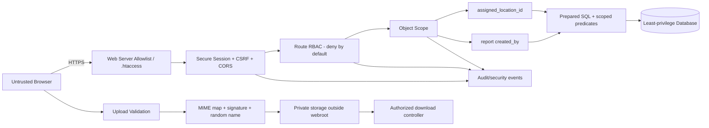

# SECURITY AUDIT REPORT

**Project:** ServicePlan-BRA  
**Audit type:** Static source-code and configuration security audit  
**Audit date:** 9 Agustus 2026  
**Overall status:** **TIDAK AMAN UNTUK PRODUCTION**  

> Audit dilakukan secara read-only terhadap source aplikasi. Nilai credential, password,
> token, dan hash sengaja tidak direproduksi dan selalu dimasking.

## SECURITY EPIC UPDATE — TERM 2 (10 AGUSTUS 2026)

Status keseluruhan tetap **TIDAK AMAN UNTUK PRODUCTION** sampai temuan lain seperti stored
DOM XSS, dependency rentan, runtime DDL, rate limiting, dan verifikasi infrastruktur selesai.
Update ini menutup tiga epic arsitektural di level kode dan automated guardrail.

### Status Epic Utama

| Epic | Cakupan | Status kode | Status operasional |
|---|---|---|---|
| EPIC-SEC-A — Security evidence & architecture | Bukti 9 commit, trust boundary, control flow, deployment gate | ✅ COMPLETE | ⚠️ Audit harus ikut setiap release |
| EPIC-SEC-B — Object authorization / IDOR | Location scope untuk aset dan turunannya; ownership scope laporan; collision-safe upsert | ✅ REMEDIATED IN CODE | ⚠️ Jalankan migration RBAC dan staging IDOR test |
| EPIC-SEC-C — Upload hardening | Private storage, MIME-extension mapping, signature check, authorized download, legacy isolation | ✅ REMEDIATED IN CODE | ⚠️ Set storage path di luar webroot dan migrasikan upload lama |
| EPIC-SEC-D — Automated security tests | Unit, static guardrail, HTTP smoke/IDOR, CI workflow | ✅ COMPLETE | ⚠️ HTTP IDOR test memerlukan akun staging terbatas |

### Bukti Rantai 9 Commit

Audit memverifikasi sembilan commit yang membentuk delivery chain security dan hosting.
Dua commit adalah integration merge dan dinyatakan sebagai merge, bukan diklaim sebagai
implementasi security baru.

| No. | Commit | Author | Jenis | Bukti kontribusi |
|---:|---|---|---|---|
| 1 | `d045e01` | seagrass489-cell | Implementasi | Audit awal, auth/session/CSRF/CORS/RBAC, protected dashboard, secret migration |
| 2 | `5af24cf` | seagrass489-cell | Integration merge | Mengintegrasikan security baseline dengan perubahan dashboard tim |
| 3 | `9d8691c` | seagrass489-cell | Implementasi | Server-side dashboard guard, internal view split, audit/deployment update |
| 4 | `a2f0367` | seagrass489-cell | Implementasi | Local-only temporary password tooling dan production rejection guard |
| 5 | `368373d` | seagrass489-cell | Hardening | Ignore rule untuk artifact lokal sensitif |
| 6 | `e9f5342` | seagrass489-cell | Integration merge | Rekonsiliasi security branch dan perubahan main |
| 7 | `e7bdd38` | seagrass489-cell | Verification tooling | Laragon sync dan login/session verification workflow |
| 8 | `75e6468` | seagrass489-cell | Security evidence | Attack simulation dan re-audit checklist 22 temuan |
| 9 | `241ecbc` | briannugraha | Hosting integration | Perbaikan environment/auth/database untuk deployment Hostinger |

### Arsitektur Security End-to-End



| Layer | Trust decision | Implementasi | Invariant |
|---|---|---|---|
| Browser | Tidak dipercaya | Tidak memakai role, actor, location, atau owner dari client | Client tidak menentukan scope |
| Session | Identitas server-side | Secure cookie, regeneration, timeout, CSRF | User ID berasal dari session |
| Route RBAC | Permission per controller/method | `api_route_permission()` + deny-by-default | Route tanpa policy ditolak |
| Object scope | Akses row per user | `api_location_scope_clause()` dan `api_report_owner_scope_clause()` | Missing assignment adalah deny-all |
| Object mutation | Existing row diverifikasi | `api_require_asset_access()` / `api_require_work_order_access()` | ID collision tidak boleh mengambil alih object |
| Database | Query terparameterisasi | Prepared statement + server-owned scope parameter | ID/location client tidak masuk SQL mentah |
| Upload | Konten hostile | MIME map, magic signature, random filename, 10 MB limit | Ekstensi tidak pernah berasal dari filename user |
| File delivery | File private | Storage luar webroot + controller berizin | Tidak ada direct URL ke upload baru |
| Regression guard | Perubahan dianggap berisiko | Unit/static/HTTP tests + GitHub Actions | Scope/upload guard diuji setiap PR |

### Cakupan Object Authorization Baru

| Resource | Read scope | Write scope | Collision protection |
|---|---|---|---|
| Assets | `assets.current_location_id = session.assigned_location_id` | Existing dan target location diverifikasi | Duplicate asset ID gagal |
| Work orders | Join ke asset yang accessible | Existing WO dan asset diverifikasi | WO ID tidak dapat dipindahkan ke asset lain |
| Fuel, PM, tire, inspection, accident | Join ke asset yang accessible | Asset diverifikasi sebelum insert/update | Accident ID collision memerlukan owner scope yang sama |
| Logistics SPB | SPB join ke asset yang accessible | Existing SPB/item dan asset diverifikasi | SPB/item ID tidak dapat mengambil alih row lokasi lain |
| Bulk sync | Hanya asset dalam scope | Existing WO diverifikasi sebelum upsert | Cross-asset WO collision ditolak |
| Archive state | Item asset/P2H/accident divalidasi ke lokasi | Archive/restore memakai pemeriksaan yang sama | Unknown type dan cross-scope ID ditolak |
| Reports | `created_by = authenticated user` | Owner-only; global via permission eksplisit | `client_key` hanya defense tambahan, bukan ownership |

### Automated Security Evidence

| Suite | File | Coverage | Hasil 10 Agustus 2026 |
|---|---|---|---|
| Unit security | `tests/security_unit.php` | Location/owner decision, deny-all, alias injection, MIME map, traversal, PDF spoof | ✅ 22 PASS / 0 FAIL |
| Static guardrail | `tests/security_static.php` | Scope coverage 12 API, upload invariants, `.htaccess`, RBAC migration | ✅ 37 PASS / 0 FAIL |
| HTTP smoke | `tests/security_http_smoke.php` | 401, direct view, evil Origin, CSRF session, live IDOR | ⚠️ Base checks siap; live IDOR NEEDS STAGING CREDENTIALS |
| CI | `.github/workflows/security-tests.yml` | PHP lint + unit + static pada push/PR | ✅ CONFIGURED; NEEDS CI RUN VERIFICATION |

### Remediation Mapping

| Finding | Status baru | Bukti | Sisa pekerjaan |
|---|---|---|---|
| SEC-004 — Upload-to-RCE | ✅ REMEDIATED IN CODE | `upload_security.php`, private storage, download controller, web deny rules | Konfigurasi `UPLOAD_STORAGE_PATH`, migrasi upload lama, staging test |
| SEC-005 — IDOR/BOLA | ✅ REMEDIATED IN CODE | Location/owner SQL scopes pada API aktif | Apply RBAC migration dan jalankan live limited-user IDOR test |
| RA-001 — Maintenance utilities public | ✅ REMEDIATED IN CODE | `.htaccess` menolak maintenance PHP/PS1/SQL/BAT/CMD/SH/MD/JSON | Verifikasi `.htaccess` aktif di Hostinger |
| RA-003 — Conditional upload RCE | ✅ REMEDIATED IN CODE | Ekstensi server-owned dan storage luar webroot | Verifikasi filesystem path dan PHP execution policy |
| RA-004 / RA-011 — Cross-location/report ownership | ✅ REMEDIATED IN CODE | `assigned_location_id` dan `created_by` menjadi predicate wajib | Data legacy `created_by IS NULL` perlu ownership review |

`NEEDS MANUAL VERIFICATION`: hasil di atas belum menyatakan aman production sebelum migration,
deployment, CI run, dan HTTP IDOR test pada Hostinger/staging benar-benar lulus.

## Remediation Update — SEC-001 dan SEC-002

**Tanggal implementasi:** 9 Agustus 2026  
**Status keseluruhan project:** tetap **TIDAK AMAN UNTUK PRODUCTION** sampai temuan P0/P1
lainnya diselesaikan.

| Finding | Status kode | Status operasional |
|---|---|---|
| SEC-001 — Tidak ada authentication/authorization | ✅ REMEDIATED IN CODE | ⚠️ Terapkan migration RBAC, environment, dan staging verification |
| SEC-002 — Credential database di source | ✅ REMOVED FROM CURRENT WORKTREE | ❌ Credential lama wajib dirotasi dan Git history masih harus dibersihkan |

Remediasi yang telah diterapkan:

- Login aktif sekarang diverifikasi server-side melalui `api/auth.php` dan tabel `users`.
- Session menggunakan strict mode, cookie `HttpOnly`, `SameSite=Strict`, idle timeout,
  absolute timeout, session ID regeneration, dan logout server-side.
- Seluruh controller API aktif mendapat authentication dan route authorization
  deny-by-default melalui `api/security.php` dan `api/db.php`.
- Metode POST/PUT/PATCH/DELETE membutuhkan CSRF token.
- Permission user dimuat ulang dari database pada setiap API request.
- CORS wildcard dihapus dan Origin yang tidak diizinkan ditolak.
- `dashboard.php` menjadi server-side session guard; aplikasi penuh dipindahkan ke
  `dashboard.view.php` yang menolak akses langsung. URL lama `dashboard.html` sekarang
  hanya berupa shell pengarah login dan juga diarahkan melalui `.htaccess` pada Apache.
- Akses web ke `data.json`, `.git`, `material/`, `raw-material/`, dan API bootstrap internal
  diblokir melalui `.htaccess`.
- Database configuration sekarang hanya berasal dari environment variable; tidak ada lagi
  credential production fallback dalam current worktree.
- Hash password seed yang sudah diketahui ditolak pada environment production.
- Migration permission tersedia pada `scripts/security_rbac_migration.sql`.
- Petunjuk deployment dan verifikasi tersedia pada `SECURITY_DEPLOYMENT.md`.

Validasi yang telah dijalankan:

- PHP lint pada 68 file PHP aktif dan legacy: **PASS, 0 failure**.
- Coverage 13 controller API terhadap bootstrap dan route policy: **PASS**.
- Unauthenticated `GET /api/assets.php`: **HTTP 401**.
- Akses `dashboard.php` tanpa session: **HTTP 302** ke login.
- Request API dari Origin yang tidak dipercaya: **HTTP 403**.
- Pencarian credential database production pada current worktree: **tidak ditemukan**.
- Full login/database integration test: **NEEDS MANUAL VERIFICATION**, karena database
  lokal tidak aktif/tersedia saat smoke test.

SEC-001 belum menutup SEC-005 secara otomatis: ownership/tenant scoping untuk setiap report
dan objek bisnis tetap harus diselesaikan sebagai tahap berikutnya. SEC-002 baru selesai
secara operasional setelah credential lama benar-benar dirotasi dan dinonaktifkan.

## 1. Executive Summary

Website ini **tidak aman untuk production** dalam kondisi saat audit dilakukan.

Risiko utama:

- API aktif tidak mempunyai autentikasi dan otorisasi server-side.
- Dashboard dapat dibuka langsung; login hanya berupa validasi JavaScript di browser.
- Kredensial database production tertanam di source dan riwayat Git.
- Terdapat stored DOM XSS yang dapat ditanam melalui API publik.
- Data aset, GPS, kecelakaan, biaya, laporan, inspeksi, dan workflow dapat dibaca atau dimodifikasi tanpa izin.
- Dokumen internal, data personel, informasi finansial, dan database dump berada di repository/deployment tree.
- Aplikasi legacy mempunyai jalur upload yang berpotensi menjadi remote code execution apabila PHP dapat dijalankan di folder upload.
- Tidak ditemukan rate limiting, validasi skema komprehensif, atau security monitoring yang memadai.

### Kesimpulan per area

| Area | Status | Ringkasan |
|---|---|---|
| Frontend | ❌ FAIL | DOM XSS, inline handler, client-only RBAC, data lokal sensitif |
| Backend/API | ❌ FAIL | Tidak ada auth, authorization, rate limit, dan schema validation |
| Injection | ❌ FAIL | Stored XSS dan potensi upload-to-RCE; SQLi tidak terkonfirmasi |
| Database | ❌ FAIL | Credential exposed, DDL saat runtime, dump berada di repository |
| Account security | ❌ FAIL | Default credentials dan session legacy tidak di-hardening |
| File handling | ❌ FAIL | Ekstensi upload berasal dari nama file pengguna dan disimpan di webroot |
| Secrets/configuration | ❌ FAIL | Credential production berada di source dan Git history |
| Infrastructure | ⚠️ REVIEW | HTTPS, server runtime, port, firewall, dan cloud config perlu diverifikasi |
| Dependencies | ⚠️ REVIEW | PDF.js affected version; tidak ada manifest/lockfile dan SCA otomatis |
| Business logic | ❌ FAIL | BOLA/IDOR, mass assignment, workflow dapat dimanipulasi |
| Privacy | ❌ FAIL | PII dan dokumen bisnis berpotensi ikut terpublikasi |
| Logging | ❌ FAIL | Audit trail dan security event monitoring tidak memadai |

## 2. Scope dan Metode Audit

Bagian repository yang diperiksa meliputi:

- `dashboard.html`, `index.html`, dan JavaScript frontend.
- Seluruh endpoint dalam `api/`.
- Aplikasi legacy dalam `archive/`.
- SQL schema, database dump, backup script, dan database helper.
- `.htaccess` dan deployment-related configuration.
- Dependency yang disimpan lokal atau dimuat melalui CDN.
- `data.json`, `material/`, dan `raw-material/`.
- Autentikasi, RBAC, session, CSRF, CORS, file upload, export, logging, serta workflow laporan.

Metode yang digunakan:

1. Pemetaan struktur repository dan teknologi.
2. Penelusuran source dan data flow frontend ke API/database.
3. Review authentication, authorization, object ownership, dan state transition.
4. Review sink XSS, query database, command execution, path, dan file upload.
5. Pencarian credential, secret, token, private key, dan dump sensitif.
6. Review dependency version dan advisory resmi yang relevan.
7. Review konfigurasi deployment, header keamanan, backup, logging, dan privacy.

Tidak dilakukan serangan terhadap sistem eksternal, denial-of-service, penghapusan data,
atau perubahan source aplikasi.

### Keterbatasan audit

Audit ini bukan penetration test pada server hidup. Hal berikut memerlukan:

`NEEDS MANUAL VERIFICATION`

- Konfigurasi TLS/HTTPS aktual.
- Apakah Apache membaca `.htaccess` dan mengizinkan override.
- Apakah `.git`, `archive/`, `material/`, `raw-material/`, dump SQL, dan upload dapat diakses publik.
- Apakah PHP dapat dieksekusi dalam `archive/uploads`.
- Firewall, port, WAF, reverse proxy, cloud IAM, dan database network ACL.
- Database grants aktual, audit log, encryption in transit, dan encryption at rest.
- Lokasi offsite, enkripsi, integritas, retention, serta restore test backup.
- Runtime PHP session configuration.
- Dependency transitif karena repository tidak mempunyai manifest/lockfile.

## 3. Critical Findings

### SEC-001 — CRITICAL — Autentikasi dan otorisasi API tidak ada

**Lokasi:**

- `.htaccess:10`
- `index.html:160-176`
- `dashboard.html:1-21`
- `api/assets.php:1-104`
- `api/work_orders.php:25-99`
- `api/sync.php:7-65`

**Masalah:** `dashboard.html` menjadi `DirectoryIndex` pertama. Login hanya membandingkan
credential hardcoded di browser. Endpoint API menerima GET, POST, PUT, atau DELETE tanpa
memverifikasi identitas, role, permission, atau kepemilikan objek.

**Dampak:** Siapa pun dapat membaca, membuat, mengubah, atau menghapus data operasional,
HSE, finansial, GPS, aset, inspeksi, dan work order.

**Skenario eksploitasi:** Penyerang membuka dashboard secara langsung, lalu memanggil API
publik untuk mengekstrak atau mengubah data.

**Rekomendasi:**

- Implementasikan autentikasi server-side terpusat.
- Terapkan middleware permission per route dan action.
- Gunakan deny-by-default.
- Validasi ownership/tenant pada setiap object access.
- Jangan percaya role atau permission yang berasal dari browser.

```php
$user = require_authenticated_user();
require_permission($user, 'assets.write');
require_csrf_token();
```

### SEC-002 — CRITICAL — Kredensial database production terekspos

**Lokasi:** `api/db.php:53-59` dan riwayat Git commit `b16f1e5`.

**Masalah:** Host, username, database name, dan password production ditulis di source.
Password dimasking dalam laporan sebagai `********`.

**Dampak:** Kebocoran repository, artifact, backup, atau web source dapat berujung pada
pengambilalihan database.

**Rekomendasi:**

- Rotasi credential segera.
- Audit connection log untuk penggunaan tidak sah.
- Gunakan secret manager atau environment server.
- Buat database user baru dengan privilege minimum.
- Bersihkan secret dari Git history secara terkoordinasi.

```php
$password = getenv('DB_PASSWORD');
if ($password === false || $password === '') {
    throw new RuntimeException('Database credential is not configured');
}
```

### SEC-003 — CRITICAL — Stored DOM XSS melalui API publik

**Lokasi:**

- `api/accidents.php:24-75`
- `dashboard.html:3970-3978`
- `scripts/dashboard.js:14144-14203`
- `scripts/dashboard.js:16786-16847`

**Masalah:** Payload JSON yang dikendalikan client disimpan dan dikembalikan oleh API.
Field seperti `unitCode`, `status`, `severity`, data aset, dan work order kemudian dibangun
menjadi HTML melalui `innerHTML`.

**Dampak:** JavaScript penyerang dapat berjalan dalam origin dashboard dan mengakses data
browser atau melakukan operasi API.

**Skenario eksploitasi:** Penyerang mengirim accident dengan `isUnitLocked=true` dan nilai
HTML/JavaScript pada `unitCode`. Payload berjalan ketika operator membuka modul HSE.

**Rekomendasi:**

- Terapkan schema validation pada server.
- Gunakan `textContent` dan DOM API.
- Hapus inline event handler.
- Gunakan `addEventListener`.
- Terapkan CSP berbasis nonce/hash setelah refactor inline script.

```javascript
const strong = document.createElement('strong');
strong.textContent = accident.unitCode;
container.replaceChildren(strong);
```

Fungsi HTML escaping tidak aman bila output ditempatkan di dalam kode JavaScript pada
atribut `onclick`. HTML entity akan didekode sebelum event handler dievaluasi.

### SEC-004 — CRITICAL — Upload berpotensi menjadi file PHP executable

**Lokasi:**

- `archive/app/helpers.php:32`
- `archive/actions/upload_document.php:1-2`
- `archive/pages/documents.php:6`

**Masalah:** MIME diperiksa menggunakan `finfo`, tetapi ekstensi file hasil penyimpanan
berasal dari nama file asli. File disimpan di bawah webroot.

**Dampak:** Polyglot gambar/PDF dengan nama berekstensi `.php` dapat disimpan sebagai PHP.
Jika server mengizinkan eksekusi PHP dalam folder upload, dampaknya remote code execution.

**Rekomendasi:**

- Simpan file di luar webroot.
- Tentukan ekstensi dari MIME yang diverifikasi server.
- Tolak ekstensi pengguna.
- Nonaktifkan eksekusi script pada storage upload.
- Gunakan download controller dengan authorization.
- Jalankan malware scanning.

```php
$extensions = [
    'image/jpeg' => 'jpg',
    'image/png' => 'png',
    'application/pdf' => 'pdf',
];

$extension = $extensions[$mime]
    ?? throw new RuntimeException('Unsupported file');
```

**NEEDS MANUAL VERIFICATION:** Apakah `archive/` dipublikasikan dan PHP dapat dieksekusi
dalam folder upload.

### SEC-005 — CRITICAL — IDOR/BOLA pada lifecycle laporan

**Lokasi:** `api/reports.php:225-265`, `269-350`, `369-401`.

**Masalah:** Draft/final report dapat dibaca berdasarkan ID, seluruh daftar report dapat
diambil, dan report dapat disimpan, dikloning, difinalisasi, atau di-void tanpa autentikasi.
`clientKey` berasal dari browser dan bukan identitas terverifikasi.

**Dampak:** Confidentiality dan integritas laporan dapat dilanggar sepenuhnya.

**Rekomendasi:**

- Kaitkan report dengan user/tenant server-side.
- Periksa permission dan ownership pada setiap operasi.
- Gunakan state machine server-side.
- Catat actor yang terautentikasi.
- Gunakan identifier acak hanya sebagai defense-in-depth, bukan pengganti authorization.

## 4. High Priority Findings

### SEC-006 — HIGH — Wildcard CORS

**Lokasi:** `api/db.php:7-18`.

API mengirim `Access-Control-Allow-Origin: *` dan mengizinkan metode mutasi serta header
`Authorization`. Situs penyerang dapat membaca response dan mengirim perubahan lintas
origin.

**Perbaikan:** Gunakan allowlist origin, metode, dan header yang eksplisit. Setelah cookie
authentication ditambahkan, gunakan CSRF token dan cookie `SameSite`.

### SEC-007 — HIGH — Data operasional, PII, GPS, dan dokumen internal terekspos

**Lokasi:**

- `api/init.php:6-29`
- `api/assets.php:15-22`
- `data.json`
- `material/`
- `raw-material/`
- SQL dump dalam `scripts/`

Data mencakup aset, lokasi/GPS, driver, kecelakaan, status unit, spare part, harga, biaya,
absensi, lembur, invoice, purchase order, pendapatan, dan informasi personel.

**Perbaikan:** Pisahkan dokumen sumber dari repository/deployment artifact, gunakan DTO
dan field allowlist, minimalkan response, klasifikasikan data, serta terapkan RBAC dan
retention policy.

**NEEDS MANUAL VERIFICATION:** Apakah folder dan file tersebut dapat diakses langsung di
server production.

### SEC-008 — HIGH — Mass assignment dan manipulasi business logic

**Lokasi:**

- `api/sync.php:17-57`
- `api/fuel_logs.php:42-52`
- `api/logistics.php:59-77`
- `api/accidents.php:33-75`

Client dapat menentukan status aset, HM/KM, lokasi, calculated LPH, anomaly flag, quantity,
status spare part, ID kecelakaan, dan data workflow.

**Perbaikan:** Gunakan command schema, hitung derived values di server, batasi transisi
status, ambil actor dari session, dan gunakan optimistic locking/idempotency.

### SEC-009 — HIGH — Endpoint seed database publik

**Lokasi:** `api/seed_dummy.php:1-122`.

Endpoint melakukan insert pada request tanpa authentication, environment guard, method
restriction, atau idempotency.

**Perbaikan:** Jangan deploy endpoint. Pindahkan seeding ke CLI/migration khusus non-production.

### SEC-010 — HIGH — Default/shared credentials dan session legacy lemah

**Lokasi:**

- `index.html:167-171`
- `archive/login.php:12-28`
- `archive/app/bootstrap.php:2`
- `archive/logout.php:1-4`
- SQL schema/dump user

Credential demo tertanam dan beberapa akun menggunakan password default yang sama. Tidak
ada session ID regeneration setelah login, explicit secure cookie flags, idle timeout,
atau brute-force protection. Logout menggunakan GET dan tidak menghapus cookie eksplisit.

**Perbaikan:** Hapus semua default password, paksa reset, regenerasi session ID, aktifkan
`Secure`, `HttpOnly`, `SameSite`, strict session mode, idle/absolute timeout, login rate
limit, dan MFA untuk role sensitif.

### SEC-011 — HIGH — Tidak ada rate limiting dan schema validation memadai

**Lokasi:** Mayoritas `api/*.php`, terutama `sync.php`, `inspections.php`, dan `reports.php`.

Validasi umumnya hanya memeriksa keberadaan field. Tidak ada batas batch, panjang string,
range angka, enum ketat, request size, atau rate limit.

**Perbaikan:** Terapkan JSON schema/DTO, body-size limit, batch limit, pagination, rate
limit per user/IP/action, dan batas database.

### SEC-012 — HIGH — Excessive database privilege dan DDL saat runtime

**Lokasi:**

- `api/accidents.php:6-10`
- `api/reports.php:26-84`
- `api/logistics.php:7-15`

Request runtime menjalankan `CREATE TABLE` atau `ALTER TABLE`. Konfigurasi lokal juga
memiliki fallback superuser database tanpa password.

**Perbaikan:** Jalankan migration saat deployment dengan akun terpisah. Runtime user hanya
memperoleh SELECT/INSERT/UPDATE/DELETE pada tabel yang dibutuhkan.

**NEEDS MANUAL VERIFICATION:** Database grants, network ACL, TLS DB, dan audit log.

### SEC-013 — HIGH — Pemilihan environment berdasarkan Host header

**Lokasi:** `api/db.php:26-42`.

`HTTP_HOST` dipakai untuk memilih konfigurasi lokal atau production. Header tersebut dapat
dikendalikan client bila web server tidak memvalidasinya.

**Perbaikan:** Tentukan environment dari server configuration yang immutable dan validasi
allowed host pada web server/reverse proxy.

### SEC-014 — HIGH — Dump dan backup database di deployment tree

**Lokasi:**

- `archive/actions/backup_database.php`
- `archive/scripts/backup_database.bat`
- SQL dump dalam `scripts/`

Dump mengandung data operasional dan password hash. Backup dibuat di bawah webroot dan
password DB diberikan melalui command-line process argument.

**Perbaikan:** Gunakan encrypted offsite backup, storage terpisah, IAM minimum, secret file
atau secure process environment, retention, integrity checks, dan restore test.

**NEEDS MANUAL VERIFICATION:** Direct file access, encryption, offsite copy, dan keberhasilan
restore.

## 5. Medium Priority Findings

### SEC-015 — MEDIUM — Internal error disclosure

**Lokasi:** `api/db.php:94-97`, `api/assets.php:50-51`, `api/work_orders.php:47-49`, dan
beberapa endpoint API lainnya.

Pesan exception database dikirim langsung ke client. Ini dapat mengungkap schema, hostname,
environment, atau detail query.

**Perbaikan:** Kembalikan error ID generik dan simpan detail pada log server dengan redaction.

### SEC-016 — MEDIUM — CSP, HTTPS enforcement, dan security headers tidak lengkap

**Lokasi:** `.htaccess:13-18`, `dashboard.html:9`, `archive/pages/qr.php:3`.

Tidak ada CSP, HSTS, Permissions-Policy, atau HTTPS redirect. `X-XSS-Protection` obsolete.
Font Awesome dan QR library tidak memakai SRI.

**Perbaikan:** Refactor inline script/handler, terapkan CSP nonce/hash, HSTS setelah HTTPS
tervalidasi, `frame-ancestors`, Permissions-Policy, dan SRI atau self-host dependency.

**NEEDS MANUAL VERIFICATION:** TLS version, certificate, redirect, reverse proxy, serta
header aktual production.

### SEC-017 — MEDIUM — Data sensitif persisten di browser storage

**Lokasi:**

- `dashboard.html:3772-3813`
- `scripts/dashboard.js:802-1005`
- `scripts/dashboard.js:10601` dan seterusnya

Aset, work order, inspeksi, report draft/history, hasil import dokumen, dan client key
disimpan di localStorage/IndexedDB tanpa expiry.

**Perbaikan:** Minimalkan data, gunakan TTL, clear saat logout, namespace per user, dan
jangan gunakan client key sebagai credential.

### SEC-018 — MEDIUM — CSV/Spreadsheet formula injection

**Lokasi:**

- `scripts/dashboard.js:14484-14493`
- `scripts/dashboard.js:15837-15843`
- `scripts/dashboard.js:12830-12837`

Export CSV tidak menetralkan nilai yang diawali `=`, `+`, `-`, atau `@`.

**Perbaikan:** Prefix nilai berbahaya dengan apostrophe dan tawarkan format ekspor yang
tidak mengevaluasi formula.

### SEC-019 — MEDIUM — Race condition nomor dokumen

**Lokasi:** `archive/app/helpers.php:31`.

Nomor baru dihitung dari nomor terakhir tanpa lock atau atomic sequence. Request paralel
dapat memperoleh nomor yang sama.

**Perbaikan:** Gunakan counter atomik/sequence, unique constraint, transaksi, dan retry.

### SEC-020 — MEDIUM — Token public-unit legacy dan rate limiting

**Lokasi:** `archive/database/schema.sql:149`, `archive/public-unit.php:1`.

Token baru menggunakan randomness yang baik, tetapi migration lama membentuk token dengan
MD5. Endpoint publik tidak mempunyai rate limit.

**Perbaikan:** Rotasi token lama, simpan hash token, gunakan entropy tinggi, expiry,
revocation, dan rate limiting.

### SEC-021 — MEDIUM — Logging dan monitoring tidak memadai

**Lokasi:** Seluruh API aktif. Audit khusus report sebagian tersedia di `api/reports.php`.

Tidak ada audit terstruktur untuk login gagal, access denied, perubahan permission, delete,
export data, perubahan status, atau rate-limit event.

**Perbaikan:** Catat actor, action, object, time, result, request ID, dan source IP. Jangan
log password, token, dokumen, atau PII berlebihan. Integrasikan alert untuk aktivitas kritis.

### SEC-022 — MEDIUM — Dependency governance tidak reproducible

**Lokasi:** `scripts/vendor/README.md` dan tidak adanya package manifest/lockfile.

Dependency dikelola manual sehingga versi transitif, provenance, dan update keamanan sulit
diverifikasi otomatis.

**Perbaikan:** Buat inventory/SBOM, lockfile bila memungkinkan, automated dependency update,
SCA pada CI, dan verifikasi checksum artifact.

## 6. Low Priority Findings

### SEC-023 — LOW — HTTP status dan method handling tidak konsisten

Beberapa endpoint mengembalikan kegagalan dengan HTTP 200 atau tidak menggunakan
`405 Method Not Allowed` secara konsisten.

**Perbaikan:** Gunakan status HTTP semantik, response envelope tetap, dan header `Allow`.

### SEC-024 — LOW — Header keamanan obsolete

`X-XSS-Protection` bukan pengganti output encoding atau CSP dan tidak lagi digunakan oleh
browser modern.

### SEC-025 — LOW — External service privacy exposure

Frontend memuat Google Sheets, map tiles, avatar, font/icon, dan resource CDN. Browser dapat
mengirim IP, referrer, dan pola penggunaan ke pihak ketiga.

**NEEDS MANUAL VERIFICATION:** ACL Google Sheet, sensitivitas data, DPA/vendor terms, data
residency, dan privacy notice.

## 7. Injection Assessment

| Jenis | Hasil |
|---|---|
| SQL Injection | Tidak ditemukan jalur terkonfirmasi; prepared statements digunakan cukup konsisten |
| NoSQL Injection | ➖ NOT APPLICABLE; NoSQL tidak ditemukan |
| Command Injection | Tidak terkonfirmasi; backup menjalankan `mysqldump` tetapi tidak ditemukan input user langsung |
| LDAP Injection | ➖ NOT APPLICABLE; LDAP tidak ditemukan |
| Template Injection | Tidak ditemukan server-side template engine yang relevan |
| XSS | ❌ FAIL; stored DOM XSS terkonfirmasi |
| Path Traversal | Tidak ditemukan jalur terkonfirmasi; router legacy menggunakan allowlist |
| File-to-RCE | ❌ Potensial melalui ekstensi upload; deployment perlu verifikasi manual |

## 8. Security Strengths

Bagian yang telah menerapkan kontrol keamanan dengan baik:

- PDO menggunakan prepared statements dan native prepares.
- Dynamic update field memakai allowlist tetap.
- Routing halaman legacy memakai allowlist.
- Aplikasi legacy mempunyai server-side RBAC dan CSRF token pada banyak operasi POST.
- Password legacy menggunakan `password_hash()` dan `password_verify()`.
- Pesan kegagalan login legacy bersifat generik sehingga mengurangi account enumeration.
- Upload memiliki batas ukuran, pemeriksaan MIME, dan random basename, walaupun ekstensi dan
  lokasi penyimpanan masih harus diperbaiki.
- Import dokumen client-side mempunyai size limit, file signature check, ZIP safety, dan
  mitigasi ZIP bomb.
- PDF.js dipanggil dengan `isEvalSupported: false`.
- Leaflet menggunakan Subresource Integrity.
- Vendor lokal mempunyai checksum terdokumentasi dan hash lokal sesuai dokumentasi.
- Workflow laporan memakai transaksi, row lock, nomor unik, dan sebagian audit log.
- `.htaccess` menonaktifkan directory listing dan mencoba memblokir file konfigurasi/dump.

Kontrol tersebut bersifat defense-in-depth dan belum mengatasi kegagalan authentication,
authorization, XSS, atau secret management pada aplikasi aktif.

## 9. Dependency Vulnerabilities

Package audit otomatis tidak dapat dilakukan karena:

- Tidak ada `package.json`, `package-lock.json`, `composer.json`, atau lockfile sejenis.
- Scanner/package manager yang relevan tidak tersedia dalam environment audit.

| Dependency | Versi | Risiko/hasil |
|---|---:|---|
| PDF.js | 3.11.174 | **HIGH upstream:** masuk rentang CVE-2024-4367. Current call memakai `isEvalSupported:false`, tetapi upgrade tetap diperlukan |
| SheetJS CE | 0.20.3 | Tidak terdampak CVE-2024-22363 yang diperbaiki mulai 0.20.2 |
| JSZip | 3.10.1 | Tidak ditemukan vulnerability terkonfirmasi; **NEEDS MANUAL VERIFICATION** dengan SCA |
| Tesseract.js/core | 5.1.1 | Outdated; tidak ditemukan CVE spesifik dalam audit manual |
| Leaflet | 1.9.4 | SRI tersedia; **NEEDS MANUAL VERIFICATION** dengan SCA |
| Font Awesome | 6.4.0 | CDN tanpa SRI; **NEEDS MANUAL VERIFICATION** |
| qrcodejs | 1.0.0 | CDN tanpa SRI dan inventory tidak dikelola |

Referensi advisory:

- Mozilla PDF.js advisory: <https://www.mozilla.org/en-US/security/advisories/mfsa2024-22/>
- NVD CVE-2024-4367: <https://nvd.nist.gov/vuln/detail/cve-2024-4367>
- SheetJS CVE-2024-22363: <https://cdn.sheetjs.com/advisories/CVE-2024-22363>
- Tesseract.js releases: <https://github.com/naptha/tesseract.js/releases>

## 10. Secrets Exposure

| Secret/credential | Lokasi | Hasil |
|---|---|---|
| Password database production | `api/db.php:58` | **EXPOSED**, dimasking: `********` |
| Host/user/database production | `api/db.php:53-59` | **EXPOSED**, nilai tidak direproduksi |
| Credential login demo/default | `index.html`, `archive/login.php`, README/schema | **EXPOSED**, dimasking: `********` |
| Password hash akun | SQL dump dan schema | **EXPOSED**, hash tidak direproduksi |
| Google Sheet identifier | `scripts/dashboard.js:6-10` | Client-visible identifier; ACL perlu diverifikasi |
| Private key | Repository yang diperiksa | Tidak ditemukan |
| JWT signing key | Repository yang diperiksa | Tidak ditemukan; JWT tidak digunakan |
| `.env` aktif | Repository yang diperiksa | Tidak ditemukan; aplikasi memakai hardcoded fallback |

Tindakan yang diperlukan:

1. Rotasi database credential dan seluruh default password.
2. Audit log koneksi dan login untuk penyalahgunaan.
3. Invalidasi session/token lama.
4. Pindahkan secret ke secret manager.
5. Jalankan secret scanning pada seluruh Git history.
6. Bersihkan history hanya setelah seluruh credential sudah dirotasi.

## 11. Authentication dan Account Security

| Kontrol | Hasil |
|---|---|
| Server-side authentication | ❌ Tidak tersedia pada aplikasi aktif |
| Password hashing | ⚠️ Baik pada legacy, tidak relevan pada login aktif client-side |
| Brute-force protection | ❌ Tidak ada |
| Login security | ❌ Hardcoded/client-only pada aplikasi aktif |
| Password reset | ❌ Tidak ditemukan |
| Session regeneration | ❌ Tidak ditemukan setelah login legacy |
| Session expiration | ❌ Tidak ditemukan |
| Logout | ⚠️ Legacy memakai GET dan tidak menghapus cookie secara eksplisit |
| Account enumeration | ✅ Pesan login legacy generik |
| Privilege separation | ❌ Client-side pada aplikasi aktif; server-side hanya pada legacy |
| MFA readiness | ❌ Tidak ditemukan |

## 12. Privacy dan Data Protection

Risiko privacy yang ditemukan:

- Koleksi data operasional dan personel berada dalam tree aplikasi.
- API menggunakan `SELECT *` atau mengembalikan dataset besar.
- GPS dan lokasi aset tidak dibatasi berdasarkan role.
- Dokumen absensi, lembur, kecelakaan, invoice, serta laporan finansial berpotensi ikut
  terpublikasi.
- Browser menyimpan salinan data sensitif tanpa expiry.
- Data pihak ketiga dimuat dari Google Sheets dan layanan eksternal.
- Belum ditemukan kebijakan retention, deletion, data classification, atau purpose limitation.

**Rekomendasi:** Lakukan data inventory, klasifikasi PII, minimisasi response, retention dan
deletion policy, role-based field filtering, serta privacy impact assessment.

## 13. Logging dan Monitoring

Security event yang perlu dicatat:

- Login berhasil/gagal dan account lockout.
- Authorization failure dan akses objek milik user/tenant lain.
- Perubahan role/permission.
- Pembuatan, pengubahan, penghapusan, finalisasi, clone, dan void laporan.
- Perubahan status aset, work order, kecelakaan, inspeksi, fuel, dan inventory.
- Upload, download, delete, dan malware scan result.
- Export data dalam jumlah besar.
- Rate-limit violation dan input validation failure.
- Perubahan konfigurasi dan migration.
- Backup/restore serta hasil integrity check.

Log tidak boleh memuat:

- Password atau password hash.
- Session ID, token penuh, API key, atau database credential.
- Seluruh isi dokumen atau payload sensitif.
- PII yang tidak diperlukan untuk audit.

## 14. Production Readiness Checklist

| Kontrol | Status | Catatan |
|---|---|---|
| Authentication aman | ❌ FAIL | Login aktif hanya client-side |
| Authorization aman | ❌ FAIL | API tidak mempunyai permission/ownership checks |
| Input validation | ❌ FAIL | Schema/range/size validation tidak memadai |
| Injection protection | ❌ FAIL | Stored XSS dan potensi upload-to-RCE |
| XSS protection | ❌ FAIL | `innerHTML` dan inline handler tidak aman |
| CSRF protection | ❌ FAIL | API aktif tanpa desain session; cross-origin writes diizinkan |
| Session security | ❌ FAIL | Active app tidak mempunyai session; legacy belum di-hardening |
| Password security | ❌ FAIL | Default/shared/hardcoded credentials |
| API security | ❌ FAIL | Public CRUD, BOLA, mass assignment |
| File upload security | ❌ FAIL | Ekstensi user dan storage di webroot |
| Database security | ❌ FAIL | Secret exposed dan runtime DDL |
| Secret management | ❌ FAIL | Credential production di source/Git |
| HTTPS | ⚠️ NEEDS REVIEW | **NEEDS MANUAL VERIFICATION**; tidak ada enforcement di source |
| Security headers | ❌ FAIL | CSP/HSTS/Permissions-Policy tidak tersedia |
| Rate limiting | ❌ FAIL | Tidak ditemukan |
| Dependency security | ⚠️ NEEDS REVIEW | Affected dependency dan tidak ada SCA/lockfile |
| Logging & monitoring | ❌ FAIL | Security audit trail tidak memadai |
| Backup/recovery | ⚠️ NEEDS REVIEW | Webroot/plaintext; restore test tidak diketahui |
| Privacy/data protection | ❌ FAIL | PII dan dokumen internal berada dalam deployment tree |

## 15. Final Priority

### P0 — FIX IMMEDIATELY

1. Jangan deploy repository dalam kondisi ini.
2. Rotasi database credential dan semua default/shared password.
3. Implementasikan authentication dan authorization server-side pada seluruh API.
4. Tutup akses publik ke dashboard, API, `seed_dummy.php`, `.git`, SQL dump, `archive/`,
   `material/`, dan `raw-material/`.
5. Perbaiki seluruh jalur stored XSS dan hentikan penggunaan untrusted data pada
   `innerHTML`/inline handler.
6. Restriksi CORS.
7. Pindahkan upload keluar webroot dan nonaktifkan eksekusi script.
8. Lindungi report lifecycle dan object access dari BOLA/IDOR.

### P1 — FIX BEFORE PRODUCTION

1. Tambahkan schema validation, request limit, pagination, dan rate limiting.
2. Terapkan state-transition validation dan hitung derived business values di server.
3. Hardening session, password reset, logout, brute-force protection, dan MFA readiness.
4. Pisahkan migration user dan runtime database user.
5. Terapkan HTTPS, CSP, HSTS, security headers, serta SRI/self-hosted assets.
6. Ganti detailed error dengan generic error ID.
7. Amankan backup dan lakukan restore test.
8. Upgrade PDF.js dan buat inventory/SBOM dependency.
9. Jalankan SAST, SCA, secret scan, dan dynamic security test pada staging.

### P2 — FIX AFTER PRODUCTION

Bagian ini hanya boleh ditunda setelah seluruh P0 dan P1 selesai:

1. Kurangi data localStorage/IndexedDB dan tambah expiry/cleanup.
2. Cegah CSV formula injection.
3. Perbaiki race condition nomor dokumen.
4. Rotasi token public-unit legacy.
5. Implementasikan audit trail, alerting, retention, dan privacy lifecycle.
6. Minimalkan API response serta penggunaan layanan pihak ketiga.

### P3 — OPTIONAL HARDENING

1. MFA wajib untuk administrator dan approver.
2. CSP nonce/hash tanpa `unsafe-inline`.
3. WAF dan anomaly detection.
4. Automated dependency update dan signed build artifact.
5. Independent penetration test setelah remediation.
6. Incident-response dan backup-restore tabletop exercise.

## 16. Final Conclusion

Project harus dianggap **tidak aman untuk production** sampai seluruh P0 dan P1 selesai,
divalidasi ulang melalui code review, security regression test, serta penetration test pada
environment staging.

Keberadaan prepared statements, password hashing legacy, CSRF legacy, dan beberapa validasi
file merupakan dasar yang baik. Namun, kontrol tersebut belum dapat mengompensasi tidak
adanya authentication/authorization pada API aktif, secret exposure, stored XSS, dan
paparan data internal.
