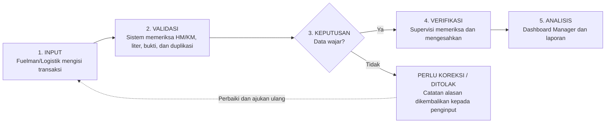
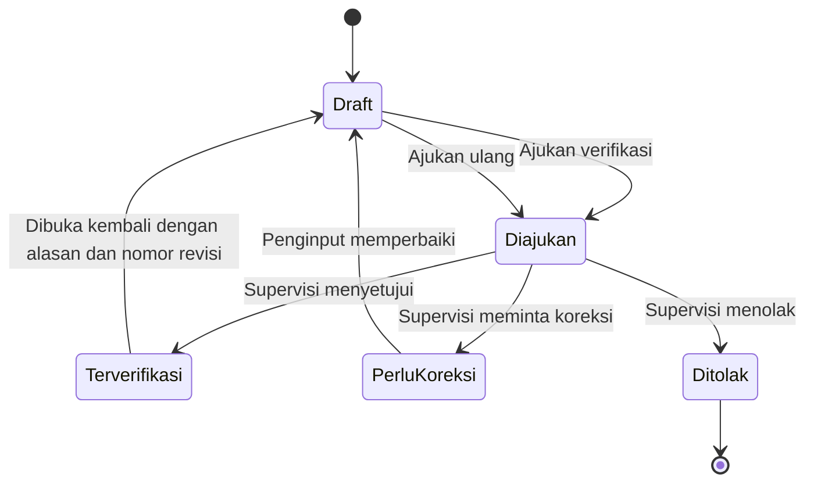
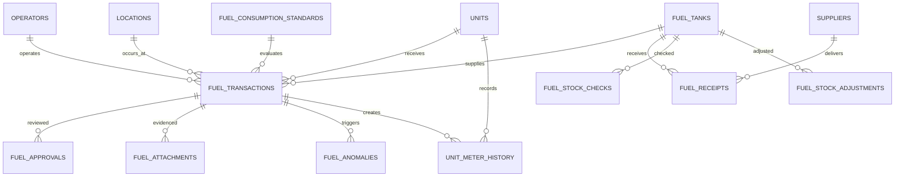

# Spesifikasi Fungsional Modul Monitoring Pemakaian BBM Unit

**Sistem tujuan:** Website Asset & Equipment PT Bina Rekayasa Anugrah  
**Disiapkan untuk:** Manager Assets & Equipment dan Tim Pengembang Website  
**Versi:** 1.0  
**Tanggal dokumen:** 24 Juli 2026  
**Jumlah halaman sumber:** 14  
**Status dokumen:** Rancangan untuk validasi dan pengembangan

> **TUJUAN UTAMA** Menyediakan pencatatan BBM yang dapat diaudit dan analisis Manager untuk mengendalikan efisiensi, biaya, kewajaran transaksi, serta selisih stok pada seluruh unit dan lokasi BRA.

## Catatan Konversi

- Struktur judul, daftar, formula, tabel, lampiran, dan istilah sumber dipertahankan.
- Diagram alur pada dokumen sumber dikonversikan menjadi diagram Mermaid dan uraian tekstual agar file Markdown mandiri.
- Bagian **Penjelasan Terperinci dan Catatan Implementasi** ditambahkan setelah isi spesifikasi. Bagian tersebut menjelaskan keterkaitan kebutuhan dan menandai keputusan yang masih perlu divalidasi; bagian itu bukan perubahan terhadap persyaratan sumber.

# Ringkasan Eksekutif

Modul Monitoring BBM dirancang sebagai bagian terpadu dari website Asset & Equipment BRA. Modul ini menghubungkan setiap pengisian BBM dengan unit, HM/KM, operator, lokasi, pekerjaan, sumber BBM, biaya, bukti foto, status verifikasi, dan stok tangki. Data yang sudah terverifikasi menjadi sumber tunggal dashboard Manager.

> **PRINSIP RANCANGAN** Satu transaksi harus menjawab lima pertanyaan: unit mana, siapa yang menggunakan dan menyalurkan, berapa liter dan biaya, berapa aktivitas HM/KM yang dihasilkan, serta apakah pemakaiannya wajar dibanding standar.

## Hasil yang Diharapkan

- Seluruh pemakaian BBM unit tercatat per transaksi dan dapat ditelusuri.

- Konsumsi aktual dapat dibandingkan dengan standar menurut unit, model, lokasi, dan jenis pekerjaan.

- Manager dapat melihat total liter, biaya, efisiensi, unit boros, transaksi anomali, dan selisih stok.

- Data terverifikasi tidak dapat diubah langsung; semua koreksi tercatat dalam audit trail.

- Laporan dapat difilter dan diekspor menurut periode, lokasi, kategori, unit, operator, dan status.

## Pengendalian Dokumen

| **Atribut**        | **Keterangan**                                                  |
|--------------------|-----------------------------------------------------------------|
| **Nama dokumen**   | Spesifikasi Fungsional Modul Monitoring Pemakaian BBM Unit      |
| **Pemilik proses** | Manager Assets & Equipment                                      |
| **Pengguna utama** | Fuelman/Logistik, Operator, Supervisi, Manager, General Manager |
| **Sistem tujuan**  | Website Asset & Equipment BRA                                   |
| **Status**         | Rancangan untuk validasi dan pengembangan                       |

## Daftar Isi

| 1\. Ruang Lingkup dan Sasaran                 | 8\. Dashboard BBM Manager                             |
|-----------------------------------------------|-------------------------------------------------------|
| 2\. Peran Pengguna dan Hak Akses              | 9\. Monitoring Stok dan Rekonsiliasi                  |
| 3\. Struktur Menu Modul BBM                   | 10\. Laporan dan Ekspor Data                          |
| 4\. Data Master dan Ketergantungan Sistem     | 11\. Struktur Data untuk Programmer                   |
| 5\. Formulir Pengisian BBM Unit               | 12\. Kriteria Penerimaan dan Tahapan Implementasi     |
| 6\. Perhitungan Otomatis dan Standar Konsumsi | Lampiran A–B. Contoh Formulir dan Wireframe Dashboard |
| 7\. Validasi, Status, dan Alur Persetujuan    |                                                       |

# 1. Ruang Lingkup dan Sasaran

## 1.1 Ruang Lingkup

Modul mencakup proses dari BBM diterima ke tangki atau fuel truck, disalurkan ke unit, diverifikasi, direkonsiliasi dengan stok fisik, hingga dianalisis oleh Manager.

| **Termasuk dalam modul**                | **Di luar tahap awal**               |
|-----------------------------------------|--------------------------------------|
| Penerimaan BBM dari supplier            | Integrasi langsung sensor IoT tangki |
| Pengisian BBM ke unit                   | Integrasi kartu BBM eksternal        |
| Pencatatan HM/KM dan bukti foto         | Prediksi berbasis machine learning   |
| Verifikasi dan audit trail              | Pembelian dan pembayaran supplier    |
| Dashboard biaya, efisiensi, dan anomali | Integrasi akuntansi penuh            |
| Stok sistem, sounding, dan selisih stok | Telematics OEM real-time             |

## 1.2 Sasaran Kinerja Modul

| **Sasaran**                | **Ukuran keberhasilan**                                                            |
|----------------------------|------------------------------------------------------------------------------------|
| **Kelengkapan pencatatan** | ≥ 98% transaksi BBM memiliki unit, liter, HM/KM, lokasi, petugas, dan bukti        |
| **Kecepatan verifikasi**   | ≥ 90% transaksi diverifikasi paling lambat 1 × 24 jam                              |
| **Keterlacakan**           | 100% perubahan data menyimpan pengguna, waktu, nilai lama, nilai baru, dan alasan  |
| **Deteksi penyimpangan**   | Sistem menandai seluruh transaksi yang melewati batas standar atau aturan validasi |
| **Rekonsiliasi stok**      | Stok sistem dan stok fisik dapat dibandingkan per tangki dan lokasi setiap hari    |

# 2. Peran Pengguna dan Hak Akses

| **Peran**          | **Input**                         | **Verifikasi**             | **Dashboard**        | **Administrasi**         |
|--------------------|-----------------------------------|----------------------------|----------------------|--------------------------|
| Fuelman/Logistik   | Pengisian, penerimaan, stok fisik | Tidak                      | Operasional terbatas | Tidak                    |
| Operator/Pengemudi | HM/KM, bukti, konfirmasi unit     | Tidak                      | Riwayat unit sendiri | Tidak                    |
| Supervisi          | Koreksi melalui catatan           | Setujui, koreksi, tolak    | Lokasi/tim           | Tidak                    |
| Manager            | Tidak wajib                       | Buka kembali dengan alasan | Seluruh analisis     | Standar dan ambang batas |
| General Manager    | Tidak                             | Tidak                      | Ringkasan eksekutif  | Tidak                    |
| Admin Sistem       | Master data                       | Tidak                      | Monitoring teknis    | Pengguna dan konfigurasi |

> **KONTROL AKSES** Data terverifikasi dikunci. Jika harus diperbaiki, Manager atau pengguna berwenang membuka transaksi dengan alasan; sistem menyimpan versi sebelum dan sesudah koreksi.

# 3. Struktur Menu Modul BBM

| **Menu**                  | **Fungsi utama**                                              | **Pengguna**           |
|---------------------------|---------------------------------------------------------------|------------------------|
| **Dashboard BBM**         | KPI, grafik, penyimpangan, perbandingan, dan tindakan lanjut  | Manager, GM, Supervisi |
| **Pengisian BBM Unit**    | Membuat dan melihat transaksi penyaluran BBM ke unit          | Fuelman, Logistik      |
| **Penerimaan BBM**        | Mencatat BBM yang diterima dari supplier ke tangki/fuel truck | Logistik               |
| **Stok Tangki BBM**       | Saldo, sounding, penyesuaian, dan selisih stok                | Logistik, Supervisi    |
| **Verifikasi Transaksi**  | Memeriksa bukti, HM/KM, liter, biaya, dan anomali             | Supervisi              |
| **Standar Konsumsi Unit** | Menetapkan target dan batas konsumsi per unit/model           | Manager, Admin         |
| **Laporan BBM**           | Filter, rincian, rekap, dan ekspor                            | Manager, GM, Supervisi |

# 4. Data Master dan Ketergantungan Sistem

Sebelum transaksi pertama dibuat, sistem harus memiliki data master yang konsisten dengan modul aset, lokasi, dan pengguna.

| **Master**           | **Data minimum**                                                                     | **Sumber/aturan**        |
|----------------------|--------------------------------------------------------------------------------------|--------------------------|
| **Unit**             | Kode unit, kategori, merek/model, nomor polisi, kapasitas tangki, tipe meter, status | Sinkron dari master aset |
| **Lokasi**           | Yard KM 12, Pit, Borrow Pit, Minas, lokasi lain                                      | Dikelola Admin           |
| **Operator**         | Nama, NIK, unit/tim, status aktif                                                    | Master personel          |
| **Tangki/sumber**    | Kode tangki, lokasi, kapasitas, jenis BBM, saldo awal                                | Master BBM               |
| **Supplier**         | Nama, kontrak, harga, jenis BBM                                                      | Master pemasok           |
| **Standar konsumsi** | Unit/model, satuan, target, minimum, maksimum, kondisi                               | Disetujui Manager        |
| **Proyek/pekerjaan** | Kode proyek, aktivitas, work order bila ada                                          | Modul operasional/WO     |

## 4.1 Aturan Tipe Meter

| **Kategori unit**                | **Meter utama** | **Satuan efisiensi utama** | **Data tambahan**                |
|----------------------------------|-----------------|----------------------------|----------------------------------|
| Excavator, dozer, grader, roller | Hour Meter (HM) | Liter/HM                   | Jenis pekerjaan/produksi         |
| Dump truck dan kendaraan         | Odometer (KM)   | Km/liter                   | Ritase, tonase bila tersedia     |
| Genset                           | Running hour    | Liter/jam                  | Beban rata-rata bila tersedia    |
| Unit tanpa meter aktif           | Input khusus    | Liter/hari sementara       | Alasan dan persetujuan Supervisi |

# 5. Formulir Pengisian BBM Unit

> **KODE FORMULIR** FRM-BBM-01 — Pengisian BBM Unit. Nomor transaksi dibuat otomatis, misalnya BBM-20260724-0001.

## 5.1 Susunan Formulir

| **Bagian**             | **Field**             | **Jenis input**        | **Aturan**                                         |
|------------------------|-----------------------|------------------------|----------------------------------------------------|
| A. Identitas transaksi | Nomor transaksi       | Otomatis               | Unik, tidak dapat diedit                           |
|                        | Tanggal dan jam       | Otomatis/dapat dipilih | Tidak boleh melebihi waktu server tanpa izin       |
|                        | Status                | Otomatis               | Draft/Diajukan/Perlu Koreksi/Terverifikasi/Ditolak |
| B. Informasi unit      | Kode unit             | Pilihan wajib          | Ambil nomor polisi, kategori, model, tangki, meter |
|                        | Lokasi operasional    | Pilihan wajib          | Yard KM 12/Pit/Borrow Pit/Minas/lainnya            |
|                        | Operator/pengemudi    | Pilihan wajib          | Hanya personel aktif                               |
|                        | Proyek/pekerjaan      | Pilihan                | Dapat dihubungkan dengan WO                        |
| C. Pengisian           | Sumber BBM            | Pilihan wajib          | Tangki/fuel truck/supplier                         |
|                        | Jenis BBM             | Otomatis/pilihan       | Harus sesuai sumber dan unit                       |
|                        | Jumlah liter          | Angka wajib            | > 0 dan ≤ kapasitas/ruang tangki                  |
|                        | Harga per liter       | Otomatis               | Dari penerimaan/harga aktif; dapat dikunci         |
|                        | Voucher/bon           | Teks wajib             | Unik pada sumber/periode                           |
|                        | Level tangki unit     | Pilihan                | Kosong, ¼, ½, ¾, penuh                             |
| D. Operasional         | HM/KM sekarang        | Angka wajib            | Tidak boleh lebih kecil dari catatan terakhir      |
|                        | Ritase/produksi       | Angka pilihan          | Aktif jika modul produksi tersedia                 |
| E. Dokumentasi         | Foto HM/KM            | Unggah wajib           | Tanggal foto dan metadata disimpan                 |
|                        | Foto pengisian/nozzle | Unggah wajib           | Menunjukkan unit/sumber                            |
|                        | GPS                   | Otomatis/pilihan       | Bandingkan dengan lokasi unit                      |
| F. Catatan             | Keterangan            | Teks kondisional       | Wajib jika anomali, meter rusak, tumpah, darurat   |
| G. Pernyataan          | Konfirmasi penginput  | Centang wajib          | Data sesuai kondisi lapangan                       |

## 5.2 Perilaku Formulir

- Setelah kode unit dipilih, sistem menampilkan data unit dan transaksi terakhir tanpa input ulang.

- Tipe field meter berubah otomatis: HM untuk alat berat, KM untuk kendaraan/dump truck, running hour untuk genset.

- Sistem menghitung selisih meter, konsumsi, biaya, deviasi standar, dan status kewajaran sebelum transaksi diajukan.

- Jika koneksi lapangan tidak stabil, Draft dapat disimpan; pengajuan hanya boleh dilakukan setelah field wajib dan bukti lengkap.

- Pengguna dapat memindai QR unit untuk mengisi kode unit dan mengurangi salah pilih.

# 6. Perhitungan Otomatis dan Standar Konsumsi

## 6.1 Alat Berat Berbasis HM

> **Selisih HM = HM sekarang − HM sebelumnya**

> Konsumsi aktual = Liter BBM ÷ Selisih HM
> Satuan: liter/HM

Contoh: 180 liter dengan selisih 12 HM menghasilkan konsumsi 15 liter/HM.

## 6.2 Dump Truck/Kendaraan Berbasis KM

> **Jarak tempuh = KM sekarang − KM sebelumnya**

> Efisiensi = Jarak tempuh ÷ Liter BBM
> Satuan: km/liter

> Konsumsi per jarak = Liter BBM ÷ Jarak tempuh
> Satuan: liter/km

## 6.3 Biaya dan Deviasi

> **Biaya BBM = Jumlah liter × Harga per liter**

> Deviasi konsumsi = (Aktual − Standar) ÷ Standar × 100%
> Untuk indikator liter/HM; semakin positif berarti semakin boros.

> Deviasi efisiensi = (Aktual − Standar) ÷ Standar × 100%
> Untuk indikator km/liter; semakin negatif berarti semakin tidak efisien.

## 6.4 Master Standar Konsumsi

| **Field**           | **Contoh**                  | **Catatan**                                   |
|---------------------|-----------------------------|-----------------------------------------------|
| **Kode unit/model** | PC C01530 / Excavator PC210 | Standar dapat khusus unit atau model          |
| **Satuan**          | Liter/HM                    | Sesuai tipe meter                             |
| **Target**          | 14,0                        | Nilai referensi utama                         |
| **Batas minimum**   | 11,0                        | Untuk deteksi data terlalu rendah/tidak wajar |
| **Batas maksimum**  | 17,0                        | Untuk peringatan boros                        |
| **Kondisi kerja**   | Loading material            | Dapat berbeda menurut pekerjaan               |
| **Lokasi/medan**    | Pit                         | Opsional bila pengaruh medan signifikan       |
| **Periode berlaku** | 01-07-2026 s.d. 31-12-2026  | Standar harus memiliki versi                  |
| **Status**          | Aktif                       | Hanya satu standar aktif per kombinasi        |

> **METODE PENETAPAN STANDAR** Gunakan manual pabrikan sebagai nilai awal, lalu kalibrasi dengan median historis BRA menurut model, usia unit, lokasi, medan, beban, dan jenis pekerjaan. Perubahan standar harus mendapat persetujuan Manager.

# 7. Validasi, Status, dan Alur Persetujuan

## 7.1 Aturan Validasi Otomatis

| **Kondisi**                              | **Respons sistem** | **Tindakan**                                |
|------------------------------------------|--------------------|---------------------------------------------|
| HM/KM menurun                            | Blokir             | Minta koreksi atau proses meter replacement |
| Liter melebihi kapasitas/ruang tangki    | Blokir             | Minta koreksi jumlah atau level awal        |
| Voucher pernah digunakan                 | Blokir             | Tampilkan transaksi duplikat                |
| Dua transaksi unit berdekatan            | Peringatan         | Periksa selang waktu dan total liter        |
| HM/KM tidak berubah pada pengisian ulang | Peringatan tinggi  | Wajib catatan dan persetujuan               |
| Unit berstatus breakdown                 | Peringatan tinggi  | Wajib alasan pengisian                      |
| Konsumsi melewati batas maksimum         | Peringatan tinggi  | Masuk daftar anomali Manager                |
| Foto HM/KM belum ada                     | Blokir pengajuan   | Tetap dapat menyimpan Draft                 |
| Lokasi GPS berbeda                       | Peringatan         | Minta konfirmasi lokasi                     |
| Harga per liter berbeda dari harga aktif | Peringatan/Blokir  | Sesuai kewenangan pengguna                  |
| Tanggal transaksi mundur                 | Peringatan         | Wajib alasan backdate                       |
| Unit tidak aktif/tidak ditemukan         | Blokir             | Perbarui master aset                        |

## 7.2 Status Transaksi

| **Status**        | **Makna**                                | **Dapat diedit oleh**                    |
|-------------------|------------------------------------------|------------------------------------------|
| **Draft**         | Belum diajukan; data dapat belum lengkap | Pembuat                                  |
| **Diajukan**      | Menunggu pemeriksaan Supervisi           | Tidak; dapat ditarik jika belum diproses |
| **Perlu Koreksi** | Dikembalikan dengan catatan wajib        | Pembuat                                  |
| **Terverifikasi** | Sah dan masuk dashboard/laporan resmi    | Terkunci                                 |
| **Ditolak**       | Tidak sah; alasan penolakan tersimpan    | Tidak                                    |

## 7.3 Alur Kerja



*Gambar 1. Alur pencatatan, validasi, verifikasi, dan analisis BBM.*

## 7.4 Audit Trail

- Pengguna pembuat, waktu dibuat, dan perangkat/IP jika diizinkan.

- Setiap perubahan nilai lama dan nilai baru, pengguna pengubah, waktu, serta alasan.

- Riwayat status, pemeriksa, waktu verifikasi, dan catatan keputusan.

- Bukti foto tidak ditimpa; revisi menghasilkan versi lampiran baru.

- Transaksi terverifikasi yang dibuka kembali mendapat nomor revisi.

# 8. Dashboard BBM Manager

Dashboard Manager menjadi pusat pemantauan seluruh unit dan lokasi. Semua visual harus saling terhubung: ketika filter atau elemen grafik dipilih, kartu KPI, grafik lain, dan tabel detail ikut diperbarui.

## 8.1 Filter Global

| **Filter wajib**     | **Nilai/contoh**                                   |
|----------------------|----------------------------------------------------|
| **Periode**          | Hari ini, minggu, bulan, rentang tanggal           |
| **Lokasi**           | Yard KM 12, Pit, Borrow Pit, Minas, lainnya        |
| **Proyek/pekerjaan** | Proyek aktif dan aktivitas                         |
| **Kategori unit**    | Excavator, dozer, grader, roller, dump truck, dll. |
| **Unit/model**       | Kode unit dan merek/model                          |
| **Operator**         | Nama operator/pengemudi                            |
| **Status unit**      | Ready for Use, breakdown, standby, service         |
| **Status transaksi** | Draft, diajukan, koreksi, terverifikasi, ditolak   |

## 8.2 Kartu KPI Utama

| **KPI**                  | **Definisi**                                 | **Satuan** |
|--------------------------|----------------------------------------------|------------|
| Total pemakaian hari ini | Σ liter transaksi terverifikasi hari ini     | Liter      |
| Pemakaian bulan berjalan | Σ liter sejak awal bulan                     | Liter      |
| Biaya bulan berjalan     | Σ liter × harga per liter                    | Rupiah     |
| Rata-rata alat berat     | Konsumsi tertimbang berdasarkan liter dan HM | Liter/HM   |
| Efisiensi dump truck     | Jarak total ÷ liter total                    | Km/liter   |
| Unit boros               | Jumlah unit melewati ambang                  | Unit       |
| Belum diverifikasi       | Transaksi status Diajukan                    | Transaksi  |
| Selisih stok             | Stok fisik − stok sistem                     | Liter      |
| Unit tanpa catatan       | Unit aktif tanpa transaksi pada periode      | Unit       |
| Perubahan bulanan        | (Bulan ini − bulan lalu) ÷ bulan lalu        | %          |

## 8.3 Grafik dan Tabel Analisis

| **Komponen**               | **Visual**          | **Pertanyaan manajerial**                                      |
|----------------------------|---------------------|----------------------------------------------------------------|
| Tren pemakaian harian      | Line/column         | Apakah pemakaian naik karena aktivitas atau penyimpangan?      |
| Tren biaya bulanan         | Column              | Bagaimana kecenderungan biaya dan realisasi terhadap anggaran? |
| Pemakaian per lokasi       | Bar                 | Lokasi mana paling besar pemakaian dan biayanya?               |
| Pemakaian per kategori     | Bar                 | Kategori mana yang dominan?                                    |
| Top 10 unit pemakaian      | Horizontal bar      | Unit mana menggunakan liter terbesar?                          |
| Aktual vs standar          | Bullet/variance bar | Unit mana boros atau tidak efisien?                            |
| BBM vs HM/KM               | Scatter             | Apakah kenaikan liter sebanding dengan aktivitas?              |
| Pemakaian per operator     | Bar/table           | Apakah pola operator berbeda pada unit sebanding?              |
| Penerimaan–penyaluran–stok | Combo               | Apakah saldo dan arus BBM konsisten?                           |
| Daftar anomali             | Tabel tindakan      | Transaksi mana perlu diperiksa terlebih dahulu?                |

## 8.4 Klasifikasi Penyimpangan

| **Warna**  | **Kriteria awal** | **Makna/tindakan**                      |
|------------|-------------------|-----------------------------------------|
| **Hijau**  | Deviasi < 5%     | Normal; pemantauan rutin                |
| **Kuning** | Deviasi 5–10%     | Perlu perhatian                         |
| **Oranye** | Deviasi >10–20%  | Perlu pemeriksaan unit/operasi          |
| **Merah**  | Deviasi >20%     | Prioritas investigasi dan tindak lanjut |

Ambang batas harus dapat dikonfigurasi oleh Manager dan dapat berbeda antara indikator liter/HM dan km/liter.

## 8.5 Tabel Penyimpangan

| **Unit**         | **Lokasi** | **Aktual** | **Standar** | **Deviasi** | **Biaya** | **Status** |
|------------------|------------|------------|-------------|-------------|-----------|------------|
| Excavator C01530 | Pit        | 19 L/HM    | 15 L/HM     | +26,7%      | Rp …      | Merah      |
| DT 00054         | Borrow Pit | 2,8 km/L   | 3,5 km/L    | −20,0%      | Rp …      | Oranye     |
| Grader CAT 120K  | Yard KM 12 | 12 L/HM    | 13 L/HM     | −7,7%       | Rp …      | Hijau      |

> **DRILL-DOWN MANAGER** Klik unit atau baris anomali untuk membuka riwayat transaksi, grafik konsumsi, foto HM/KM, operator, lokasi, status unit, work order terkait, dan catatan verifikasi.

# 9. Monitoring Stok dan Rekonsiliasi

> **Stok sistem = Stok awal + Penerimaan − Penyaluran − Penyesuaian**

> **Selisih stok = Stok fisik − Stok sistem**

## 9.1 Formulir Stok Fisik

| **Field**                       | **Aturan**                                       |
|---------------------------------|--------------------------------------------------|
| **Tanggal dan jam pemeriksaan** | Wajib; otomatis dari server                      |
| **Tangki dan lokasi**           | Wajib; pilih sumber aktif                        |
| **Stok awal**                   | Otomatis dari saldo penutupan sebelumnya         |
| **Penerimaan**                  | Otomatis dari transaksi penerimaan terverifikasi |
| **Penyaluran**                  | Otomatis dari pengisian unit terverifikasi       |
| **Penyesuaian**                 | Hanya dengan alasan dan persetujuan              |
| **Stok menurut sistem**         | Dihitung otomatis                                |
| **Stok fisik hasil sounding**   | Wajib diisi                                      |
| **Selisih**                     | Dihitung otomatis dan diberi status              |
| **Foto meter/sounding**         | Wajib                                            |
| **Pemeriksa dan catatan**       | Wajib jika terdapat selisih                      |

## 9.2 Kontrol Selisih

- Sistem menampilkan selisih liter dan persentase terhadap stok sistem.

- Selisih melewati toleransi memerlukan catatan penyebab dan verifikasi Supervisi.

- Penyesuaian stok tidak boleh mengubah transaksi historis; dibuat sebagai transaksi penyesuaian terpisah.

- Dashboard menampilkan tren kehilangan/kelebihan stok per tangki dan lokasi.

- Penutupan stok harian menghasilkan saldo awal hari berikutnya.

# 10. Laporan dan Ekspor Data

| **Laporan**               | **Isi minimum**                                  | **Format**        |
|---------------------------|--------------------------------------------------|-------------------|
| Harian pengisian unit     | Transaksi per unit, HM/KM, liter, biaya, status  | Layar, Excel, PDF |
| Rekap bulanan             | Liter dan biaya per lokasi/kategori/unit         | Layar, Excel, PDF |
| Efisiensi unit            | Aktual, standar, deviasi, tren, operator         | Layar, Excel      |
| Anomali dan tindak lanjut | Aturan terpicu, verifikasi, catatan, status aksi | Layar, Excel, PDF |
| Penerimaan BBM            | Supplier, dokumen, volume, harga, tangki         | Layar, Excel      |
| Stok dan rekonsiliasi     | Stok awal, masuk, keluar, sistem, fisik, selisih | Layar, Excel, PDF |
| Audit trail               | Perubahan, pengguna, waktu, alasan, status       | Layar, Excel      |

> **ATURAN EKSPOR** File ekspor harus mempertahankan filter aktif, mencantumkan waktu cetak, nama pengguna, periode, lokasi, dan status transaksi. Rekap resmi hanya menggunakan data terverifikasi.

# 11. Struktur Data untuk Programmer

## 11.1 Tabel Minimum

| **Tabel**                      | **Fungsi**                          | **Field inti**                                                                             |
|--------------------------------|-------------------------------------|--------------------------------------------------------------------------------------------|
| **fuel_transactions**          | Transaksi penyaluran BBM ke unit    | id, trx_no, unit_id, tank_id, operator_id, location_id, meter_value, liters, price, status |
| **fuel_receipts**              | Penerimaan BBM dari supplier        | id, receipt_no, supplier_id, tank_id, liters, price, received_at, status                   |
| **fuel_stock_checks**          | Satuan pemeriksaan dan rekonsiliasi | id, tank_id, system_stock, physical_stock, variance, checked_at, status                    |
| **fuel_stock_adjustments**     | Penyesuaian stok terpisah           | id, tank_id, liters, direction, reason, approval_id                                        |
| **fuel_tanks**                 | Master sumber/tangki/fuel truck     | id, code, location_id, capacity, fuel_type, active                                         |
| **fuel_consumption_standards** | Target dan ambang konsumsi          | id, unit/model, metric, target, min, max, valid_from, valid_to                             |
| **unit_meter_history**         | Riwayat HM/KM/running hour          | id, unit_id, meter_type, value, recorded_at, source_trx_id                                 |
| **fuel_approvals**             | Riwayat keputusan verifikasi        | id, transaction_id, action, user_id, note, action_at                                       |
| **fuel_attachments**           | Foto dan dokumen bukti              | id, transaction_id, type, file_path, metadata, uploaded_by                                 |
| **fuel_anomalies**             | Aturan terpicu dan tindak lanjut    | id, transaction_id, rule_code, severity, status, resolution                                |
| **audit_logs**                 | Jejak perubahan seluruh entitas     | id, entity, entity_id, old_value, new_value, user_id, reason, changed_at                   |
| **units/locations/operators**  | Referensi master yang sudah ada     | Gunakan foreign key; hindari duplikasi master                                              |

## 11.2 Aturan Integritas Data

- Nomor transaksi, nomor voucher/bon, dan referensi penerimaan menggunakan unique constraint sesuai konteks.

- Unit, lokasi, operator, tangki, supplier, dan pengguna menggunakan foreign key.

- Jumlah liter, harga, HM/KM, dan saldo menggunakan tipe desimal yang sesuai; hindari float untuk nilai keuangan.

- Gunakan soft delete untuk master; transaksi historis tidak boleh dihapus.

- Waktu disimpan dengan timezone dan ditampilkan dalam Asia/Jakarta.

- Lampiran disimpan dengan checksum, tipe berkas, ukuran, pengguna, dan waktu unggah.

- Setiap query dashboard resmi memfilter status Terverifikasi.

- Perhitungan konsumsi harus menangani meter replacement, reset meter, dan transaksi pertama.

## 11.3 Integrasi Modul Lain

| **Modul**                | **Data yang dipakai/dikirim**                                     |
|--------------------------|-------------------------------------------------------------------|
| **Master aset**          | Identitas unit, kategori, model, kapasitas tangki, status, lokasi |
| **Condition monitoring** | Status ready/breakdown/downtime untuk validasi pengisian          |
| **Work order**           | Keterkaitan pengisian darurat/service dengan WO                   |
| **Operasional/produksi** | HM/KM, ritase, tonase, aktivitas, dan lokasi                      |
| **Biaya**                | Biaya BBM per unit, lokasi, proyek, dan bulan                     |
| **Pengguna & otorisasi** | Peran, lokasi kerja, persetujuan, audit trail                     |

# 12. Kriteria Penerimaan dan Tahapan Implementasi

## 12.1 Kriteria Penerimaan (UAT)

| **ID** | **Skenario penerimaan**                                              | **Target** |
|--------|----------------------------------------------------------------------|------------|
| UAT-01 | Pengguna memilih unit dan data identitas/meter tampil otomatis       | Lulus      |
| UAT-02 | HM/KM lebih kecil dari sebelumnya ditolak sistem                     | Lulus      |
| UAT-03 | Liter melebihi kapasitas menampilkan blokir/peringatan sesuai aturan | Lulus      |
| UAT-04 | Foto wajib mencegah transaksi diajukan bila belum lengkap            | Lulus      |
| UAT-05 | Supervisi dapat setujui, koreksi, atau tolak dengan catatan          | Lulus      |
| UAT-06 | Data terverifikasi muncul pada dashboard sesuai filter               | Lulus      |
| UAT-07 | Perhitungan liter/HM dan km/liter sesuai contoh manual               | Lulus      |
| UAT-08 | Transaksi anomali muncul dengan warna dan severity yang benar        | Lulus      |
| UAT-09 | Stok sistem = awal + masuk − keluar − penyesuaian                    | Lulus      |
| UAT-10 | Ekspor sesuai filter dan hanya memakai data terverifikasi            | Lulus      |
| UAT-11 | Semua perubahan data tercatat dalam audit trail                      | Lulus      |
| UAT-12 | Hak akses membatasi menu dan tindakan tiap peran                     | Lulus      |

## 12.2 Tahapan Implementasi yang Disarankan

| **Tahap**                   | **Cakupan**                                                                     |
|-----------------------------|---------------------------------------------------------------------------------|
| **Tahap 1 — Fondasi**       | Master tangki, standar konsumsi, formulir pengisian, validasi dasar, verifikasi |
| **Tahap 2 — Dashboard**     | KPI Manager, filter, grafik utama, anomali, drill-down                          |
| **Tahap 3 — Stok**          | Penerimaan, stok sistem, sounding, rekonsiliasi, selisih                        |
| **Tahap 4 — Integrasi**     | Status unit, WO, produksi/ritase, biaya, notifikasi                             |
| **Tahap 5 — Penyempurnaan** | QR unit, offline draft, GPS, telematics/IoT jika dibutuhkan                     |

> **PRIORITAS PENGEMBANGAN** Mulai dari kualitas transaksi dan verifikasi. Dashboard yang bagus tidak akan akurat apabila kode unit, HM/KM, liter, harga, lokasi, dan bukti belum konsisten.

# Lampiran A. Contoh Tampilan Formulir FRM-BBM-01

Rancangan berikut menunjukkan pengelompokan field pada layar. Programmer dapat menyesuaikan komponen UI tanpa mengubah data wajib dan aturan validasi.

| **A. IDENTITAS TRANSAKSI** |                             |
|----------------------------|-----------------------------|
| **Nomor transaksi**        | Otomatis: BBM-YYYYMMDD-XXXX |
| **Tanggal & jam**          | \[ tanggal \] \[ jam \]     |
| **Status**                 | Draft                       |

| **B. INFORMASI UNIT**    |                                                       |
|--------------------------|-------------------------------------------------------|
| **Kode unit \***         | \[ Cari/pindai QR unit \]                             |
| **Nomor polisi / model** | Terisi otomatis                                       |
| **Lokasi \***            | \[ Yard KM 12 / Pit / Borrow Pit / Minas / lainnya \] |
| **Operator \***          | \[ Pilih operator \]                                  |
| **Pekerjaan/WO**         | \[ Pilih aktivitas atau WO \]                         |

| **C. DATA PENGISIAN** |                                  |
|-----------------------|----------------------------------|
| **Sumber BBM \***     | \[ Tangki/Fuel Truck/Supplier \] |
| **Jenis BBM**         | Terisi otomatis                  |
| **Jumlah liter \***   | \[ angka \] liter                |
| **Harga/liter**       | Terisi otomatis                  |
| **Voucher/bon \***    | \[ teks \]                       |
| **Level awal tangki** | \[ Kosong / ¼ / ½ / ¾ / Penuh \] |

| **D. METER & BUKTI**   |                              |
|------------------------|------------------------------|
| **HM/KM sekarang \***  | \[ angka \]                  |
| **Nilai sebelumnya**   | Terisi otomatis              |
| **Selisih & konsumsi** | Dihitung otomatis            |
| **Foto HM/KM \***      | \[ Unggah kamera \]          |
| **Foto pengisian \***  | \[ Unggah kamera \]          |
| **GPS**                | Terisi otomatis / konfirmasi |

| **E. CATATAN & AKSI** |                                                |
|-----------------------|------------------------------------------------|
| **Catatan**           | \[ Jelaskan anomali/kondisi khusus \]          |
| **Pernyataan \***     | ☐ Saya menyatakan data sesuai kondisi lapangan |
| **Aksi**              | \[ Simpan Draft \] \[ Ajukan Verifikasi \]     |

# Lampiran B. Wireframe Dashboard Manager

Susunan layar desktop yang direkomendasikan:

> **BARIS FILTER** Periode \| Lokasi \| Proyek \| Kategori \| Unit \| Operator \| Status Unit \| Status Transaksi \| Terapkan \| Reset

| **KPI 1**      | **KPI 2**       | **KPI 3**       | **KPI 4**  | **KPI 5**          |
|----------------|-----------------|-----------------|------------|--------------------|
| Liter hari ini | Liter bulan ini | Biaya bulan ini | Unit boros | Belum diverifikasi |

| **Grafik A — Tren pemakaian harian**           | **Grafik B — Aktual vs standar**             |
|------------------------------------------------|----------------------------------------------|
| Line/column per hari; pilihan liter atau biaya | Variance bar per unit; warna menurut deviasi |

| **Grafik C — Pemakaian per lokasi**   | **Grafik D — Top 10 unit**            |
|---------------------------------------|---------------------------------------|
| Bar horizontal dengan liter dan biaya | Bar horizontal; klik untuk drill-down |

> **Tabel anomali prioritas**                                                        
| Unit \| Lokasi \| Waktu \| Aktual \| Standar \| Deviasi \| Aturan \| Status \| Aksi |

| **Grafik E — Penerimaan, penyaluran, dan stok** | **Panel tindakan Manager**                                     |
|-------------------------------------------------|----------------------------------------------------------------|
| Combo chart harian per tangki/lokasi            | Transaksi belum diverifikasi; selisih stok; unit tanpa catatan |

## Catatan Akhir untuk Pengembang

Spesifikasi ini menjadi acuan fungsional awal. Sebelum coding final, pemilik proses, fuelman/logistik, Supervisi, dan Manager perlu memvalidasi field, standar konsumsi, toleransi stok, serta alur otorisasi. Setiap perubahan hasil validasi harus dicatat sebagai revisi spesifikasi.

---

# Penjelasan Terperinci dan Catatan Implementasi

## 1. Kedudukan Dokumen

Dokumen ini adalah **spesifikasi fungsional awal**, bukan desain teknis final dan bukan SOP operasional yang sudah disahkan. Fungsinya adalah menyamakan pemahaman antara pemilik proses dan tim pengembang mengenai:

1. data yang harus dicatat;
2. siapa yang boleh melakukan tindakan tertentu;
3. perhitungan yang dilakukan sistem;
4. kondisi yang harus diblokir atau diperingatkan;
5. status transaksi dan alur persetujuannya;
6. informasi yang tampil pada dashboard;
7. pengendalian stok dan audit trail;
8. struktur data minimum; dan
9. kriteria penerimaan sebelum modul dinyatakan lulus UAT.

Konsekuensinya, beberapa nilai operasional masih berupa contoh atau ambang awal. Dokumen sendiri meminta validasi akhir dari pemilik proses, Fuelman/Logistik, Supervisi, dan Manager sebelum coding final.

## 2. Sasaran Bisnis yang Hendak Diselesaikan

Modul tidak hanya berfungsi sebagai buku catatan pengisian BBM. Modul dirancang sebagai sistem pengendalian yang menghubungkan tiga sudut pandang:

| Sudut Pandang | Pertanyaan yang Dijawab |
|---|---|
| Transaksi | BBM disalurkan kapan, dari sumber mana, kepada unit apa, oleh siapa, dan berapa liter? |
| Operasional | Berapa HM/KM atau aktivitas yang dihasilkan oleh konsumsi tersebut? |
| Pengendalian | Apakah jumlah, biaya, bukti, lokasi, meter, dan tingkat konsumsi dapat dinilai wajar serta dapat diaudit? |

Keluaran akhir yang diharapkan bukan sekadar total liter, tetapi kemampuan untuk menjelaskan perbedaan konsumsi menurut unit, model, lokasi, medan, pekerjaan, operator, dan periode.

## 3. Batas Sistem

### 3.1 Termasuk pada Versi Awal

Ruang lingkup inti membentuk rantai proses berikut:

```text
Penerimaan dari supplier
        ↓
Saldo tangki/fuel truck
        ↓
Penyaluran ke unit
        ↓
Pencatatan HM/KM dan bukti
        ↓
Validasi dan verifikasi
        ↓
Dashboard, laporan, dan anomali
        ↓
Sounding serta rekonsiliasi stok
```

### 3.2 Belum Menjadi Bagian Tahap Awal

Integrasi IoT, kartu BBM eksternal, machine learning, akuntansi penuh, pembayaran supplier, dan telematics OEM ditempatkan di luar tahap awal. Arsitektur data sebaiknya tetap menyediakan titik integrasi agar fitur tersebut dapat ditambahkan tanpa mengganti identitas transaksi utama.

## 4. Model Tanggung Jawab Pengguna

### 4.1 Pemisahan Tugas

| Peran | Tanggung Jawab Utama | Batasan Kritis |
|---|---|---|
| Fuelman/Logistik | Mencatat penerimaan, penyaluran, dan stok fisik | Tidak memverifikasi transaksinya sendiri |
| Operator/Pengemudi | Memberikan HM/KM, bukti, dan konfirmasi unit | Hanya melihat riwayat unit sendiri |
| Supervisi | Memeriksa, mengoreksi melalui catatan, menyetujui, atau menolak | Keputusan harus meninggalkan catatan |
| Manager | Melihat seluruh analisis, mengatur standar, dan membuka kembali transaksi dengan alasan | Tidak mengubah transaksi terverifikasi tanpa jejak revisi |
| General Manager | Mengakses ringkasan eksekutif | Tidak melakukan input atau verifikasi |
| Admin Sistem | Memelihara master, pengguna, dan konfigurasi | Tidak menjadi pemberi keputusan transaksi |

Pemisahan ini mencegah orang yang membuat transaksi sekaligus mengesahkan transaksi yang sama.

### 4.2 Data Terverifikasi sebagai Sumber Resmi

Prinsip terpenting pada dokumen adalah bahwa dashboard dan laporan resmi hanya mengambil transaksi berstatus **Terverifikasi**. Draft, Diajukan, Perlu Koreksi, dan Ditolak tetap tersimpan untuk proses operasional dan audit, tetapi tidak boleh mengubah KPI resmi.

## 5. Data Master sebagai Prasyarat

Transaksi BBM bergantung pada master yang konsisten. Hubungan utamanya adalah:

| Master | Mengapa Diperlukan |
|---|---|
| Unit | Menentukan identitas, kategori, model, kapasitas tangki, meter, status, dan lokasi |
| Lokasi | Menstandarkan Yard, Pit, Borrow Pit, Minas, dan lokasi lain |
| Operator | Memastikan hanya personel aktif yang dapat dipilih |
| Tangki/sumber | Menentukan kapasitas, jenis BBM, lokasi, dan saldo |
| Supplier | Menghubungkan penerimaan, kontrak, harga, dan jenis BBM |
| Standar konsumsi | Menjadi pembanding aktual dan sumber severity |
| Proyek/pekerjaan | Memberi konteks aktivitas dan work order |

Jika master tidak terjaga, validasi transaksi dan analisis dashboard akan menghasilkan kesimpulan yang salah meskipun formula secara teknis benar.

## 6. Klasifikasi Field Formulir

### 6.1 Field Otomatis

- nomor transaksi;
- status;
- data turunan unit;
- jenis BBM bila sudah ditentukan oleh sumber;
- harga aktif;
- nilai meter sebelumnya;
- selisih meter;
- konsumsi/efisiensi;
- biaya;
- deviasi;
- GPS bila perangkat mengizinkan.

Field otomatis sebaiknya ditampilkan sebagai read-only dan tetap menyimpan sumber nilainya.

### 6.2 Field Wajib

- kode unit;
- lokasi;
- operator/pengemudi;
- sumber BBM;
- jumlah liter;
- voucher/bon;
- HM/KM/running hour;
- foto meter;
- foto pengisian/nozzle;
- pernyataan kebenaran data.

### 6.3 Field Kondisional

- proyek atau work order;
- ritase/produksi;
- level awal tangki;
- catatan;
- alasan backdate;
- alasan pengisian unit breakdown;
- alasan meter rusak atau meter replacement;
- konfirmasi perbedaan GPS;
- catatan selisih stok.

Field kondisional harus memiliki aturan pemicu yang eksplisit agar pengguna mengetahui mengapa field berubah menjadi wajib.

## 7. Interpretasi Meter dan Formula

## 7.1 Alat Berat Berbasis HM

```text
Selisih HM = HM sekarang - HM sebelumnya
Konsumsi = Liter BBM / Selisih HM
```

Nilai lebih tinggi dalam liter/HM menunjukkan lebih banyak BBM untuk setiap jam meter dan, dalam konteks yang sebanding, cenderung lebih boros.

Contoh pada dokumen:

```text
180 liter / 12 HM = 15 liter/HM
```

## 7.2 Kendaraan dan Dump Truck Berbasis KM

```text
Jarak = KM sekarang - KM sebelumnya
Efisiensi = Jarak / Liter BBM
Konsumsi per jarak = Liter BBM / Jarak
```

Untuk km/liter, nilai lebih tinggi berarti lebih efisien. Untuk liter/km, nilai lebih rendah berarti lebih efisien.

## 7.3 Biaya

```text
Biaya = Liter × Harga per liter
```

Spesifikasi menyatakan harga berasal dari penerimaan atau harga aktif, tetapi belum menetapkan metode valuasi ketika terdapat beberapa harga penerimaan dalam satu tangki. Pilihan yang perlu diputuskan antara lain harga terakhir, rata-rata tertimbang, atau metode lain yang disetujui Finance/Manager.

## 7.4 Deviasi dan Arah Kewajaran

```text
Deviasi = (Aktual - Standar) / Standar × 100%
```

Interpretasi tidak dapat menggunakan tanda secara sama untuk semua metrik:

| Metrik | Arah yang Memburuk |
|---|---|
| Liter/HM | Aktual lebih tinggi daripada standar |
| Liter/km | Aktual lebih tinggi daripada standar |
| Km/liter | Aktual lebih rendah daripada standar |

Contoh tabel penyimpangan menunjukkan logika arah ini:

- `19 L/HM` dibanding `15 L/HM` menghasilkan `+26,7%` dan berstatus merah.
- `2,8 km/L` dibanding `3,5 km/L` menghasilkan `-20,0%` dan berstatus oranye karena efisiensi menurun.
- `12 L/HM` dibanding `13 L/HM` menghasilkan `-7,7%` dan berstatus hijau karena konsumsi lebih rendah.

Implementasi severity harus **metric-aware** dan tidak sekadar memakai nilai absolut deviasi.

## 8. Standar Konsumsi

Standar dapat ditetapkan pada tingkat unit atau model, kemudian dipersempit menurut kondisi kerja dan lokasi. Setiap standar harus memiliki:

- metrik dan satuan;
- target;
- batas minimum;
- batas maksimum;
- konteks kerja;
- lokasi/medan;
- periode berlaku;
- status aktif;
- pihak yang menyetujui.

Dokumen menyarankan manual pabrikan sebagai nilai awal, lalu dikalibrasi menggunakan median historis BRA. Pendekatan ini mencegah manual pabrikan digunakan tanpa mempertimbangkan usia unit, medan, beban, dan pola kerja aktual.

### Keputusan yang Masih Diperlukan

- jumlah minimum data historis sebelum median dianggap layak;
- perlakuan data breakdown, idle berlebih, atau pekerjaan tidak normal;
- prioritas standar khusus unit terhadap standar model;
- mekanisme overlap periode;
- histori persetujuan perubahan standar.

## 9. Aturan Validasi

Aturan validasi dapat dikelompokkan menjadi tiga tingkat.

### 9.1 Blokir

Transaksi tidak dapat diajukan apabila:

- HM/KM menurun tanpa proses meter replacement;
- liter melebihi kapasitas/ruang tangki;
- voucher sudah dipakai;
- foto HM/KM belum tersedia;
- unit tidak aktif atau tidak ditemukan.

### 9.2 Peringatan Tinggi

Pengajuan tetap mungkin dilakukan dengan alasan dan persetujuan ketika:

- meter tidak berubah pada pengisian ulang;
- unit berstatus breakdown;
- konsumsi melewati batas maksimum.

### 9.3 Peringatan

Konfirmasi diperlukan ketika:

- transaksi berdekatan;
- GPS berbeda;
- harga tidak sama dengan harga aktif;
- transaksi di-backdate.

Dokumen belum menetapkan nilai numerik untuk “berdekatan”, toleransi GPS, toleransi harga, atau toleransi waktu backdate. Nilai tersebut harus menjadi konfigurasi atau keputusan proses sebelum UAT.

## 10. Siklus Status Transaksi



### Implikasi Teknis

- Setiap transisi menyimpan pengguna, waktu, catatan, dan status sebelumnya.
- Pembukaan kembali transaksi terverifikasi tidak boleh menimpa versi lama.
- Penolakan tidak menghapus data.
- Penarikan transaksi Diajukan hanya diperbolehkan sebelum Supervisi memprosesnya.

## 11. Audit Trail dan Bukti

Audit trail mencakup dua lapisan:

1. **riwayat bisnis**, seperti status, keputusan, pemeriksa, dan alasan;
2. **riwayat teknis**, seperti pengguna, waktu, perangkat/IP bila diizinkan, nilai lama, nilai baru, dan lampiran.

Bukti foto tidak boleh ditimpa. Koreksi menghasilkan versi lampiran baru sehingga bukti yang digunakan pada keputusan sebelumnya tetap dapat ditelusuri.

## 12. Dashboard Manager

Dashboard dirancang sebagai alat pengambilan keputusan, bukan hanya tampilan angka.

### 12.1 Fungsi Filter

Semua KPI, grafik, dan tabel harus merespons filter yang sama. Contohnya, ketika Manager memilih lokasi Pit dan kategori Excavator, total liter, biaya, tren, top unit, dan daftar anomali harus menggunakan populasi yang identik.

### 12.2 Makna KPI

| KPI | Pertanyaan yang Dijawab |
|---|---|
| Total pemakaian hari ini | Berapa liter resmi yang telah disalurkan hari ini? |
| Pemakaian bulan berjalan | Berapa akumulasi liter bulan ini? |
| Biaya bulan berjalan | Berapa nilai rupiah berdasarkan harga transaksi? |
| Rata-rata alat berat | Berapa konsumsi tertimbang pada unit berbasis HM? |
| Efisiensi dump truck | Berapa jarak total yang dihasilkan per liter? |
| Unit boros | Berapa unit yang melewati ambang worsening? |
| Belum diverifikasi | Berapa transaksi masih menunggu tindakan Supervisi? |
| Selisih stok | Apakah stok fisik sama dengan saldo sistem? |
| Unit tanpa catatan | Unit aktif mana yang tidak mempunyai transaksi pada periode? |
| Perubahan bulanan | Bagaimana perubahan dibanding bulan sebelumnya? |

### 12.3 Weighted Average

“Rata-rata alat berat” harus dihitung dari total liter dibagi total selisih HM, bukan rata-rata sederhana dari rasio per transaksi:

```text
Rata-rata tertimbang = Σ liter / Σ selisih HM
```

Metode ini mencegah transaksi dengan HM sangat kecil mempunyai bobot yang sama dengan transaksi beraktivitas besar.

### 12.4 Drill-down

Setiap anomali harus dapat ditelusuri ke:

- transaksi;
- foto HM/KM;
- operator;
- lokasi;
- status unit;
- work order;
- catatan verifikasi;
- riwayat konsumsi;
- standar yang digunakan dan versinya.

## 13. Monitoring Stok

## 13.1 Alur Saldo

```text
Stok awal
+ Penerimaan terverifikasi
- Penyaluran terverifikasi
- Penyesuaian
= Stok sistem
```

```text
Selisih = Stok fisik - Stok sistem
```

### Catatan tentang Penyesuaian

Tabel programmer menyebut field `direction`, sedangkan formula menuliskan penyesuaian sebagai pengurang. Implementasi perlu memilih satu konvensi:

- nilai penyesuaian selalu positif dan `direction` menentukan tambah/kurang; atau
- nilai penyesuaian bertanda positif/negatif dan formula menjumlahkan nilai bertanda.

Kedua mekanisme tidak boleh digunakan bersamaan karena dapat membalik saldo.

## 13.2 Sounding

Pemeriksaan stok fisik harus mengikat:

- tangki;
- lokasi;
- waktu server;
- saldo sistem;
- hasil sounding;
- foto meter/sounding;
- pemeriksa;
- catatan bila terdapat selisih.

Penyesuaian stok harus menjadi transaksi baru, bukan perubahan transaksi penerimaan atau penyaluran lama.

## 14. Struktur Data dan Relasi

Diagram berikut merangkum relasi minimum yang tersirat dalam spesifikasi.



### Fungsi Entitas

| Entitas | Peran |
|---|---|
| `fuel_transactions` | Sumber transaksi penyaluran ke unit |
| `fuel_receipts` | Penerimaan supplier ke tangki/fuel truck |
| `fuel_stock_checks` | Snapshot stok sistem dan fisik |
| `fuel_stock_adjustments` | Koreksi terpisah dengan alasan dan approval |
| `fuel_tanks` | Master sumber BBM |
| `fuel_consumption_standards` | Versi target dan batas |
| `unit_meter_history` | Riwayat meter lintas transaksi |
| `fuel_approvals` | Keputusan verifikasi |
| `fuel_attachments` | Foto dan dokumen |
| `fuel_anomalies` | Aturan yang terpicu dan resolusi |
| `audit_logs` | Jejak perubahan seluruh entitas |

## 15. Integrasi Modul

### 15.1 Master Aset

Memberikan identitas, tipe meter, kapasitas tangki, status, dan lokasi. Modul BBM tidak seharusnya membuat master unit duplikat.

### 15.2 Condition Monitoring

Memberi status ready, breakdown, standby, atau service. Status ini menjadi konteks validasi pengisian.

### 15.3 Work Order

Menghubungkan pengisian yang terjadi karena service, breakdown, atau kebutuhan darurat.

### 15.4 Operasional/Produksi

Memberikan ritase, tonase, aktivitas, HM/KM, dan lokasi untuk menjelaskan konsumsi.

### 15.5 Biaya

Menerima biaya BBM per unit, lokasi, proyek, dan periode. Integrasi akuntansi penuh belum menjadi tahap awal.

### 15.6 Pengguna dan Otorisasi

Memberikan peran, lokasi kerja, hak persetujuan, dan identitas audit.

## 16. Laporan dan Ekspor

Ekspor resmi harus:

- memakai filter aktif;
- mencantumkan waktu cetak;
- mencantumkan pengguna;
- mencantumkan periode dan lokasi;
- mencantumkan status transaksi;
- hanya memasukkan data terverifikasi.

File Excel sebaiknya mempertahankan tipe data numerik, tanggal, zona waktu, dan ID referensi; PDF dapat digunakan untuk bentuk laporan yang tidak dimaksudkan untuk diolah ulang.

## 17. Penjelasan Kriteria UAT

| UAT | Risiko yang Dicegah |
|---|---|
| UAT-01 | Salah pilih unit dan input ulang identitas |
| UAT-02 | Meter mundur tanpa proses replacement/reset |
| UAT-03 | Pengisian melebihi kemampuan fisik tangki |
| UAT-04 | Transaksi tanpa bukti |
| UAT-05 | Alur verifikasi tidak berjalan |
| UAT-06 | Dashboard menggunakan data selain yang sah |
| UAT-07 | Formula berbeda dari perhitungan manual |
| UAT-08 | Severity anomali salah |
| UAT-09 | Saldo stok tidak mengikuti formula |
| UAT-10 | Ekspor mengabaikan filter/status |
| UAT-11 | Perubahan tidak dapat diaudit |
| UAT-12 | Pengguna mengakses fungsi di luar kewenangan |

UAT perlu menguji bukan hanya skenario normal, tetapi juga batas nilai, data kosong, meter reset, transaksi pertama, duplikasi bersamaan, unggahan gagal, koneksi terputus, dan dua pengguna yang memproses transaksi yang sama.

## 18. Tahapan Implementasi

### Tahap 1 - Fondasi

Prioritasnya adalah transaksi yang benar, master data, formula, validasi, dan verifikasi. Tanpa fondasi ini, dashboard akan menampilkan angka yang terlihat meyakinkan tetapi tidak dapat dipercaya.

### Tahap 2 - Dashboard

Dashboard dibangun setelah definisi KPI dan sumber data resmi stabil.

### Tahap 3 - Stok

Penerimaan, penyaluran, sounding, dan penyesuaian membentuk buku stok yang dapat direkonsiliasi.

### Tahap 4 - Integrasi

Status unit, work order, produksi, ritase, biaya, dan notifikasi memberi konteks terhadap konsumsi.

### Tahap 5 - Penyempurnaan

QR, offline draft, GPS, dan telematics/IoT mengurangi input manual, tetapi tidak menggantikan aturan transaksi dan audit.

## 19. Keputusan yang Masih Perlu Divalidasi

Spesifikasi belum menetapkan secara final:

1. toleransi selang waktu untuk dua transaksi berdekatan;
2. radius toleransi GPS;
3. batas dan kewenangan perbedaan harga;
4. batas waktu backdate;
5. toleransi stok dalam liter dan persen;
6. metode harga persediaan BBM;
7. cara menghitung ruang tangki dari level ¼, ½, ¾;
8. perlakuan transaksi pertama;
9. prosedur meter replacement dan reset;
10. masa berlaku mode sementara liter/hari;
11. retention period foto dan audit log;
12. batas ukuran serta format lampiran;
13. SLA verifikasi per lokasi atau shift;
14. aturan pembukaan kembali transaksi;
15. perbedaan standar menurut model, unit, medan, dan pekerjaan;
16. cara menangani multi-fuel dan salah jenis BBM;
17. mekanisme offline conflict ketika draft disinkronkan;
18. pihak yang boleh mengubah standar aktif;
19. aturan pembulatan liter, HM/KM, biaya, dan persentase;
20. definisi final warna dan severity untuk setiap jenis metrik.

## 20. Rekomendasi Tambahan untuk Tim Pengembang

> Bagian ini merupakan rekomendasi implementasi, bukan persyaratan eksplisit pada dokumen sumber.

- Gunakan decimal untuk liter, meter, harga, dan saldo; jangan gunakan floating point untuk uang.
- Simpan waktu dalam UTC atau format timezone-aware dan tampilkan Asia/Jakarta.
- Terapkan optimistic locking atau version number agar koreksi bersamaan tidak saling menimpa.
- Simpan `standard_id` dan versinya pada transaksi agar hasil deviasi historis tidak berubah ketika standar baru diaktifkan.
- Simpan sumber harga dan metode valuasi pada transaksi.
- Gunakan checksum lampiran serta object storage yang tidak memungkinkan overwrite.
- Buat rule engine atau konfigurasi aturan agar ambang tidak tertanam permanen dalam kode.
- Simpan hasil perhitungan penting beserta inputnya untuk keperluan audit, namun tetap dapat dihitung ulang.
- Catat alasan dan identitas pengguna untuk tindakan override.
- Buat indeks pada waktu transaksi, unit, tangki, lokasi, status, dan voucher agar dashboard dan pemeriksaan duplikasi tetap cepat.
- Pisahkan status transaksi dari status tindak lanjut anomali; transaksi dapat terverifikasi tetapi anomali masih terbuka.
- Pastikan QR hanya mengisi identitas unit, bukan melewati validasi pengguna atau lokasi.

## 21. Kesimpulan Penjelasan

Spesifikasi membentuk modul BBM yang berorientasi audit. Pusat modelnya adalah transaksi terverifikasi yang menghubungkan unit, meter, liter, biaya, operator, lokasi, sumber BBM, bukti, dan standar konsumsi.

Tiga fondasi yang menentukan keberhasilan modul adalah:

1. **kualitas master dan input transaksi**;
2. **verifikasi serta audit trail yang tidak dapat dihapus**; dan
3. **perhitungan yang memahami perbedaan arah antara liter/HM dan km/liter**.

Dashboard, rekonsiliasi stok, dan analisis anomali baru dapat dipercaya setelah tiga fondasi tersebut berjalan konsisten.
